# DMP Data Security Platform — Sitemap & Information Architecture

The definitive IA document for the DMP data security platform. All downstream design work references this document for page hierarchy, navigation structure, URL patterns, and labeling conventions.

---

## 1. Sitemap (Mermaid)

```mermaid
graph TD
    ROOT[DMP Application Root]

    subgraph STANDALONE ["Standalone"]
        DASH[Dashboard]
    end

    subgraph DISCOVERY ["Discovery"]
        CONN[Connections]
        CONN --> CONN_LIST[Connection List]
        CONN --> CONN_DETAIL[Connection Detail]
        CONN_DETAIL --> CONN_TAB_OVER[Tab: Overview]
        CONN_DETAIL --> CONN_TAB_SCHEMAS[Tab: Schemas]
        CONN_DETAIL --> CONN_TAB_SCANS[Tab: Scan History]
        CONN_DETAIL --> CONN_TAB_SETTINGS[Tab: Settings]
        CONN --> CONN_ADD[Modal: Add Connection Wizard]
        CONN_ADD --> CONN_ADD_1[Step 1: Select Platform]
        CONN_ADD --> CONN_ADD_2[Step 2: Configure Credentials]
        CONN_ADD --> CONN_ADD_3[Step 3: Test Connection]
        CONN_ADD --> CONN_ADD_4[Step 4: Select Schemas]
        CONN_ADD --> CONN_ADD_5[Step 5: Review & Save]
        CONN --> CONN_DELETE[Modal: Delete Confirmation]

        CAT[Data Catalog]
        CAT --> CAT_LIST[Catalog Browse]
        CAT --> CAT_TABLE[Table Detail]
        CAT_TABLE --> CAT_TAB_COLS[Tab: Columns]
        CAT_TABLE --> CAT_TAB_CLASS[Tab: Classifications]
        CAT_TABLE --> CAT_TAB_ACCESS[Tab: Access]
        CAT --> CAT_OVERRIDE[Modal: Classification Override]

        SCANS[Scans]
        SCANS --> SCANS_LIST[Scan History List]
        SCANS --> SCANS_DETAIL[Scan Detail]
        SCANS_DETAIL --> SCANS_TAB_RESULTS[Tab: Results]
        SCANS_DETAIL --> SCANS_TAB_ERRORS[Tab: Errors]
        SCANS --> SCANS_PROGRESS[Modal: Scan Progress]
        SCANS --> SCANS_RESULTS_SUMMARY[Modal: Scan Results Summary]
    end

    subgraph PROTECTION ["Protection"]
        POL[Policies]
        POL --> POL_LIST[Policy List]
        POL --> POL_DETAIL[Policy Detail]
        POL_DETAIL --> POL_TAB_OVER[Tab: Overview]
        POL_DETAIL --> POL_TAB_DATA[Tab: Applied Data]
        POL_DETAIL --> POL_TAB_LOG[Tab: Activity Log]
        POL --> POL_CREATE[Modal: Create Policy Wizard]
        POL_CREATE --> POL_CREATE_1[Step 1: Policy Basics]
        POL_CREATE --> POL_CREATE_2[Step 2: Classification Rules]
        POL_CREATE --> POL_CREATE_3[Step 3: Token Configuration]
        POL_CREATE --> POL_CREATE_4[Step 4: Scope]
        POL_CREATE --> POL_CREATE_5[Step 5: Review & Create]
        POL --> POL_DELETE[Modal: Delete Confirmation]

        REM[Remediation]
        REM --> REM_LIST[Remediation History List]
        REM --> REM_DETAIL[Remediation Detail Panel]
        REM --> REM_OPTIONS[Modal: Remediation Options]
        REM --> REM_TOKEN[Modal: Tokenize Flow]
        REM_TOKEN --> REM_TOKEN_CFG[Configure Columns]
        REM_TOKEN --> REM_TOKEN_PREVIEW[Preview Before/After]
        REM --> REM_REVOKE[Modal: Revoke Access Flow]
        REM_REVOKE --> REM_REVOKE_SELECT[Select Grants]
        REM_REVOKE --> REM_REVOKE_IMPACT[Impact Preview]
        REM --> REM_DELETE_DATA[Modal: Delete Data Flow]
        REM --> REM_APPLY_POL[Modal: Apply Policy Flow]
        REM --> REM_SUCCESS[Modal: Remediation Success]
    end

    subgraph COMPLIANCE ["Compliance"]
        REG[Regulations]
        REG --> REG_LIST[Regulation List]
        REG --> REG_DETAIL[Regulation Detail]
        REG_DETAIL --> REG_TAB_REQ[Tab: Requirements]
        REG_DETAIL --> REG_TAB_COV[Tab: Coverage]
        REG_DETAIL --> REG_TAB_GAPS[Tab: Gaps]

        REP[Reports]
        REP --> REP_LIST[Report List]
        REP --> REP_BUILDER[Report Builder]
        REP --> REP_VIEW[Generated Report View]
        REP --> REP_SCHEDULE[Modal: Schedule Report]
    end

    subgraph DASHBOARD_VIEWS ["Dashboard Views"]
        DASH --> DASH_RISK[Risk Score + Trend]
        DASH --> DASH_COVERAGE[Protection Coverage]
        DASH --> DASH_COMPLIANCE[Compliance Status Cards]
        DASH --> DASH_TOPRISK[Top Risks Table]
        DASH --> DASH_ACTIVITY[Activity Feed]
        DASH --> DASH_RISK_DETAIL[Risk Detail View]
        DASH_RISK_DETAIL --> RISK_TAB_ACCESS[Tab: Access Analysis]
        DASH_RISK_DETAIL --> RISK_TAB_REGS[Tab: Regulation Mapping]
        DASH_RISK_DETAIL --> RISK_TAB_FACTORS[Tab: Risk Factors]
        DASH_RISK_DETAIL --> RISK_TAB_RECS[Tab: Recommendations]
    end

    subgraph SETTINGS_AREA ["Settings (Footer)"]
        SETTINGS[Settings]
        SETTINGS --> SET_TAB_ACCOUNT[Tab: Account]
        SETTINGS --> SET_TAB_TEAM[Tab: Team]
        SETTINGS --> SET_TAB_INT[Tab: Integrations]
        SETTINGS --> SET_TAB_NOTIF[Tab: Notifications]
        SETTINGS --> SET_TAB_API[Tab: API]
    end

    ROOT --> DASH
    ROOT --> CONN
    ROOT --> CAT
    ROOT --> SCANS
    ROOT --> POL
    ROOT --> REM
    ROOT --> REG
    ROOT --> REP
    ROOT --> SETTINGS
```



---

## 2. Navigation Structure

### 2.1 Sidebar (Primary Navigation)

```
SIDEBAR (220px expanded / 56px collapsed)
│
├── Dashboard                         icon: grid-2x2       standalone, no group
│
├── GROUP: Discovery                  11px uppercase label
│   ├── Connections                   icon: plug-zap
│   ├── Data catalog                  icon: database
│   └── Scans                         icon: scan-search
│
├── GROUP: Protection                 11px uppercase label
│   ├── Policies                      icon: shield-check
│   └── Remediation                   icon: wrench
│
├── GROUP: Compliance                 11px uppercase label
│   ├── Regulations                   icon: scale
│   └── Reports                       icon: file-bar-chart
│
├── ─── spacer ───
│
└── FOOTER (pinned to bottom)
    ├── Settings                      icon: settings
    └── [Collapse toggle]             icon: panel-left-close / panel-left-open
```

### 2.2 Page Tabs (Secondary Navigation)

| Page | Tabs |
|------|------|
| Connection detail | Overview, Schemas, Scan history, Settings |
| Table detail | Columns, Classifications, Access |
| Scan detail | Results, Errors |
| Policy detail | Overview, Applied data, Activity log |
| Regulation detail | Requirements, Coverage, Gaps |
| Risk detail | Access analysis, Regulation mapping, Risk factors, Recommendations |
| Settings | Account, Team, Integrations, Notifications, API |

### 2.3 Toggle Tabs (Tertiary Navigation)

| Page | Toggle | Options |
|------|--------|---------|
| Connection list | Status filter | All / Active / Error |
| Data catalog | View mode | Grid / List |
| Remediation history | Status filter | All / Pending / Completed / Failed |
| Policy list | Status filter | All / Active / Draft / Disabled |
| Risk detail > Access analysis | Access type | Machine access / Human access |

### 2.4 Breadcrumb Paths

Every page at depth 2+ shows a breadcrumb. The current page is rendered as plain text (not a link).

| Current Page | Breadcrumb Path |
|-------------|-----------------|
| Connection detail | Connections > {Connection Name} |
| Connection detail > Settings tab | Connections > {Connection Name} > Settings |
| Table detail | Data catalog > {Schema Name} > {Table Name} |
| Scan detail | Scans > Scan #{ID} |
| Policy detail | Policies > {Policy Name} |
| Regulation detail | Regulations > {Regulation Name} |
| Risk detail | Dashboard > {Risk Area Name} |
| Report view | Reports > {Report Name} |
| Settings (any tab) | Settings > {Tab Name} |

Breadcrumb generation rule: Each segment is the sidebar item label, followed by the entity name or identifier. Tab names appear as a segment only when the tab represents a distinct URL (e.g., Settings > Team). For detail page tabs that do not change the URL path, the breadcrumb stays at the detail level.

### 2.5 Collapsed Sidebar Behavior

- Sidebar collapses from 220px to 56px, showing icons only
- Group labels are hidden when collapsed
- Hovering an icon shows a tooltip with the item label
- Active state indicator (blue-100 left border) remains visible
- Footer items (Settings, Collapse toggle) remain at bottom
- Collapse preference persists across sessions (localStorage)

---

## 3. Page Inventory

| Page | Parent | Type | Tabs/Sub-views | Entry Points | Primary Actions | Primary Persona |
|------|--------|------|----------------|-------------|-----------------|-----------------|
| **Dashboard** | Root | Dashboard | Risk score, Protection coverage, Compliance cards, Top risks, Activity feed | Sidebar, Login (default landing) | Filter by time range, Export report, Schedule report | Marcus (Executive) |
| **Risk detail** | Dashboard | Detail | Access analysis, Regulation mapping, Risk factors, Recommendations | Dashboard drill-down (click risk score or top risk) | Remediate, Acknowledge, Snooze, Export | Priya (Governance) |
| **Connection list** | Discovery | List | N/A (toggle: All/Active/Error) | Sidebar, Dashboard empty state CTA | + Add connection, Filter, Search | Jordan (Data Engineer) |
| **Connection detail** | Connection list | Detail | Overview, Schemas, Scan history, Settings | Click row in Connection list | Edit, Delete, Trigger scan, Disable | Jordan (Data Engineer) |
| **Add connection wizard** | Connection list | Form/Wizard (modal) | 5 steps: Select platform, Configure, Test, Select schemas, Review | "+ Add connection" button | Back, Next, Test connection, Save | Jordan (Data Engineer) |
| **Connection delete confirmation** | Connection detail | Modal | N/A | Delete button on Connection detail | Confirm delete, Cancel | Jordan (Data Engineer) |
| **Data catalog** | Discovery | List | N/A (toggle: Grid/List) | Sidebar, Scan results, Connection detail schema click | Filter, Search | Priya (Governance) |
| **Table detail** | Data catalog | Detail | Columns, Classifications, Access | Click table in Data catalog | Accept/Override/Reject classification, Bulk accept, Tokenize, Revoke access | Priya (Governance) |
| **Classification override** | Table detail | Modal | N/A | Override action on a column | Select classification, Add notes, Save | Priya (Governance) |
| **Scan history list** | Discovery | List | N/A (inline expand) | Sidebar | Trigger scan, Filter | Jordan (Data Engineer) |
| **Scan detail** | Scan history | Detail | Results, Errors | Click scan row, Scan completion | View data catalog, Re-scan, Retry failed tables | Jordan (Data Engineer) |
| **Scan progress** | Scans | Modal | N/A | Trigger scan action | Cancel scan | Jordan (Data Engineer) |
| **Scan results summary** | Scans | Modal | N/A | Scan completion | View data catalog, Re-scan | Jordan (Data Engineer) |
| **Policy list** | Protection | List | N/A (toggle: All/Active/Draft/Disabled) | Sidebar | + Create policy, Filter | Priya (Governance) |
| **Policy detail** | Policy list | Detail | Overview, Applied data, Activity log | Click row in Policy list | Apply, Edit, Clone, Disable, Delete | Priya (Governance) |
| **Create policy wizard** | Policy list | Form/Wizard (modal) | 5 steps: Basics, Classifications, Token config, Scope, Review | "+ Create policy" button | Back, Next, Create policy | Priya (Governance) |
| **Policy delete confirmation** | Policy detail | Modal | N/A | Delete button on Policy detail | Confirm delete, Cancel | Priya (Governance) |
| **Remediation history** | Protection | List | N/A (toggle: All/Pending/Completed/Failed) | Sidebar, Remediation success return | Filter, Export | Priya (Governance) |
| **Remediation detail** | Remediation history | Detail (side panel) | N/A | Click row in Remediation history | View affected data, Rollback (tokenization only) | Priya (Governance) |
| **Remediation options** | Multiple | Modal | N/A | Risk detail recommendation, Table detail action, Dashboard "Remediate" | Select remediation type | Priya (Governance) |
| **Tokenize flow** | Remediation options | Modal (multi-step) | Configure, Preview | Select "Tokenize" | Configure columns, Preview, Apply | Jordan (Data Engineer) |
| **Revoke access flow** | Remediation options | Modal (multi-step) | Select grants, Impact preview | Select "Revoke access" | Select grants, Confirm revocation | Priya (Governance) |
| **Delete data flow** | Remediation options | Modal | N/A | Select "Delete data" | Type confirmation, Delete | Jordan (Data Engineer) |
| **Apply policy flow** | Remediation options | Modal | N/A | Select "Apply policy", Policy detail action | Select policy, Preview, Apply | Priya (Governance) |
| **Remediation success** | Remediation flows | Modal | N/A | Successful remediation | View dashboard, Remediate more | Priya (Governance) |
| **Regulation list** | Compliance | List | N/A | Sidebar | Filter by status | Priya (Governance) |
| **Regulation detail** | Regulation list | Detail | Requirements, Coverage, Gaps | Click row in Regulation list, Dashboard compliance card | Generate report, Remediate gaps | Priya (Governance) |
| **Report list** | Compliance | List | N/A | Sidebar, Dashboard export | + Generate report, Schedule report | Marcus (Executive) |
| **Report builder** | Report list | Form/Wizard | N/A | "+ Generate report" button | Select template, Configure, Generate | Priya (Governance) |
| **Generated report view** | Report list | Detail | N/A | Click report in list, Generation completion | Download PDF, Share, Schedule recurring | Marcus (Executive) |
| **Schedule report** | Reports | Modal | N/A | Schedule button on Report list or Builder | Set frequency, Recipients, Save | Priya (Governance) |
| **Settings** | Footer | Settings | Account, Team, Integrations, Notifications, API | Sidebar footer | Edit settings per tab | Jordan (Data Engineer) |
| **Dashboard empty state** | Dashboard | Empty State | Onboarding steps: Connect, Scan, Review | First login (no data) | Connect first data source | Jordan (Data Engineer) |
| **Connection list empty state** | Connection list | Empty State | N/A | Navigate to Connections with none configured | + Add connection | Jordan (Data Engineer) |
| **Data catalog empty state** | Data catalog | Empty State | N/A | Navigate to Catalog with no scans completed | Go to Connections | Jordan (Data Engineer) |
| **Policy list empty state** | Policy list | Empty State | N/A | Navigate to Policies with none created | + Create policy | Priya (Governance) |

---

## 4. Grouping Rationale

### Dashboard (Standalone)

**Why standalone**: The Dashboard is the default landing page and entry point for all users. It sits above the groups because it aggregates data from all three groups (Discovery, Protection, Compliance) and serves as the executive summary. It does not belong in any single group.

**User mental model**: "How are we doing right now?" This is the first question every user asks, regardless of role.

**Primary personas**: Marcus (executive) for consumption, Priya (governance) for drill-down to action.

**Alternatives considered**: Placing Dashboard inside a "Monitor" group was rejected because it would add an unnecessary click and hide the most important page behind a group label.

### Discovery

**Items**: Connections, Data catalog, Scans

**Why these belong together**: All three pages relate to the upstream part of the data security loop -- connecting to data platforms, scanning metadata, and browsing what was found. They follow a natural left-to-right workflow: connect a source, scan it, browse the results.

**User mental model**: "What data do we have, and what is it?" This is the foundation that everything else depends on.

**Primary persona**: Jordan (data engineer) owns Connections and Scans. Priya (governance) owns Data Catalog review and classification.

**Alternatives considered**:
- Separating Scans into a standalone item was rejected because scans are always initiated from or about a connection, making them tightly coupled to Discovery.
- Renaming the group to "Data" was rejected as too vague and could be confused with the data being protected.
- Placing Data Catalog under a "Classify" group was rejected because classification is an activity done within the catalog, not a separate section.

### Protection

**Items**: Policies, Remediation

**Why these belong together**: Both pages involve taking action to secure data. Policies define the rules, and Remediation applies the fixes. They represent the "do something about it" phase of the data security loop.

**User mental model**: "What are we doing about it?" Users move from understanding risk (Discovery) to taking action (Protection).

**Primary persona**: Priya (governance) defines policies. Both Jordan and Priya execute remediation depending on the action type.

**Alternatives considered**:
- Adding a "Risk" item to this group was rejected because risk assessment is a read-only analytical view better served by the Dashboard.
- Renaming to "Security" was rejected because it overlaps with the overall product positioning and is less action-oriented.
- Splitting Remediation into sub-items (Tokenize, Revoke, Delete) was rejected because these are actions within a single workflow, not separate navigation destinations.

### Compliance

**Items**: Regulations, Reports

**Why these belong together**: Both pages serve the downstream reporting and audit function. Regulations define what must be complied with; Reports prove that compliance to auditors and leadership.

**User mental model**: "Can we prove we're compliant?" This is the output of the entire loop -- evidence for auditors, executives, and regulators.

**Primary persona**: Priya (governance) manages regulation mapping. Marcus (executive) consumes reports.

**Alternatives considered**:
- Adding Audit Logs to this group was considered but deferred -- audit logs may be better served as a sub-tab within Settings or as a future standalone item.
- Merging Regulations into the Dashboard compliance cards was rejected because regulation management requires its own CRUD interface.
- Renaming to "Audit" was rejected because it implies a narrower scope than the actual functionality.

### Settings (Footer)

**Items**: Settings

**Why in footer**: Settings is an infrequent destination. Placing it in the footer follows the Software DS convention and keeps the primary sidebar focused on the core workflow.

**User mental model**: "Configure my account and integrations." This is administrative, not part of the daily security workflow.

**Primary persona**: Jordan (data engineer) for integrations and API keys. All users for account settings.

---

## 5. Labeling & Taxonomy

### Sidebar Labels

| Label | Why This Label | Alternatives Considered | Consistency Notes |
|-------|----------------|------------------------|-------------------|
| Dashboard | Universal term for overview/summary pages. Immediately understood. | "Overview", "Home", "Risk overview" | Used as-is across the application. The page title also reads "Dashboard". |
| Connections | Data engineers think in terms of "connections" to platforms, not "data sources" or "integrations". Matches mental model of plugging into infrastructure. | "Data sources" (too formal), "Integrations" (overlaps with Settings > Integrations), "Platforms" (too vague) | Consistent with "Add connection" wizard and "Connection detail" page title. |
| Data catalog | Industry-standard term used by Snowflake, Databricks, and governance tools. Users search for this term. | "Data inventory" (less standard), "Assets" (too abstract), "Tables" (too specific) | Two words, sentence case. Page title mirrors sidebar label. |
| Scans | Short, action-oriented noun. Clear that this relates to scanning data sources. | "Scan history" (too long for sidebar), "Discovery runs" (too technical), "Ingestion" (internal term) | Consistent with "Trigger scan" and "Scan detail" labels elsewhere. |
| Policies | Noun form of the primary object managed on this page. Clear within context of a security product. | "Tokenization policies" (too long), "Rules" (too generic), "Templates" (misleading) | Consistent with "Create policy" wizard and "Policy detail" page title. |
| Remediation | Domain-standard term in data security. More specific than alternatives. | "Actions" (too vague), "Fixes" (too casual), "Tasks" (overlaps with project management), "Findings" (refers to input, not action) | Consistent with "Remediation options" modal and "Remediation success" screen. |
| Regulations | More specific than "Compliance" (which is the group name). Identifies the objects managed on this page. | "Frameworks" (too abstract), "Standards" (too broad), "Compliance rules" (redundant with group) | Consistent with "Regulation detail" page title. |
| Reports | Universal term. Users expect to find report generation and history here. | "Compliance reports" (too long), "Analytics" (implies interactive BI), "Exports" (too narrow) | Consistent with "Generate report" and "Report builder" labels. |
| Settings | Universal convention for application configuration. | "Preferences" (too narrow), "Admin" (implies role restriction), "Configuration" (too technical) | Footer position follows Software DS convention. |

### Group Labels

| Label | Why This Label | Alternatives Considered | Consistency Notes |
|-------|----------------|------------------------|-------------------|
| DISCOVERY | Maps to the first two stages of the DMP loop (Discover + Classify). Action-oriented and descriptive. | "DATA" (too vague), "SOURCES" (too narrow, excludes catalog), "INVENTORY" (passive) | Uppercase, 11px, as per Software DS group label convention. |
| PROTECTION | Maps to the Remediate stage. Active, security-oriented. | "SECURITY" (overlaps with product name), "ACTIONS" (too generic), "ENFORCEMENT" (too authoritarian) | Uppercase, 11px. |
| COMPLIANCE | Maps to the Track stage. Industry-standard term. | "REPORTING" (too narrow), "AUDIT" (implies a specific activity), "GOVERNANCE" (overlaps with persona role) | Uppercase, 11px. |

### Tab Labels

| Page | Tab Label | Why This Label | Alternatives Considered |
|------|-----------|----------------|------------------------|
| Connection detail | Overview | Standard first tab showing summary | "Summary", "Details" |
| Connection detail | Schemas | Shows database schemas under this connection | "Data", "Structure" |
| Connection detail | Scan history | Historical record of scans | "Scans", "History" |
| Connection detail | Settings | Connection-specific configuration | "Configuration", "Config" |
| Table detail | Columns | Primary data: column names, types, samples | "Fields", "Schema" |
| Table detail | Classifications | Classification status per column | "Sensitivity", "Labels" |
| Table detail | Access | Who/what can access this table | "Permissions", "Security" |
| Scan detail | Results | What the scan found | "Findings", "Output" |
| Scan detail | Errors | What failed during the scan | "Failures", "Issues" |
| Policy detail | Overview | Summary of policy settings | "Summary", "Details" |
| Policy detail | Applied data | Tables/columns using this policy | "Coverage", "Scope" |
| Policy detail | Activity log | Change history for this policy | "History", "Audit trail" |
| Regulation detail | Requirements | Checklist of regulation requirements | "Rules", "Controls" |
| Regulation detail | Coverage | What data is covered | "Scope", "Data" |
| Regulation detail | Gaps | Unmet requirements | "Issues", "Non-compliant" |
| Risk detail | Access analysis | Who/what has access to at-risk data | "Permissions", "Access" |
| Risk detail | Regulation mapping | Which regulations are affected | "Compliance", "Regulations" |
| Risk detail | Risk factors | Contributing factors to the score | "Breakdown", "Causes" |
| Risk detail | Recommendations | Suggested remediation actions | "Actions", "Suggested fixes" |
| Settings | Account | User account settings | "Profile", "My account" |
| Settings | Team | Team member management | "Users", "Members" |
| Settings | Integrations | Third-party service connections | "Connected services", "Apps" |
| Settings | Notifications | Alert and notification preferences | "Alerts", "Preferences" |
| Settings | API | API key management and documentation | "Developer", "API keys" |

---

## 6. URL Structure

```
/dashboard                                    Dashboard (default landing)
/dashboard/risk/:riskId                       Risk detail view

/connections                                  Connection list
/connections/new                              Add connection wizard
/connections/:connectionId                    Connection detail (Overview tab default)
/connections/:connectionId/schemas            Connection detail > Schemas tab
/connections/:connectionId/scan-history       Connection detail > Scan history tab
/connections/:connectionId/settings           Connection detail > Settings tab

/catalog                                      Data catalog browse
/catalog/:connectionId/:schema                Schema view (filtered catalog)
/catalog/:connectionId/:schema/:table         Table detail (Columns tab default)
/catalog/:connectionId/:schema/:table/classifications   Table detail > Classifications tab
/catalog/:connectionId/:schema/:table/access  Table detail > Access tab

/scans                                        Scan history list
/scans/:scanId                                Scan detail (Results tab default)
/scans/:scanId/errors                         Scan detail > Errors tab

/policies                                     Policy list
/policies/new                                 Create policy wizard
/policies/:policyId                           Policy detail (Overview tab default)
/policies/:policyId/applied-data              Policy detail > Applied data tab
/policies/:policyId/activity-log              Policy detail > Activity log tab

/remediation                                  Remediation history list
/remediation/:remediationId                   Remediation detail

/regulations                                  Regulation list
/regulations/:regulationId                    Regulation detail (Requirements tab default)
/regulations/:regulationId/coverage           Regulation detail > Coverage tab
/regulations/:regulationId/gaps               Regulation detail > Gaps tab

/reports                                      Report list
/reports/new                                  Report builder
/reports/:reportId                            Generated report view

/settings                                     Settings (Account tab default)
/settings/team                                Settings > Team tab
/settings/integrations                        Settings > Integrations tab
/settings/notifications                       Settings > Notifications tab
/settings/api                                 Settings > API tab
```

### URL Conventions

- All lowercase, hyphen-separated for multi-word segments
- Entity IDs use `:entityId` pattern (UUIDs in production)
- Tab views are separate URL segments so they can be deep-linked and bookmarked
- The first tab in any detail page is the default (no extra segment needed)
- Wizard steps do not have separate URLs -- step state is managed client-side within the modal
- Modal URLs are not separate routes -- modals are triggered by actions and do not change the URL

---

## 7. Navigation Patterns & Interactions

### 7.1 Sidebar Collapse/Expand

| Behavior | Detail |
|----------|--------|
| Trigger | Click the collapse toggle icon in the footer |
| Expanded width | 220px -- icon + text label for each item |
| Collapsed width | 56px -- icon only |
| Group labels | Visible when expanded (11px uppercase), hidden when collapsed |
| Tooltips | Shown on hover when collapsed, showing item label |
| Animation | 200ms ease-out transition on width |
| Persistence | Collapse state saved to localStorage, restored on page load |
| Responsive | Auto-collapses below 1024px viewport width; overlay mode below 768px |

### 7.2 Active State Highlighting Rules

| Scenario | Active Sidebar Item |
|----------|-------------------|
| On `/dashboard` | Dashboard |
| On `/dashboard/risk/:id` | Dashboard |
| On `/connections` | Connections |
| On `/connections/:id` (any tab) | Connections |
| On `/connections/new` | Connections |
| On `/catalog` | Data catalog |
| On `/catalog/:connId/:schema/:table` (any tab) | Data catalog |
| On `/scans` or `/scans/:id` | Scans |
| On `/policies` or `/policies/:id` or `/policies/new` | Policies |
| On `/remediation` or `/remediation/:id` | Remediation |
| On `/regulations` or `/regulations/:id` | Regulations |
| On `/reports` or `/reports/:id` or `/reports/new` | Reports |
| On `/settings` (any tab) | Settings |

Rule: The sidebar item that matches the first URL segment is always the active item. Child pages, detail views, and tabs do not change which sidebar item is highlighted.

### 7.3 Breadcrumb Generation Rules

1. Parse the current URL into segments
2. Map the first segment to its sidebar label (e.g., `/catalog` maps to "Data catalog")
3. For each subsequent segment, resolve the entity name via API (e.g., `:connectionId` resolves to "Production Snowflake")
4. Tab segments are only shown in breadcrumbs for Settings (where tabs represent distinct functional areas); for other detail pages, tabs are indicated by the tab bar, not the breadcrumb
5. The final segment is rendered as plain text (not a link)
6. Maximum depth: 4 segments (sidebar item > entity > sub-entity > tab)

### 7.4 Default Landing Page Logic

| Condition | Landing Page |
|-----------|-------------|
| Authenticated user, has data | `/dashboard` |
| Authenticated user, no connections | `/dashboard` with onboarding empty state (Step 1: Connect, Step 2: Scan, Step 3: Review) |
| Unauthenticated | Redirect to login |
| Deep link URL provided | Navigate to deep link target after auth |
| Invalid URL | 404 page with link back to Dashboard |

### 7.5 Deep Linking Support

- Every page and tab has a unique URL that can be bookmarked and shared
- Modals and wizards do not have unique URLs (they are transient UI states)
- Sharing a URL to a detail page (e.g., `/connections/abc123`) loads the page directly with full context
- If the user lacks permission to view a deep-linked page, show a 403 with explanation
- Query parameters are used for filter state: e.g., `/connections?status=error&platform=snowflake`

---

## 8. Scalability Assessment

### 8.1 Adding New Features

| Scenario | Where It Fits | Impact on IA |
|----------|--------------|--------------|
| New data platform (e.g., Azure Synapse) | Add as platform option in Add Connection wizard | No sidebar or IA change needed. Platform list is extensible. |
| New regulation (e.g., DORA, state privacy laws) | Add as entry in Regulation list and option in Policy wizard | No sidebar change. Regulation list and Policy wizard are extensible. |
| New remediation type (e.g., data masking) | Add as option in Remediation Options modal | No sidebar change. Remediation type list is extensible. |
| New classification category (e.g., financial data) | Add to classification taxonomy in Table Detail and Policy wizard | No sidebar change. Classification dropdown is extensible. |
| Alerts / Notifications center | Add as standalone sidebar item under a new "Monitor" group or within Dashboard | Could be a new sidebar item (9 of 10 max) or a sub-view of Dashboard. |
| Audit logs | Add as tab within Settings, or as standalone sidebar item under Compliance | Tab within Settings is preferred (avoids sidebar growth). |
| Data lineage | Add as tab within Table Detail or as standalone item under Discovery | Tab within Table Detail is preferred. If lineage becomes a major feature, consider standalone. |
| Role-based access control (RBAC) | Add as tab within Settings (Roles tab) | Settings tab bar grows to 6 (still within max). |

### 8.2 Sidebar Capacity

- Current count: 8 items (Dashboard + 6 section items + Settings)
- Recommended max: 10 visible without scrolling (Software DS guideline)
- Room for growth: 2 more items before redesign is needed
- If more than 10 items are needed: consider collapsible groups (click to expand/collapse) or moving infrequent items into Settings sub-tabs

### 8.3 Tab Limits Per Detail Page

| Page | Current Tabs | Max Recommended | Room |
|------|-------------|----------------|------|
| Connection detail | 4 | 6 | 2 more |
| Table detail | 3 | 6 | 3 more |
| Scan detail | 2 | 6 | 4 more |
| Policy detail | 3 | 6 | 3 more |
| Regulation detail | 3 | 6 | 3 more |
| Risk detail | 4 | 6 | 2 more |
| Settings | 5 | 6 | 1 more |

### 8.4 What Triggers an IA Redesign

- More than 10 sidebar items: Introduce collapsible groups or secondary navigation
- More than 4 groups: Re-evaluate grouping strategy; consider merging or restructuring
- More than 6 tabs on any page: Split into sub-pages or introduce vertical tab navigation
- Depth exceeding 4 levels: Flatten the hierarchy or reconsider the page structure
- New persona with fundamentally different workflows: Consider role-based navigation views

---

## 9. Cross-Reference to Flows

| Flow | Pages Involved | Primary Navigation Path |
|------|---------------|------------------------|
| **Flow 1: Data Source Connections** | Connection list, Add connection wizard (5 steps), Connection detail, Connection delete confirmation | Sidebar > Connections > + Add connection > (wizard steps) > Connection detail |
| **Flow 2: Data Scanning & Classification** | Connection detail (trigger scan), Scan progress modal, Scan results summary, Data catalog, Table detail, Classification override modal | Connection detail > Trigger scan > Scan progress > Scan results > Data catalog > Table detail > Classify columns |
| **Flow 3: Risk Assessment & Scoring** | Dashboard, Risk detail, Access analysis tab (Machine/Human toggle) | Sidebar > Dashboard > Click risk score > Risk detail > Access analysis tab |
| **Flow 4: Remediation** | Risk detail (or Table detail, or Dashboard), Remediation options modal, Tokenize/Revoke/Delete/Apply policy modal flows, Remediation success modal, Remediation history | Dashboard or Table detail > "Remediate" > Remediation options > (type-specific flow) > Success > Dashboard |
| **Flow 5: Tokenization Policy Management** | Policy list, Create policy wizard (5 steps), Policy detail, Policy delete confirmation | Sidebar > Policies > + Create policy > (wizard steps) > Policy detail |
| **Flow 6: Risk Dashboard & Monitoring** | Dashboard (all sections), Risk detail, Regulation detail, Remediation, Data catalog (filtered) | Sidebar > Dashboard > (drill-down to any section) |

### Cross-Flow Navigation Map

| From Page | To Page | Trigger | Navigation Type |
|-----------|---------|---------|-----------------|
| Dashboard (empty state) | Connection list | "Connect your first data source" CTA | Cross-flow link |
| Dashboard | Data catalog | Click protection coverage donut | Drill-down |
| Dashboard | Risk detail | Click risk score or top risk row | Drill-down |
| Dashboard | Remediation options | Click "Remediate" on a risk item | Action modal |
| Dashboard | Regulation detail | Click compliance status card | Drill-down |
| Connection detail | Data catalog | Click schema or table in Schemas tab | Cross-flow link |
| Connection detail | Scan progress | "Trigger scan" button | Action modal |
| Table detail | Remediation options | "Tokenize" or "Revoke access" on column | Action modal |
| Table detail | Classification override | "Override" on a column classification | Action modal |
| Risk detail | Remediation options | Click recommendation action | Action modal |
| Remediation success | Dashboard | "View dashboard" button | Return navigation |
| Remediation success | Remediation options | "Remediate more" button | Re-entry |
| Policy detail | Remediation (apply policy) | "Apply policy" action | Cross-flow link |
| Regulation detail | Report builder | "Generate compliance report" | Cross-flow link |
| Regulation detail | Remediation options | "Remediate gaps" action | Action modal |
| Scan results summary | Data catalog | "View data catalog" button | Cross-flow link |

---

## Appendix: Design System Reference

This IA is built on the Software DS navigation patterns. Key constraints from the design system:

| Pattern | Constraint |
|---------|-----------|
| Sidebar items | 8-10 max visible without scrolling |
| Sidebar groups | 2-4 groups maximum |
| Sidebar expanded | 220px width, icon + text |
| Sidebar collapsed | 56px width, icon only + tooltip |
| Page tabs | 3-6 max per page |
| Toggle tabs | 2-3 options only |
| Breadcrumbs | Show at depth 2+; current page is not a link |
| Active state | `--sds-color-blue-100` background + `--sds-color-blue-750` text |
| Group labels | 11px uppercase |
