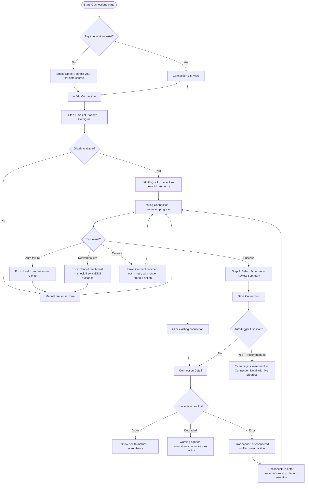
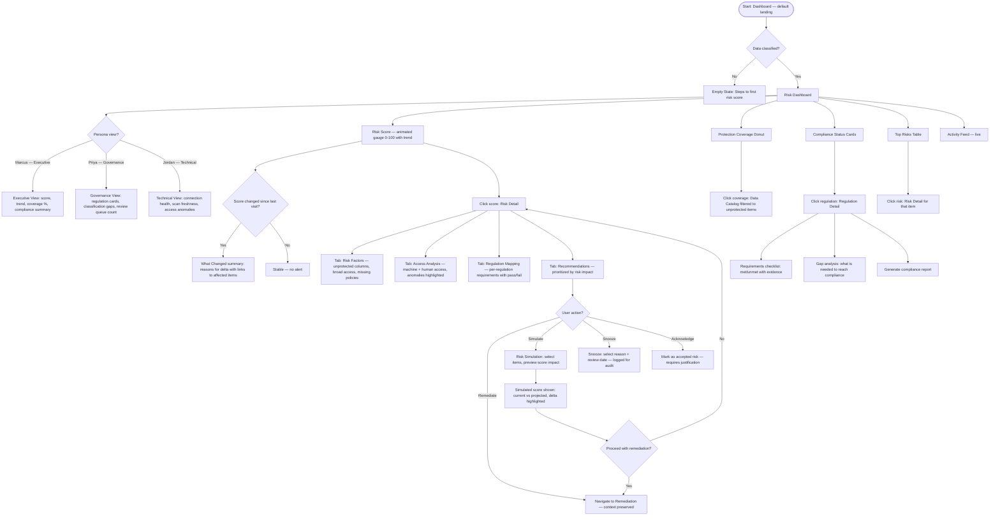
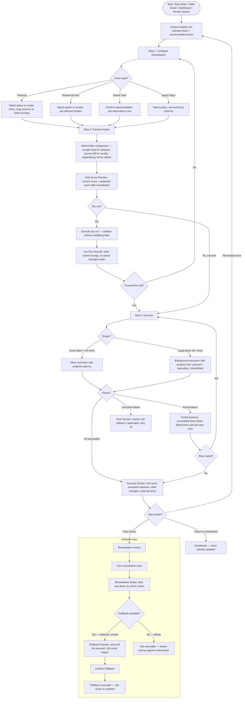

```mermaid
flowchart TD
    A([Start: Dashboard — default landing]) --> A0{First time?}
    A0 -->|Yes| A1[Onboarding Dashboard — progress tracker to first risk score]
    A0 -->|No| A2{Alert ribbon active?}
    A2 -->|Yes| A3[Persistent alert: risk increase / scan failure / compliance change]
    A2 -->|No| B

    A3 --> B[Risk Dashboard with View Toggle]

    B --> B1[View Toggle: Executive / Governance / Operations]

    subgraph executive["Executive View (Marcus)"]
        C1[Risk Score Gauge — animated, 0-100]
        C2[30-Day Trend Chart — line graph with key events marked]
        C3[Protection Coverage — donut: protected vs unprotected %]
        C4[Compliance Summary — one card per regulation: compliant/partial/non-compliant]
        C5[Quick Actions — top 3 recommended next steps]
    end

    subgraph governance["Governance View (Priya)"]
        D1[Classification Review Queue Summary — N items pending, breakdown by confidence]
        D2[Regulation Compliance Cards — detailed, with gap counts]
        D3[Policy Coverage — which policies are active, what they cover]
        D4[Recent Classification Decisions — audit trail]
        D5[Quick Actions — review queue, remediate gaps, generate report]
    end

    subgraph operations["Operations View (Jordan)"]
        E1[Connection Health — all connections with status badges]
        E2[Scan Status — running, last completed, next scheduled]
        E3[Scan Freshness Heatmap — which connections are stale]
        E4[System Alerts — failures, timeouts, schema drift]
        E5[Quick Actions — reconnect, re-scan, view failures]
    end

    B1 -->|Executive| executive
    B1 -->|Governance| governance
    B1 -->|Operations| operations

    C1 --> F[Click: Risk Detail — Flow 3]
    C3 --> G[Click: Data Catalog filtered to unprotected]
    C4 --> H[Click: Regulation Detail]
    C5 --> I[Click: Navigate to recommended action]
    D1 --> J[Click: Classification Review Queue — Flow 2]
    D2 --> H
    E1 --> K[Click: Connection Detail — Flow 1]
    E2 --> L[Click: Scan Detail — Flow 2]

    B --> M[Activity Feed — filterable, live-updating]
    M --> M1[Filter: scans / classifications / remediations / policies / system]

    B --> N[Export & Reports]
    N --> N1[Generate Report Now: Executive Summary / Compliance Audit / Risk Trend]
    N --> N2[Schedule Report: frequency + recipients + format]
    N --> N3[Download: PDF / CSV]
```

# Data Security Product — UX Flows v2 (Refined)

## Product Overview

**Product**: Standalone data security SaaS that helps companies discover, classify, and secure sensitive data across their infrastructure.

**The Five-Stage Loop**: Discover > Classify > Assess > Remediate > Track

**Primary Users**:
- **Jordan (Data Engineer)**: Manages connections, runs scans, monitors infrastructure. Expects dense, technical UIs. Connection-centric, pipeline-aware.
- **Priya (Governance Analyst)**: Defines policies, reviews classifications, tracks compliance. Wants clear workflow queues, not alert firehoses.
- **Marcus (VP Security)**: Consumes dashboards, risk scores, compliance reports. Needs one-page summaries and improvement metrics.

**Classification model**: Guided semi-automatic — system suggests, users confirm or override.

---

## Flow 1: Data Source Connections (Refined)

**Goal**: Connect external data platforms so the system can scan and ingest metadata.
**Stage**: Discover
**Primary persona**: Jordan (Data Engineer)

### What Changed and Why

- **Combined Select Platform + Configure into a single step.** The platform selection is a simple card click that reveals the credential form inline, cutting one full wizard step. Competitors like Atlan achieve 4-6 week time-to-value partly through reduced setup friction.
- **Added "Quick Connect" path for OAuth-enabled platforms.** Snowflake and BigQuery support OAuth. Offering a one-click OAuth path alongside manual credentials removes 60% of the configuration form for those platforms.
- **Merged Review & Save into the schema selection step.** A collapsible summary panel on the schema selection screen eliminates a dedicated review page. The user sees what they picked as they pick it.
- **Added network error recovery.** The original flow only handled credential errors on test. Now handles DNS resolution failure, firewall blocks, and timeout separately with targeted guidance.
- **Added "Reconnect" flow for broken connections.** Existing connections that lose connectivity now surface a reconnect action that skips platform selection and goes straight to credential re-entry.
- **Added connection health polling with degraded state.** Connections are not just "active" or "error" — they can be "degraded" (slow response, intermittent timeouts). This prevents false-alarm disconnection badges.
- **Added persona-specific entry points.** Jordan sees technical connection health metrics (latency, query count). Priya sees schema coverage and classification status. Marcus does not interact with this flow directly.

### Refined Flow Diagram



### Updated Screen Inventory

| Screen | Purpose | Entry From | Key Content | Actions | Exits To | Page Type |
|--------|---------|------------|-------------|---------|----------|-----------|
| **Connection List** | Browse all connected data sources | Sidebar nav | Table: name, platform icon, status badge (active/degraded/error), last scan, schema count, classification coverage % | + Add Connection, filter by platform/status, bulk reconnect | Connection Detail, Add Connection | List view |
| **Add Connection — Platform + Configure** | Select platform and enter credentials in one step | Connection List | Platform card grid (top), credential form (bottom, appears on card click). OAuth button for supported platforms. | Test Connection, Quick Connect (OAuth), Cancel | Test result | Wizard (2-step) |
| **Add Connection — Select Schemas** | Choose databases/schemas + confirm | Successful test | Left: tree view with checkboxes. Right: collapsible summary panel showing platform, host, selected count. | Save + Start Scan (primary), Save Only (secondary), Back | Connection Detail | Wizard (2-step) |
| **Connection Detail** | View connection health and manage | Connection List, wizard completion | Tabs: Overview (health metrics, latency chart), Schemas (browsable tree), Scan History (list), Settings (credentials, schedule). Status badge prominent. | Edit, Reconnect, Trigger Scan, Disable, Delete | Schema/Table Detail, Scan Progress | Detail view |

### Edge Cases (Updated)

| Category | Scenario | Design Response |
|----------|----------|-----------------|
| Empty state | No connections yet | Guided empty state with platform logos and "Connect in under 2 minutes" promise |
| Auth error | Credentials invalid | Inline error on credential form with specific reason (wrong password, expired token, insufficient permissions) |
| Network error | Host unreachable | Separate error state with checklist: "Check that the hostname is correct, your firewall allows outbound connections on port 443, and the service is not in maintenance" |
| Timeout | Test takes > 30s | Show elapsed time counter. At 30s offer "Retry with extended timeout (60s)" option |
| Degraded | Intermittent connectivity | Yellow "degraded" badge. Health tab shows latency chart with spikes highlighted. "This may affect scan reliability" warning |
| Reconnect | Previously working connection fails | "Reconnect" button on error banner. Pre-fills platform and host, only asks for new credentials |
| Permission | Read-only user | All mutation buttons disabled with tooltip. Connection list and detail visible. |
| Destructive | Delete connection with data | Two-step confirmation: acknowledge data loss count, type connection name to confirm |
| Interruption | User closes browser mid-wizard | Draft saved to localStorage. On return, toast: "Resume setting up your Snowflake connection?" |
| Scale | 50+ connections | Pagination, platform/status filters, search. Connection health summary bar at top (12 active, 2 degraded, 1 error) |

### Cross-Flow Improvements

| Connection Point | Improvement |
|-----------------|-------------|
| Connection > Scan | "Save + Start Scan" is the primary CTA, making the transition to Flow 2 the default happy path. Eliminates the decision point of "should I scan now?" |
| Connection > Data Catalog | Schema tree in Connection Detail links directly to Table Detail in Data Catalog, maintaining context |
| Dashboard > Connection | Dashboard health widget shows connection status summary. Click routes to Connection List filtered to problem connections |
| Onboarding > Connection | Flow 7 (onboarding) feeds directly into this flow with pre-selected platform based on signup questionnaire |

---

## Flow 2: Data Scanning & Classification (Refined)

**Goal**: Scan connected data sources, ingest metadata, and classify sensitive data with guided semi-automatic classification.
**Stage**: Discover + Classify
**Primary personas**: Jordan (scan operations), Priya (classification review)

### What Changed and Why

- **Split the flow into two clear phases: Scan (Jordan) and Review (Priya).** The original flow mixed scanning operations with classification review. These are often done by different people at different times. The scan phase is Jordan's domain; the classification review queue is Priya's. Each gets a dedicated entry point and optimized interface.
- **Added a Classification Review Queue.** Instead of forcing users to navigate Data Catalog > Table Detail > review columns, Priya gets a dedicated "Review Queue" that surfaces all pending classifications sorted by confidence (lowest first). This is the single biggest UX improvement — Varonis's 4.9/5 rating comes partly from surfacing actionable items, not making users hunt for them.
- **Added smart bulk actions with confidence thresholds.** "Accept all above 90% confidence" was mentioned in v1 edge cases but not in the flow. Now it is a first-class action in the review queue with a preview of what will be accepted.
- **Added scan scheduling.** The original flow only supported manual scan triggers. Now supports recurring schedules (daily, weekly) — essential for continuous monitoring that competitors like Cyera offer.
- **Added background scan with notification.** Large scans (10K+ tables) run in the background. A sidebar badge shows active scans, and the user gets an in-app notification + optional email on completion.
- **Added "Schema Drift" detection as a scan sub-type.** When a re-scan detects schema changes (new tables, dropped columns, type changes), these are surfaced as a dedicated "Changes since last scan" summary before classification review.
- **Added classification conflict resolution.** When an override conflicts with a policy or regulation mapping, the user sees the conflict immediately rather than discovering it later in the risk assessment.

### Refined Flow Diagram

```mermaid
flowchart TD
    subgraph scan_phase["Phase 1: Scan (Jordan)"]
        A([Start: Connection Detail / Scans page]) --> B{Scan type?}
        B -->|Manual trigger| C[Scan Running — Live Progress]
        B -->|Scheduled| B1[Configure Schedule: daily/weekly + time]
        B1 --> B2[Schedule Saved — next run shown]

        C --> C1[Progress: tables scanned / total, columns discovered, ETA]
        C1 --> C2{Large scan > 10K tables?}
        C2 -->|Yes| C3[Move to background — sidebar badge + notification on complete]
        C2 -->|No| C4[Stay on progress screen]

        C3 --> D{Scan result?}
        C4 --> D
        D -->|Complete| E[Scan Summary]
        D -->|Partial failure| F[Summary + Failed Tables list with per-table retry]
        D -->|Full failure| G[Error screen: reason + retry + check connection health link]
        G --> G1{Connection still healthy?}
        G1 -->|No| G2[Route to Connection Reconnect flow]
        G1 -->|Yes| C

        E --> H{Re-scan detected changes?}
        H -->|Yes| H1[Schema Drift Summary: new tables, dropped columns, type changes]
        H -->|No| I[Data Catalog updated notification]
        H1 --> I
    end

    subgraph classify_phase["Phase 2: Classification Review (Priya)"]
        I --> J([Classification Review Queue])
        J --> J1[Pending items sorted by confidence — lowest first]
        J1 --> J2{Review mode?}

        J2 -->|Single column| K[Column Detail: sample values, context, suggested classification, confidence]
        J2 -->|Table batch| L[Table Review: all columns for one table, inline accept/override/reject]
        J2 -->|Bulk action| M[Bulk Accept: set threshold, preview affected items, confirm]

        K --> K1{Decision?}
        K1 -->|Accept| N[Classification Confirmed — success animation]
        K1 -->|Override| O[Override Panel: select classification + add justification note]
        K1 -->|Reject| P[Mark Not Sensitive — confirm if confidence was > 70%]

        O --> O1{Conflicts with existing policy?}
        O1 -->|Yes| O2[Conflict Warning: show affected policy + regulation, require acknowledgment]
        O1 -->|No| N

        L --> N
        M --> M1[Preview: "42 columns will be accepted as suggested. 3 below threshold excluded."]
        M1 --> N
        P --> N

        N --> Q[Risk Score Recalculating — brief animation]
        Q --> R[Updated score shown inline — delta displayed]
    end
```

### Updated Screen Inventory

| Screen | Purpose | Entry From | Key Content | Actions | Exits To | Page Type | Primary Persona |
|--------|---------|------------|-------------|---------|----------|-----------|-----------------|
| **Scan Progress** | Real-time scan status | Trigger scan, schedule | Progress bar with %, tables scanned/total, columns discovered counter (animated), ETA, elapsed time | Cancel, Move to Background | Scan Summary | Progress view | Jordan |
| **Scan Summary** | What was found | Scan completion | Cards: total tables, total columns, sensitive columns by category (PCI/PII/PHI), new vs previously classified, schema drift count | View Review Queue, Re-scan, View Data Catalog | Review Queue, Data Catalog | Summary view | Jordan |
| **Schema Drift Summary** | Changes since last scan | Scan summary (re-scans only) | Table: change type (new/dropped/modified), item name, impact on classifications | Acknowledge, Re-classify affected | Review Queue | Summary view | Jordan/Priya |
| **Classification Review Queue** | Centralized review workflow | Scan summary, sidebar nav, notification | Queue list: column name, table, connection, suggested classification, confidence %, sample (masked). Sorted by confidence ascending. Filter by: connection, classification type, confidence range | Accept, Override, Reject (single), Bulk Accept with threshold, Filter | Column Detail, Table Review | Queue/list view | Priya |
| **Table Review** | Review all columns for one table | Review Queue (group by table) | Column list with inline actions. Confidence bar per column. Bulk select. Sample values (masked, click to reveal) | Accept All, Accept Above Threshold, Override, Reject per column | Review Queue | Classification review table | Priya |
| **Data Catalog** | Browse all scanned data assets | Sidebar nav | Table: schema, table name, column count, classified %, sensitivity level, last scanned. Filter bar: connection, sensitivity, review status | Search, Filter, Click row | Table Detail | List view | Priya/Jordan |
| **Table Detail** | Column-level view of one table | Data Catalog, Review Queue | Column list: name, type, classification, confidence, status badge, sample. Tabs: Classifications, Access, Lineage, History | Accept/Override/Reject, Remediate column, View access | Remediation, Data Catalog | Detail view | Priya |

### Edge Cases (Updated)

| Category | Scenario | Design Response |
|----------|----------|-----------------|
| Empty state | No scans run | Review Queue shows: "No classifications to review yet. Run your first scan to discover sensitive data." + link to Connections |
| Background scan | Scan takes > 15 minutes | Auto-moves to background. Sidebar "Scans" nav item shows badge with count of running scans. Toast on completion |
| Partial failure | Some tables failed | Summary highlights failures. Per-table retry button. "Retry all failed" bulk action. Successful results are usable immediately |
| Full failure | Scan completely fails | Check connection health first. If connection is broken, route to reconnect. If connection is fine, show error details + retry |
| Confidence | Below 60% confidence | Red warning badge. These items appear first in queue. Tooltip: "Low confidence — manual review recommended" |
| Confidence | Above 95% confidence | Green badge. Suggested for auto-accept in bulk action. Still reviewable individually |
| Scale | 10K+ columns pending | Bulk accept with confidence threshold. Pagination. Progress indicator: "247 of 10,342 reviewed" |
| Conflict | Override conflicts with policy | Inline warning at override time: "This conflicts with your PCI Compliance Policy. Proceed anyway?" + require justification |
| Schema drift | Columns dropped since last scan | "3 previously classified columns no longer exist. Classifications archived." Notification, not blocker |
| Stale | No scan in 30+ days | Warning badge on connection in list. Dashboard alert. Suggested re-scan |
| Network | Connection drops mid-scan | Partial results saved. Error banner: "Scan interrupted at 67%. Resume scan to continue from where it stopped." Resume action |
| Audit | Need to track who classified what | Every accept/override/reject logged with user, timestamp, previous value, justification (if override) |

### Cross-Flow Improvements

| Connection Point | Improvement |
|-----------------|-------------|
| Connection > Scan | "Save + Start Scan" in Flow 1 feeds directly into the scan progress screen. No intermediate steps |
| Scan > Review Queue | Scan completion notification includes "Review N classifications" CTA that deep-links to the queue filtered to that scan |
| Review Queue > Risk | Every classification decision triggers an inline risk score delta preview: "+2 points" or "-5 points" so Priya sees the risk impact of her decisions in real time |
| Review Queue > Remediation | Columns classified as high-sensitivity show a "Remediate Now" shortcut directly in the queue, skipping the Data Catalog intermediate |
| Data Catalog > Table Detail | Breadcrumb navigation preserves filter state so the user can return to their filtered catalog view |

---

## Flow 3: Risk Assessment & Scoring (Refined)

**Goal**: Evaluate risk based on sensitive data exposure, access patterns, and regulation requirements.
**Stage**: Assess
**Primary personas**: Marcus (executive view), Priya (compliance detail), Jordan (technical drill-down)

### What Changed and Why

- **Added persona-specific dashboard views.** Marcus sees the executive summary (score, trend, coverage %). Priya sees the compliance-focused view (regulation cards, gap analysis). Jordan sees the technical view (connection health, scan freshness, access anomalies). Same data, different emphasis — toggled via a view selector, not separate pages. This avoids the Wiz problem of security-team-only UX.
- **Added risk score animation on entry.** When the dashboard loads, the risk score animates from 0 to the current value (like a speedometer). This creates a visceral "moment of truth" and makes score changes feel tangible. The 30-day trend line draws in with the same animation.
- **Added "What changed?" summary when risk score shifts.** Instead of just showing a delta arrow, the dashboard explains why: "Risk increased by 8 points: 12 new PII columns discovered, 4 access grants added." Actionable, not just informational.
- **Added risk score simulation.** Users can see "If I remediate these 5 items, my score would drop to X." This preview-before-action pattern drives remediation adoption. No competitor offers this — it is the UX equivalent of Wiz's attack path visualization but for risk reduction.
- **Added "Snooze with reason" for acknowledged risks.** The original flow had "snooze" but no accountability. Now requires a reason and a review date. Snoozed items resurface automatically and appear in compliance reports.
- **Removed the separate Access Analysis screen.** Merged access analysis into Risk Detail as a tab. The separate screen created unnecessary navigation depth. Wiz's security graph drill-downs work because they stay in-context; we should too.
- **Added real-time risk recalculation indicator.** When classifications change (in Flow 2), the dashboard shows a brief "Recalculating..." state with a subtle pulse animation, then reveals the new score with a delta.

### Refined Flow Diagram



### Updated Screen Inventory

| Screen | Purpose | Entry From | Key Content | Actions | Exits To | Page Type | Primary Persona |
|--------|---------|------------|-------------|---------|----------|-----------|-----------------|
| **Risk Dashboard** | At-a-glance risk posture | Login (default), sidebar | Risk score gauge (animated), trend sparkline, "What Changed" summary, protection donut, compliance cards, top risks, activity feed. View toggle: Executive/Governance/Technical | Time range filter, View toggle, Export, Drill-down | Risk Detail, Data Catalog, Remediation, Regulation Detail | Dashboard | All (view-dependent) |
| **Risk Detail** | Deep dive into risk area | Dashboard drill-down | Tabbed: Risk Factors, Access Analysis, Regulation Mapping, Recommendations. Risk simulation panel. Snooze/Acknowledge actions | Remediate, Simulate, Snooze, Acknowledge, Export | Remediation, Risk Dashboard | Detail view with tabs | Priya/Jordan |
| **Risk Simulation** | Preview remediation impact | Risk Detail "Simulate" | Checkbox list of remediatable items. Live-updating projected score. Before/after comparison | Proceed to Remediate, Cancel | Remediation | Interactive panel (drawer) | Priya |
| **Regulation Detail** | Per-regulation compliance | Dashboard compliance card | Requirements checklist (pass/fail with evidence links), affected data inventory, gap analysis, remediation suggestions | Generate report, Remediate gaps, Export | Remediation, Report generation | Detail view | Priya |

### Risk Score Model (Unchanged)

| Score Range | Label | Token | Animation |
|-------------|-------|-------|-----------|
| 0-25 | Low Risk | `--sds-status-success-*` | Gauge fills to green zone, celebratory subtle pulse |
| 26-50 | Moderate Risk | `--sds-status-warning-*` | Gauge fills to yellow zone |
| 51-75 | High Risk | `--sds-status-error-*` (lighter) | Gauge fills to orange zone |
| 76-100 | Critical Risk | `--sds-status-error-*` | Gauge fills to red zone, persistent glow |

### Edge Cases (Updated)

| Category | Scenario | Design Response |
|----------|----------|-----------------|
| Empty state | No classified data | Dashboard shows empty gauge at 0 with CTA steps: "1. Connect data source 2. Run scan 3. Review classifications" with progress indicator |
| Loading | Risk recalculating after classification changes | Gauge shows pulse animation, "Recalculating..." label. Partial results shown, full update within seconds |
| Score jump | Risk increased significantly | Alert banner: "Risk score increased by 23 points" with "What Changed" expansion showing specific reasons. Persists until dismissed or addressed |
| Score drop | Risk decreased after remediation | Celebratory micro-interaction: score ticks down with green flash. "What Changed" shows remediation actions taken |
| Simulation | User simulates remediation | Drawer panel shows projected score. Does not modify anything until user confirms and enters remediation flow |
| Staleness | Data > 30 days old | Warning banner: "Risk score based on data from 45 days ago. Re-scan recommended." + one-click re-scan trigger |
| Conflict | Regulation requirements conflict | Flag in Regulation Detail: "Conflict: GDPR Article 17 (right to erasure) vs. HIPAA 45 CFR 164.530 (6-year retention). Manual resolution required." Link to guidance |
| Snooze expiry | Snoozed risk reaches review date | Re-surfaces in top risks list with "Snooze expired" badge. Notification sent to original snoozer |
| Executive | Marcus needs board-ready report | Export > Executive PDF: one page, risk score, trend, coverage %, top 3 risks, compliance status |
| Permission | Read-only user views risk | All data visible. Remediate/Snooze/Acknowledge buttons show "Request access" tooltip |

### Cross-Flow Improvements

| Connection Point | Improvement |
|-----------------|-------------|
| Classification > Risk | Risk score delta shown inline during classification review (Flow 2). Dashboard auto-refreshes when user navigates back |
| Risk > Remediation | "Remediate" action from Risk Detail carries full context (which risk, which items, recommended action) into the Remediation flow — no re-selection needed |
| Risk Simulation > Remediation | Simulation selections carry over as pre-selected items in the remediation flow |
| Dashboard > All Flows | Every dashboard widget is a drill-down entry point. No dead-end widgets. Every metric links to its source data |
| Onboarding > Dashboard | First-time dashboard shows the animated empty-to-scored transition when first risk score is calculated |

---

## Flow 4: Remediation (Refined)

**Goal**: Apply fixes to reduce risk — tokenize, revoke access, delete data, or apply policies.
**Stage**: Remediate
**Primary personas**: Priya (governance-driven remediation), Jordan (technical execution)

### What Changed and Why

- **Added remediation context preservation.** Entry from Risk Detail, Table Detail, or Dashboard now carries pre-selected items and recommended action type. The user does not re-navigate or re-select what was already identified. This is the #1 friction point in competitor DSPM tools that "route to tickets" (Cyera, BigID) rather than executing in-context.
- **Consolidated remediation into a single 3-step pattern: Configure > Preview > Execute.** The original flow had 4 different sub-flows (tokenize, revoke, delete, apply policy) each with different step counts. Now they all share the same 3-step pattern with type-specific content in each step. This reduces cognitive load and makes the UI consistent.
- **Added dry-run mode for all remediation types.** Previously only mentioned for tokenization. Now all four types support a dry-run that shows exactly what will change without executing. This addresses the "production data anxiety" that slows adoption of automated remediation.
- **Added batch remediation with progress tracking.** Remediating 500+ columns now shows a progress bar with per-item status (queued > executing > done/failed). Failed items can be retried individually. Similar to Varonis's automated remediation approach but with human oversight.
- **Added remediation rollback as a first-class screen, not just an option.** Rollback is critical for trust. It now has its own screen accessible from Remediation History, showing exactly what will be reversed and the risk score impact.
- **Added "Remediation Plan" for staged rollouts.** Enterprise users need to remediate in phases (dev > staging > prod). A remediation plan groups multiple actions into a staged execution with approval gates between stages.
- **Added success celebration with risk score delta.** When remediation completes, the success screen shows an animated risk score reduction (78 > 65) with a green trend animation. This closes the loop and makes the value tangible.

### Refined Flow Diagram



### Updated Screen Inventory

| Screen | Purpose | Entry From | Key Content | Actions | Exits To | Page Type | Primary Persona |
|--------|---------|------------|-------------|---------|----------|-----------|-----------------|
| **Configure Remediation** | Set up the remediation action | Risk Detail, Table Detail, Dashboard, Review Queue | Pre-filled from entry context. Type selector (Tokenize/Revoke/Delete/Apply Policy). Type-specific configuration form. Affected items list with checkboxes | Configure, Remove items, Switch type | Preview | Wizard step 1 | Priya/Jordan |
| **Preview Impact** | See what will change before executing | Configure step | Before/After comparison (type-specific). Projected risk score with animated delta. Dry-run option. Warning callouts for production data, dependencies, irreversible actions | Execute, Dry Run, Back, Edit | Execute, Dry Run Results | Wizard step 2 | Priya/Jordan |
| **Dry Run Results** | Validation without execution | Preview (dry run) | Simulated results: what would change, items affected, projected outcomes. No actual data modified | Proceed for Real, Back to Configure | Execute | Results view | Jordan |
| **Execution Progress** | Track remediation execution | Preview (execute) | Progress bar (for batches). Per-item status: queued/executing/done/failed. Elapsed time. Cancel button | Cancel (if in progress) | Success/Partial/Error | Progress view | Jordan |
| **Remediation Success** | Celebrate risk reduction | Execution complete | Animated risk score: before > after (ticking down). Items remediated count. Audit log link. "What changed" summary | Return to Dashboard, Remediate More, View History | Dashboard, Configure, History | Success celebration | Priya/Jordan |
| **Remediation History** | Audit trail | Sidebar nav, success screen | Table: date, type, user, affected items count, risk impact, status (applied/rolled back/failed). Filter by type/user/date | Filter, Export, Click entry for detail | Remediation Detail | List view | Priya/Marcus |
| **Remediation Detail** | Single remediation record | History list | What was done, who did it, when, affected items, risk score change, rollback availability | Rollback (if available), Export | Rollback Preview | Detail view | Priya |
| **Rollback Preview** | Confirm rollback | Remediation Detail | What will be reversed, items affected, projected risk score after rollback | Confirm Rollback, Cancel | Remediation History | Confirmation view | Priya/Jordan |

### Edge Cases (Updated)

| Category | Scenario | Design Response |
|----------|----------|-----------------|
| Destructive | Deleting data with downstream dependencies | Dependency tree visualization in preview. "3 pipelines reference this table" warning. Require typed confirmation of table name |
| Destructive | Tokenizing production data | Production data warning banner in preview. Dry-run is the default CTA for production targets. "This will modify production data" with orange warning |
| Partial failure | Some items fail during batch | Succeeded items are committed. Failed items listed with individual error reasons. "Retry Failed" bulk action. Risk score reflects partial completion |
| Rollback | Tokenization needs reversal | Available for 30 days. Rollback preview shows detokenized sample data. Risk score impact (will increase). Audit log notes rollback reason |
| Rollback | Delete needs reversal | Not available. Original confirmation step says "Deletion is permanent and cannot be reversed." Require typed confirmation |
| Permission | User can view but not execute | "Request Approval" button replaces "Execute." Routes to approval workflow (manager notification) |
| Batch | 500+ items | Background execution with progress tracker. Email notification on completion. Progress viewable from sidebar badge |
| Conflict | Remediation conflicts with active policy | Warning in preview: "This action conflicts with policy X. Override requires admin approval." |
| Network | Connection drops during execution | Partial results saved. Error with clear status: "23 of 50 completed before interruption." Resume button |
| Audit | Compliance requires trail | Every action (including dry runs, rollbacks, cancellations) logged with user, timestamp, items, justification |
| Concurrent | Two users remediating same items | Optimistic locking. Second user sees "These items are being remediated by [user] — started 2 minutes ago." Option to wait or choose different items |

### Cross-Flow Improvements

| Connection Point | Improvement |
|-----------------|-------------|
| Risk > Remediation | Context preservation eliminates re-selection. Risk Detail "Remediate" button passes the specific risk, affected items, and recommended action type |
| Risk Simulation > Remediation | Items selected in risk simulation carry over as pre-checked items in Configure Remediation |
| Review Queue > Remediation | "Remediate Now" shortcut in classification review queue for high-sensitivity columns goes directly to Configure with the column pre-selected |
| Remediation > Dashboard | Success screen shows the dashboard score updating in real-time. "Return to Dashboard" navigates with the score delta still visible |
| Remediation > Policy | "Create new policy" inline option during tokenization configuration links to a simplified policy creation (Flow 5) and returns to the remediation flow |
| Remediation > History | All completed remediations immediately appear in history. History is filterable by the originating flow (from risk, from review queue, from dashboard) |

---

## Flow 5: Tokenization Policy Management (Refined)

**Goal**: Define and manage reusable tokenization policies that map data classifications to token configurations.
**Stage**: Remediate (infrastructure)
**Primary persona**: Priya (policy definition), Jordan (technical configuration)

### What Changed and Why

- **Combined Step 1 (Basics) and Step 2 (Classifications) into a single step.** Policy name, description, regulation, and classification selection are closely related and fit on one screen. Cuts the wizard from 5 steps to 3.
- **Added policy templates.** Instead of starting from scratch, users can choose from pre-built templates: "PCI Compliance," "GDPR PII Protection," "HIPAA PHI Security," "General PII." Templates pre-fill classification rules, token formats, and scope — user customizes from there. Immuta's pre-built compliance templates (HIPAA, GDPR, CCPA) demonstrate the value of this pattern.
- **Added "Impact Preview" before policy creation.** Shows how many existing columns would match this policy and what the risk score impact would be if applied. This makes policy creation feel connected to the rest of the system rather than abstract configuration.
- **Added inline policy creation from Remediation flow.** When a user is tokenizing data and no suitable policy exists, they can create one inline (drawer, not full-page navigation) and return to remediation without losing context.
- **Added policy versioning.** Editing an active policy creates a new version. Previous versions are viewable. Diff view between versions. This provides the audit trail governance teams need.
- **Added policy testing.** Before applying a policy, users can test it against sample data to see the tokenization output. This builds confidence and reduces rollback frequency.
- **Removed "Disable" as a separate action — merged with status toggle.** Active/Disabled is now a toggle on the Policy Detail page, not a separate action in a menu. Simpler interaction pattern.

### Refined Flow Diagram

```mermaid
flowchart TD
    A([Start: Policies page]) --> B{Any policies exist?}
    B -->|No| C[Empty State + Template Gallery]
    B -->|Yes| D[Policy List View]

    C --> E{Start from?}
    D --> E
    E -->|Template| E1[Choose template — pre-fills wizard]
    E -->|Scratch| E2[Blank wizard]
    D --> F[Click existing policy]
    F --> G[Policy Detail View]

    E1 --> H[Step 1: Basics + Classifications]
    E2 --> H
    H --> H1[Name, description, regulation, priority]
    H --> H2[Classification checkboxes: PCI/PII/PHI/Custom]

    H2 --> I[Step 2: Token Configuration]
    I --> I1[Per-classification token format: FPE, hash, random, mask]
    I --> I2[Preservation rules, reversibility setting]
    I --> I3[Test against sample data — preview tokenized output]

    I3 --> J[Step 3: Scope + Review]
    J --> J1[Scope: all matching / specific connections / specific schemas]
    J --> J2[Impact preview: N columns match, projected risk score change]
    J --> J3[Summary of all settings]

    J3 --> K[Create Policy — status: Draft]
    K --> G

    G --> L{Actions}
    L -->|Apply to data| M[Select targets > Preview > Apply — enters Remediation Flow 4]
    L -->|Edit| N[Edit wizard — creates new version]
    L -->|Clone| O[Duplicate with "Copy of" name]
    L -->|Toggle active/disabled| P[Toggle with confirmation if active policies affected]
    L -->|Delete| Q{Applied to data?}
    Q -->|Yes| Q1[Block: "Transfer 234 columns to another policy or detokenize first"]
    Q -->|No| Q2[Confirm deletion]

    N --> N1[Version created — diff view available]
```

### Updated Screen Inventory

| Screen | Purpose | Entry From | Key Content | Actions | Exits To | Page Type | Primary Persona |
|--------|---------|------------|-------------|---------|----------|-----------|-----------------|
| **Policy List** | Browse all tokenization policies | Sidebar nav | Table: name, regulation, classifications covered, scope, status toggle (active/draft/disabled), applied-to count, last modified. Filter by regulation/status | + Create Policy, filter, search | Policy Detail, Create Policy | List view | Priya |
| **Template Gallery** | Quick-start policy creation | Empty state, Create Policy | Cards: PCI Compliance, GDPR PII Protection, HIPAA PHI Security, General PII, Blank. Each shows what is pre-configured | Select template | Wizard Step 1 | Card grid | Priya |
| **Create Policy — Basics + Classifications** | Name, regulation, and classification scope | Template or Blank | Form: name, description, regulation dropdown, priority. Classification checkbox groups (pre-filled if template). | Next, Cancel | Token Configuration | Wizard step 1/3 | Priya |
| **Create Policy — Token Configuration** | Configure tokenization rules | Basics step | Per-classification config: token format selector (FPE/hash/random/mask), preservation rules, reversibility. Test panel: paste sample data, see tokenized output | Test, Next, Back | Scope + Review | Wizard step 2/3 | Jordan/Priya |
| **Create Policy — Scope + Review** | Define scope and confirm | Token Config | Scope selector (all/connections/schemas). Impact preview: matching column count, risk score projection. Full settings summary | Create Policy, Back | Policy Detail | Wizard step 3/3 | Priya |
| **Policy Detail** | View and manage a policy | Policy List | Tabs: Overview (settings summary, status toggle), Applied Data (tables/columns), Versions (history with diff), Activity Log. Impact metrics | Apply, Edit, Clone, Delete, Toggle status | Apply flow, Edit wizard | Detail view with tabs | Priya |
| **Policy Version Diff** | Compare policy versions | Policy Detail Versions tab | Side-by-side diff: changed fields highlighted. Version metadata: who changed, when, why | Revert to version, Close | Policy Detail | Diff view | Priya |
| **Inline Policy Creator** | Create policy from Remediation flow | Remediation Flow 4 (tokenize) | Drawer overlay with condensed 3-step wizard. Same content as full wizard, drawer format | Create + Return to Remediation | Remediation Configure step | Drawer/panel | Priya |

### Edge Cases (Updated)

| Category | Scenario | Design Response |
|----------|----------|-----------------|
| Empty state | No policies | Template gallery as primary CTA: "Start with a template to protect sensitive data in minutes" |
| Conflict | Two policies cover same column | Warning during scope step: "12 columns already covered by PCI Policy. This policy will take precedence (higher priority)." Priority ordering configurable |
| Regulation | Custom regulation needed | "Custom" regulation option with free-text name and description fields |
| Edit | Editing active policy | Creates new version. Warning: "Changes applied to 234 columns on next policy enforcement run. Apply immediately?" |
| Delete | Policy has applied tokenization | Block deletion. Offer: "Transfer columns to another policy" or "Detokenize all columns first" |
| Template | Template does not quite fit | All template fields are editable. Template is a starting point, not a constraint |
| Testing | Token format produces unexpected output | Test panel shows live preview. User can adjust format and re-test before saving |
| Version | Need to revert a policy change | Version history with diff. "Revert to version N" creates a new version with old settings |
| Inline creation | Creating from Remediation flow | Drawer slides in. On save, new policy is auto-selected in the remediation configuration. Drawer closes, user is back in Flow 4 |

### Cross-Flow Improvements

| Connection Point | Improvement |
|-----------------|-------------|
| Policy > Remediation | "Apply Policy" on Policy Detail enters Remediation Flow 4 with the policy pre-selected. Target selection starts immediately |
| Remediation > Policy | "Create New Policy" in Remediation tokenize configuration opens inline policy creator (drawer). Returns to remediation with new policy selected |
| Policy > Risk | Impact preview during creation shows projected risk score change. Policy Detail shows cumulative risk reduction from this policy |
| Policy > Data Catalog | "Applied Data" tab on Policy Detail links to Data Catalog filtered to columns using this policy |
| Onboarding > Policy | Flow 7 suggests creating first policy immediately after first scan reveals sensitive data, using templates |

---

## Flow 6: Risk Dashboard & Monitoring (Refined)

**Goal**: Provide at-a-glance risk visibility with trends, drill-downs, and alerts for all personas.
**Stage**: Track
**Primary persona**: Marcus (executive), Priya (compliance monitoring), Jordan (operational health)

### What Changed and Why

- **Added three persona-specific dashboard modes.** This is the core improvement. The dashboard is the most-visited screen, but Marcus, Priya, and Jordan need fundamentally different information. Instead of one dense dashboard, a view toggle switches between Executive (score + trend + coverage), Governance (compliance cards + classification queue + regulation gaps), and Operations (connection health + scan status + scan freshness). Same underlying data, different layouts and emphasis.
- **Added persistent alert ribbon.** Risk increases, scan failures, and compliance changes are not just in-page banners — they appear in a thin ribbon below the top nav that persists across all pages until addressed. This ensures Marcus sees the alert even if he is on a different page.
- **Added "Quick Actions" panel.** The dashboard now surfaces the top 3 recommended actions (e.g., "Review 42 pending classifications," "Remediate 5 critical PII columns," "Re-scan Snowflake — last scan 32 days ago"). Each is a one-click navigation to the right flow with context. This reduces the time from "seeing a problem" to "acting on it."
- **Added scheduled report delivery (email).** The original flow mentioned scheduled reports but did not detail the setup. Now: choose template, frequency (daily/weekly/monthly), recipients, and format (PDF/CSV). Audit-friendly for compliance teams.
- **Merged Protection Coverage into the main dashboard as a prominent section** rather than a drill-down destination. Coverage is one of Marcus's top 3 metrics and should be visible without a click.
- **Added real-time activity feed with filtering.** The activity feed now supports filtering by type (scans, classifications, remediations, policy changes, user actions) and is live-updating via WebSocket. This replaces the need for a separate "Recent Activity" page.
- **Added dashboard loading skeleton.** On first load, the dashboard shows skeleton cards that match the layout, filling in as data arrives. Score loads first (most important), then trend, then coverage, then compliance cards. Progressive disclosure reduces perceived load time.

### Refined Flow Diagram



### Updated Screen Inventory

| Screen | Purpose | Entry From | Key Content | Actions | Exits To | Page Type | Primary Persona |
|--------|---------|------------|-------------|---------|----------|-----------|-----------------|
| **Risk Dashboard — Executive** | Board-ready risk overview | Login, sidebar, view toggle | Risk score gauge (animated), trend chart with event markers, protection coverage donut, compliance summary cards, quick actions | View toggle, Time range filter, Export | Risk Detail, Data Catalog, Regulation Detail | Dashboard | Marcus |
| **Risk Dashboard — Governance** | Compliance and classification focus | View toggle | Review queue summary (pending count + confidence breakdown), regulation cards with gap counts, policy coverage matrix, recent decisions | View toggle, Go to Review Queue, Generate Report | Review Queue, Regulation Detail, Reports | Dashboard | Priya |
| **Risk Dashboard — Operations** | Infrastructure health | View toggle | Connection health table, scan status (running/completed/scheduled), freshness heatmap, system alerts | View toggle, Reconnect, Re-scan, View Failures | Connection Detail, Scan Progress | Dashboard | Jordan |
| **Alert Ribbon** | Persistent cross-page alerts | Auto-triggered by events | Thin banner: alert type icon, message, timestamp, action link. Dismissible or auto-clears on resolution | Click action, Dismiss | Varies by alert type | Global ribbon | All |
| **Reports** | Generate and schedule reports | Dashboard export, sidebar | Template selector, frequency settings, recipient list, format picker. History of generated reports | Generate Now, Schedule, Download | PDF/Email delivery | Form + list | Priya/Marcus |

### Edge Cases (Updated)

| Category | Scenario | Design Response |
|----------|----------|-----------------|
| Empty state | No data at all | Onboarding dashboard (Flow 7) replaces normal dashboard with progress tracker |
| Loading | Dashboard loading with large dataset | Skeleton cards in layout. Score loads first (< 1s), then trend (< 2s), then detail widgets. Progressive disclosure |
| Stale | Dashboard data > 24 hours old | "Last updated: 26 hours ago" with yellow warning. "Refresh" button and "Re-scan recommended" CTA |
| Alert | Risk score jumped 20+ points | Alert ribbon (persistent, cross-page): red, with specific cause. Dashboard score gauge shows before/after with highlighted delta |
| Alert | Scan failure | Alert ribbon (persistent): orange, with connection name and retry link |
| Alert | Compliance status changed | Alert ribbon (persistent): red for non-compliant change, with regulation name and gap detail link |
| View preference | User always uses one view | View preference saved per user. Last-used view loads by default on next visit |
| Export | Report generation takes time | "Generating report..." progress indicator. Download link emailed when ready for large reports |
| Scale | 50+ connections in operations view | Grouped by status (error first, degraded, then active). Collapsed groups for healthy connections. Search and filter |
| Real-time | Activity feed during active scan | Live-updating entries. "Scan in progress" pinned at top of feed with live progress |

### Cross-Flow Improvements

| Connection Point | Improvement |
|-----------------|-------------|
| Dashboard > All Flows | Quick Actions panel provides one-click navigation to the highest-priority action across all flows. Context is preserved (e.g., "Review 42 classifications" links to Review Queue filtered to that scan) |
| All Flows > Dashboard | Every flow completion (connection saved, scan complete, classification reviewed, remediation applied) triggers a dashboard data refresh. Returning to dashboard always shows current state |
| Dashboard > Reports | Report generation uses the current dashboard view and time range as defaults. Executive view generates executive report. Governance view generates compliance report |
| Alert Ribbon > All Flows | Alerts persist across page navigation. Clicking an alert navigates to the source flow with relevant context |
| Onboarding > Dashboard | Flow 7 transitions seamlessly into the dashboard when the first risk score is calculated. The onboarding progress tracker fades and the full dashboard reveals |

---

## Flow 7: Onboarding & First-Time Experience (New)

**Goal**: Get a new user from sign-up to first risk score visible within 30 minutes.
**Stage**: All five stages compressed into a guided first run.
**Primary persona**: Jordan (initial setup), with handoff moments for Priya and Marcus.

### Design Principles

1. **Time-to-value target: 30 minutes to first risk score.** Atlan achieves 4-6 weeks for full deployment. We aim for a meaningful first result in 30 minutes, with full deployment over days/weeks.
2. **Progressive disclosure.** Show only what is needed at each step. Do not overwhelm with the full platform during onboarding.
3. **Guided but not locked in.** Users can skip steps and explore freely at any point. The onboarding checklist persists as a dismissible widget until completed.
4. **Celebrate micro-wins.** Each completed step gets a brief success animation and progress update. Reaching the first risk score is the big celebration moment.

### Onboarding Flow Diagram

```mermaid
flowchart TD
    A([Sign Up Complete]) --> B[Welcome Screen]
    B --> B1[Persona Selection: I am a Data Engineer / Governance Analyst / Security Leader]
    B1 --> B2{Persona?}
    B2 -->|Jordan — Engineer| B3[Dashboard: Operations view default, connection setup emphasized]
    B2 -->|Priya — Governance| B4[Dashboard: Governance view default, classification review emphasized]
    B2 -->|Marcus — Executive| B5[Dashboard: Executive view default, invite team member prompt]

    B3 --> C[Onboarding Dashboard — Progress Tracker]
    B4 --> C
    B5 --> C

    C --> C0[Progress: 0 of 5 steps — illustrated progress bar]

    C --> D[Step 1: Connect Your First Data Source]
    D --> D1[Platform quick-select: Snowflake / AWS / Databricks / BigQuery]
    D1 --> D2{OAuth available?}
    D2 -->|Yes| D3[One-click OAuth — fastest path]
    D2 -->|No| D4[Guided credential form with inline help tooltips]
    D3 --> D5[Connection test — animated progress]
    D4 --> D5
    D5 --> D6{Success?}
    D6 -->|Yes| D7[Step 1 Complete — celebration micro-animation]
    D6 -->|No| D8[Troubleshooting guide: common errors with solutions]
    D8 --> D4

    D7 --> E[Step 2: Run First Scan — Auto-triggered]
    E --> E1[Scan progress with educational tooltips: what the scan is doing, what it will find]
    E1 --> E2{Scan size?}
    E2 -->|Small < 100 tables| E3[Stay on progress — completes in minutes]
    E2 -->|Large 100+ tables| E4[Background with ETA — continue to explore platform]
    E3 --> E5[Step 2 Complete — show discovery stats: N tables, M columns, K sensitive]
    E4 --> E5

    E5 --> F[Step 3: Review First Classifications — Guided]
    F --> F1[Guided Review Queue: show top 5 highest-confidence suggestions first]
    F1 --> F2[Coach marks: explain confidence score, accept/override/reject actions]
    F2 --> F3[User reviews 5 classifications — with explanations of each classification type]
    F3 --> F4[Step 3 Complete — classification concept understood]

    F4 --> G[Step 4: See Your Risk Score — The Big Moment]
    G --> G1[Risk score calculating animation — building anticipation]
    G1 --> G2[Risk Score Revealed — animated gauge fills to score]
    G2 --> G3[Score explanation: what it means, what drives it, how to improve it]
    G3 --> G4[Step 4 Complete — primary value demonstrated]

    G4 --> H[Step 5: Take First Action]
    H --> H1{Risk level?}
    H1 -->|Low: 0-25| H2[Congrats — show recommended monitoring setup]
    H1 -->|Moderate-Critical: 26-100| H3[Recommended action: Remediate top risk item]
    H3 --> H4[Guided remediation of one item — preview > execute with explanations]
    H4 --> H5[Score updated — watch it decrease]
    H2 --> I
    H5 --> I

    I[Onboarding Complete — Full Dashboard Revealed]
    I --> I1[Confetti animation — transition to full dashboard]
    I --> I2[Onboarding checklist becomes dismissible widget for remaining optional tasks]
    I2 --> I3[Optional: Invite team members]
    I2 --> I4[Optional: Create first policy]
    I2 --> I5[Optional: Schedule recurring scans]
    I2 --> I6[Optional: Set up compliance report]
```



### Screen Inventory

| Screen | Purpose | Entry From | Key Content | Actions | Exits To | Page Type |
|--------|---------|------------|-------------|---------|----------|-----------|
| **Welcome** | First impression, persona selection | Sign-up complete | Product value prop (one sentence), persona cards with descriptions | Select persona | Onboarding Dashboard | Welcome/choice |
| **Onboarding Dashboard** | Central hub during onboarding | Welcome | Progress bar (0-5 steps), current step card with CTA, preview of what is coming next. Simplified sidebar with only relevant nav items visible | Start current step, Skip step, Explore | Step-specific screens | Dashboard (simplified) |
| **Guided Connection Setup** | Simplified version of Flow 1 | Onboarding step 1 | Reduced platform grid (top 4 only), credential form with helper text for every field, inline troubleshooting | Connect, Skip | Scan Progress | Wizard (simplified) |
| **First Scan Progress** | Scan with educational context | Connection success | Progress bar + educational tooltips explaining what the scan does: "Discovering tables... Analyzing column patterns... Identifying sensitive data..." | Wait (auto-progresses), Move to Background | Scan Summary (simplified) | Progress + education |
| **Guided Classification Review** | Teach the review workflow | Scan complete | Top 5 suggestions only (not full queue). Coach marks on first item. Confidence score explanation. Sample data preview | Accept, Override, Reject (with explanations) | Risk Score Reveal | Guided review |
| **Risk Score Reveal** | The "aha" moment | Classification review | Animated gauge filling from 0 to score. Score explanation panel: "Your score is 67 (High Risk) because..." with drill-down links. Improvement suggestions | View Breakdown, Take Action | First Remediation or Dashboard | Celebration |
| **First Remediation** | Demonstrate the remediate-to-improve loop | Risk Score Reveal | Top recommended action pre-selected. Simplified preview. Execute with guided explanation. Score update animation after success | Execute, Skip | Full Dashboard | Guided action |
| **Onboarding Complete** | Transition to full product | First Remediation or Skip | Confetti. Full dashboard revealed. Dismissible checklist widget for remaining tasks | Explore Dashboard, Optional Tasks | Full Dashboard | Celebration + transition |

### Timing Estimates

| Step | Estimated Time | Cumulative |
|------|---------------|------------|
| Sign up + Welcome | 2 minutes | 2 min |
| Connect first data source (OAuth) | 3 minutes | 5 min |
| Connect first data source (manual) | 8 minutes | 10 min |
| First scan (small dataset) | 5 minutes | 15 min |
| First scan (medium dataset) | 15 minutes | 25 min |
| Review 5 classifications | 3 minutes | 18-28 min |
| See risk score | 1 minute | 19-29 min |
| First remediation | 3 minutes | 22-32 min |
| **Total** | **22-32 minutes** | **Within 30-min target** |

### Edge Cases

| Category | Scenario | Design Response |
|----------|----------|-----------------|
| Abandonment | User leaves mid-onboarding | Progress saved. On next login: "Welcome back! You were setting up your first connection. Resume?" |
| Skip | User wants to skip onboarding | "Skip" available at every step. Onboarding checklist persists as a dismissible sidebar widget. User can return to any step |
| Large dataset | First scan takes > 15 minutes | "Your scan is running in the background. You'll be notified when it's complete. In the meantime, explore the platform." Platform tour offered |
| No sensitive data | First scan finds nothing sensitive | "No sensitive data found in scanned schemas. This could mean: data is already well-organized, or try scanning additional schemas." CTA to add more schemas or connections |
| Multiple users | Team signs up together | First user completes setup. Subsequent team members see the existing connection/scan/classifications and start from Step 3 (review) |
| Expert user | Jordan knows the product category well | "I know what I'm doing" link skips educational tooltips and coach marks. Wizard steps still required but explanations hidden |
| Error | Connection fails on first try | Encouraging error messaging: "That didn't work, but that's common. Here's what to check..." Troubleshooting checklist with the 3 most common causes for that platform |

---

## Updated Cross-Flow Navigation Map

### Complete Navigation Paths

| # | From | To | Trigger | Context Passed | Personas |
|---|------|-----|---------|---------------|----------|
| 1 | Dashboard (empty) | Onboarding | First login | Persona selection | All |
| 2 | Dashboard | Connections List | Quick Action / Connection health widget | Filter to problem connections (if from alert) | Jordan |
| 3 | Dashboard | Data Catalog | Click protection coverage donut | Filter: unprotected items | Priya |
| 4 | Dashboard | Risk Detail | Click risk score or top risk item | Risk item ID | All |
| 5 | Dashboard | Remediation | Quick Action "Remediate N items" | Pre-selected items + action type | Priya |
| 6 | Dashboard | Review Queue | Quick Action "Review N classifications" or Governance view | Filter to latest scan | Priya |
| 7 | Dashboard | Regulation Detail | Click compliance card | Regulation ID | Priya/Marcus |
| 8 | Dashboard | Reports | Export button | Current view + time range as defaults | Marcus |
| 9 | Onboarding | Connection Setup | Step 1 CTA | Persona (affects help text) | Jordan |
| 10 | Onboarding | Scan Progress | Auto-triggered after connection | Connection ID | Jordan |
| 11 | Onboarding | Review Queue (guided) | Step 3 CTA | Top 5 items only, coach marks enabled | Priya |
| 12 | Onboarding | Dashboard | Onboarding complete | First risk score, celebration state | All |
| 13 | Connection List | Connection Detail | Click row | Connection ID | Jordan |
| 14 | Connection List | Add Connection | "+ Add Connection" button | None | Jordan |
| 15 | Connection Detail | Scan Progress | "Trigger Scan" or auto-trigger | Connection ID, selected schemas | Jordan |
| 16 | Connection Detail | Data Catalog | Click schema/table | Filter: this connection | Jordan/Priya |
| 17 | Connection Detail | Reconnect | "Reconnect" on error state | Connection ID, pre-filled host | Jordan |
| 18 | Scan Progress | Scan Summary | Scan completion | Scan results | Jordan |
| 19 | Scan Summary | Review Queue | "Review N classifications" CTA | Filter: this scan's results | Priya |
| 20 | Scan Summary | Data Catalog | "View Data Catalog" | Filter: this scan | Jordan/Priya |
| 21 | Review Queue | Table Review | Group by table click | Table ID | Priya |
| 22 | Review Queue | Remediation | "Remediate Now" on high-sensitivity column | Column ID, recommended action | Priya |
| 23 | Review Queue | Risk Dashboard | Back navigation / sidebar | Auto-refreshed risk score | All |
| 24 | Data Catalog | Table Detail | Click table row | Table ID | Priya/Jordan |
| 25 | Table Detail | Remediation | "Tokenize" / "Revoke Access" on column | Column ID, classification, action type | Priya |
| 26 | Table Detail | Policy Detail | Click applied policy name | Policy ID | Priya |
| 27 | Risk Detail | Remediation | Click recommendation / "Remediate" | Risk item, affected items, recommended action | Priya |
| 28 | Risk Detail | Risk Simulation | "Simulate" | Remediatable items list | Priya |
| 29 | Risk Simulation | Remediation | "Proceed to Remediate" | Pre-selected items from simulation | Priya |
| 30 | Remediation Configure | Policy Creator (inline) | "Create New Policy" during tokenize | Returns to Remediation with new policy | Priya |
| 31 | Remediation Success | Dashboard | "Return to Dashboard" | Updated risk score, delta | All |
| 32 | Remediation Success | Remediation Configure | "Remediate More" | Reset, no pre-selection | Priya |
| 33 | Remediation Success | Remediation History | "View History" | Latest entry highlighted | Priya |
| 34 | Remediation History | Remediation Detail | Click entry | Remediation ID | Priya |
| 35 | Remediation Detail | Rollback Preview | "Rollback" action | Remediation items, projected score | Priya/Jordan |
| 36 | Policy List | Policy Detail | Click row | Policy ID | Priya |
| 37 | Policy List | Create Policy | "+ Create" or template card | Template pre-fill (if selected) | Priya |
| 38 | Policy Detail | Remediation | "Apply Policy" | Policy ID, matching columns | Priya |
| 39 | Policy Detail | Data Catalog | "Applied Data" tab, click column | Filter: this policy | Priya |
| 40 | Regulation Detail | Remediation | "Remediate Gaps" | Gap items, regulation context | Priya |
| 41 | Regulation Detail | Reports | "Generate Compliance Report" | Regulation, current status | Priya/Marcus |
| 42 | Any page (alert ribbon) | Source flow | Click alert action | Alert context (risk change, scan failure, etc.) | All |

### Flow Adjacency (Five-Stage Loop)

```
                    ┌──────────────────────────────────────────┐
                    │                                          │
    ┌───────────┐   │  ┌───────────┐  ┌───────────┐  ┌──────┴────┐
    │  DISCOVER │──►│  │ CLASSIFY  │─►│  ASSESS   │─►│ REMEDIATE │
    │  Flow 1   │   │  │  Flow 2   │  │  Flow 3   │  │  Flow 4   │
    │  Flow 2a  │   │  │  Flow 2b  │  │           │  │  Flow 5   │
    └───────────┘   │  └───────────┘  └───────────┘  └───────────┘
                    │                                      │
                    │  ┌───────────┐                       │
                    │  │   TRACK   │◄──────────────────────┘
                    │  │  Flow 6   │
                    │  └─────┬─────┘
                    │        │
                    └────────┘  (Loop: track reveals new risks → discover more)

    Flow 7 (Onboarding): Compressed walk through all 5 stages
```

---

## Status Token Mapping (Refined)

### Updated Token Table

| Flow State | Token | Usage | New in v2? |
|------------|-------|-------|------------|
| **Connection States** | | | |
| Connection active | `--sds-status-success-*` | Green badge — healthy connection | |
| Connection degraded | `--sds-status-warning-*` | Yellow badge — intermittent connectivity | Yes |
| Connection error | `--sds-status-error-*` | Red badge — disconnected/failed | |
| Connection testing | `--sds-status-info-*` | Blue badge — test in progress | |
| Connection configuring | `--sds-status-neutral-*` | Gray badge — setup in progress | |
| **Scan States** | | | |
| Scan running | `--sds-status-info-*` | Blue indicator — scan in progress | |
| Scan running (background) | `--sds-status-info-*` | Blue badge on sidebar nav item | Yes |
| Scan completed | `--sds-status-success-*` | Green — scan finished successfully | |
| Scan partial failure | `--sds-status-warning-*` | Yellow — some tables failed | Yes |
| Scan failed | `--sds-status-error-*` | Red — scan completely failed | |
| Scan queued | `--sds-status-neutral-*` | Gray — scheduled, waiting to run | |
| Scan stale (> 30 days) | `--sds-status-warning-*` | Yellow warning badge on connection | Yes |
| **Classification States** | | | |
| Classification pending review | `--sds-status-warning-*` | Yellow — needs human confirmation | |
| Classification pending (low confidence < 60%) | `--sds-status-error-*` | Red warning — low confidence, prioritize | Yes |
| Classification confirmed | `--sds-status-success-*` | Green — accepted by user | |
| Classification overridden | `--sds-status-info-*` | Blue — user changed the suggestion | |
| Classification rejected | `--sds-status-neutral-*` | Gray — marked as not sensitive | |
| **Risk Levels** | | | |
| Risk: Low (0-25) | `--sds-status-success-*` | Green gauge/badge | |
| Risk: Moderate (26-50) | `--sds-status-warning-*` | Yellow gauge/badge | |
| Risk: High (51-75) | `--sds-status-error-*` | Orange gauge/badge (use lighter error variant) | |
| Risk: Critical (76-100) | `--sds-status-error-*` | Red gauge/badge with persistent glow | |
| Risk recalculating | `--sds-status-info-*` | Blue pulse animation on score | Yes |
| Risk snoozed | `--sds-status-neutral-*` | Gray — acknowledged, review date set | Yes |
| Risk snooze expired | `--sds-status-warning-*` | Yellow — snoozed item needs re-review | Yes |
| **Remediation States** | | | |
| Remediation applied | `--sds-status-success-*` | Green — protection in place | |
| Remediation in progress | `--sds-status-info-*` | Blue — executing | |
| Remediation failed | `--sds-status-error-*` | Red — execution failed | |
| Remediation partial | `--sds-status-warning-*` | Yellow — some items failed | Yes |
| Remediation rolled back | `--sds-status-warning-*` | Yellow — previously applied, now reversed | |
| Remediation dry run | `--sds-status-info-*` | Blue outline (not solid) — simulated only | Yes |
| **Policy States** | | | |
| Policy active | `--sds-status-success-*` | Green — policy enforcing | |
| Policy draft | `--sds-status-neutral-*` | Gray — not yet applied | |
| Policy disabled | `--sds-status-warning-*` | Yellow — paused | |
| **Regulation States** | | | |
| Regulation compliant | `--sds-status-success-*` | Green — all requirements met | |
| Regulation non-compliant | `--sds-status-error-*` | Red — requirements not met | |
| Regulation partial | `--sds-status-warning-*` | Yellow — some requirements unmet | |
| **Onboarding States** | | | |
| Onboarding step complete | `--sds-status-success-*` | Green checkmark on progress bar | Yes |
| Onboarding step current | `--sds-status-info-*` | Blue highlight — active step | Yes |
| Onboarding step pending | `--sds-status-neutral-*` | Gray — not yet reached | Yes |

### New States Added in v2

1. **Connection degraded** — Between active and error. Captures intermittent connectivity without false-alarm disconnection badges.
2. **Scan partial failure** — Distinguishes "some tables failed" from "entire scan failed." Allows users to work with partial results.
3. **Scan stale** — Flags connections that have not been scanned recently. Drives re-scan behavior.
4. **Classification low confidence** — Upgrades low-confidence items from warning to error-level visibility, ensuring they get reviewed first.
5. **Risk recalculating** — Provides visual feedback during the brief period after classification changes when the score is updating.
6. **Risk snoozed / snooze expired** — Adds accountability to risk acknowledgment. Snoozed items have a lifecycle.
7. **Remediation partial** — Captures the "some succeeded, some failed" batch outcome.
8. **Remediation dry run** — Distinguishes simulated executions from real ones in history and audit trails.
9. **Onboarding states** — Progress tracker states for the new Flow 7.

---

## Complete Screen Map (Updated)

### Primary Navigation (Sidebar)

```
SIDEBAR
├── Dashboard                    ← Risk Dashboard with view toggle (default landing)
│
├── GROUP: Discovery
│   ├── Connections              ← Data source management
│   ├── Data Catalog             ← Browse scanned data + classifications
│   ├── Scans                    ← Scan history + trigger new scans
│   └── Review Queue             ← Classification review workflow (NEW)
│
├── GROUP: Protection
│   ├── Policies                 ← Tokenization policy management
│   └── Remediation              ← Remediation history + actions
│
├── GROUP: Compliance
│   ├── Regulations              ← Regulation mapping + status
│   └── Reports                  ← Generate/schedule compliance reports
│
├── ─── spacer ───
│
└── FOOTER
    ├── Settings                 ← Account, team, integrations
    └── [Collapse toggle]

GLOBAL ELEMENTS
├── Alert Ribbon                 ← Below top nav, persistent until addressed (NEW)
├── Sidebar Scan Badge           ← Shows running scan count (NEW)
└── Onboarding Checklist         ← Dismissible widget during first-time experience (NEW)
```

### Total Screen Count

| Flow | v1 Screens | v2 Screens | Change |
|------|-----------|-----------|--------|
| Flow 1: Connections | 6 | 4 | -2 (combined wizard steps) |
| Flow 2: Scanning & Classification | 5 | 7 | +2 (Review Queue, Table Review added; Schema Drift Summary added) |
| Flow 3: Risk Assessment | 4 | 4 | 0 (Access Analysis merged into Risk Detail tabs; Risk Simulation added as drawer) |
| Flow 4: Remediation | 8 | 8 | 0 (restructured: Dry Run Results added, Options screen removed — type selection merged into Configure) |
| Flow 5: Policies | 7 | 8 | +1 (Template Gallery, Inline Creator, Version Diff added; two wizard steps combined) |
| Flow 6: Dashboard | 4 | 5 | +1 (three dashboard views are same screen with toggle; Alert Ribbon and Reports added) |
| Flow 7: Onboarding (NEW) | 0 | 8 | +8 |
| **Total** | **34** | **44** | **+10** |

Note: The +10 is largely from the new onboarding flow (8 screens) and two new screens in existing flows. Meanwhile, 5 screens were eliminated by combining wizard steps, keeping the core product lean despite added functionality.

---

## Next Steps

- **For each screen**: Use `/wireframe-agent` to sketch the layout, prioritizing: Onboarding Welcome, Risk Dashboard (all three views), Classification Review Queue, Remediation Success (with score animation)
- **For detailed specs**: Use `/page-designer` to create full layout specs with Software DS tokens, starting with the Risk Dashboard views
- **For UI copy**: Use `/content-copy-designer` for onboarding text, empty states, error messages, alert ribbon messages, and celebration copy
- **For information architecture validation**: Use `/information-architect` to validate the updated sidebar (especially the new Review Queue placement under Discovery)
