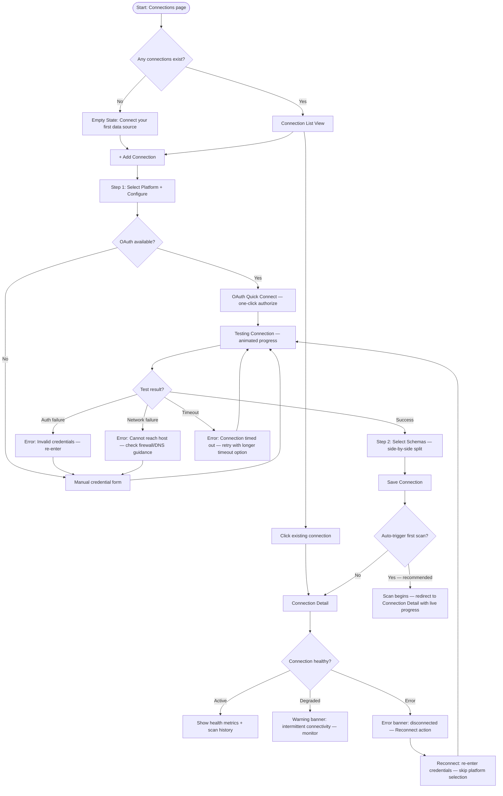
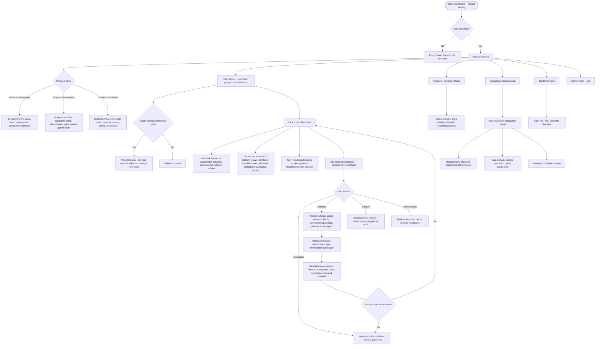
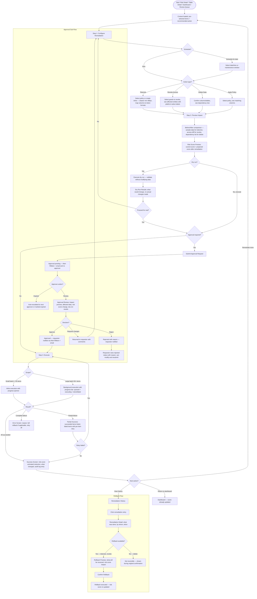

```mermaid
flowchart TD
    A([Start: Dashboard — default landing]) --> A0{First time?}
    A0 -->|Yes| A1[Onboarding Dashboard — progress tracker to first risk score]
    A0 -->|No| A2{Alert ribbon active?}
    A2 -->|Yes| A3[Persistent alert: risk increase / scan failure / compliance change]
    A2 -->|No| B

    A3 --> B[Risk Dashboard with View Toggle]

    B --> B1[View Toggle: Executive / Governance / Operations]

    subgraph executive["Executive View (Marcus)"]
        C1[Risk Score Gauge — animated, 0-100]
        C2[30-Day Trend Chart — line graph with key events marked]
        C3[Protection Coverage — donut: protected vs unprotected %]
        C4[Compliance Summary — one card per regulation: compliant/partial/non-compliant]
        C5[Quick Actions — top 3 recommended next steps]
    end

    subgraph governance["Governance View (Priya)"]
        D1[Classification Review Queue Summary — N items pending, breakdown by confidence]
        D2[Regulation Compliance Cards — detailed, with gap counts]
        D3[Policy Coverage — which policies are active, what they cover]
        D4[Recent Classification Decisions — audit trail]
        D5[Quick Actions — review queue, remediate gaps, generate report]
    end

    subgraph operations["Operations View (Jordan)"]
        E1[Connection Health — all connections with status badges]
        E2[Scan Status — running, last completed, next scheduled]
        E3[Scan Freshness Heatmap — Y: connections by platform, X: time buckets, color: freshness]
        E4[System Alerts — failures, timeouts, schema drift]
        E5[Quick Actions — reconnect, re-scan, view failures]
    end

    B1 -->|Executive| executive
    B1 -->|Governance| governance
    B1 -->|Operations| operations

    C1 --> F[Click: Risk Detail — Flow 3]
    C3 --> G[Click: Data Catalog filtered to unprotected]
    C4 --> H[Click: Regulation Detail]
    C5 --> I[Click: Navigate to recommended action]
    D1 --> J[Click: Classification Review Queue — Flow 2]
    D2 --> H
    E1 --> K[Click: Connection Detail — Flow 1]
    E2 --> L[Click: Scan Detail — Flow 2]

    B --> M[Activity Feed — filterable, live-updating]
    M --> M1[Filter: scans / classifications / remediations / policies / system]

    B --> N[Export & Reports]
    N --> N1[Generate Report Now: Executive Summary / Compliance Audit / Risk Trend]
    N --> N2[Schedule Report — modal: template, frequency, recipients, format]
    N --> N3[Download: PDF / CSV]

    B --> S[Universal Search — Cmd+K]
    S --> S1[Search overlay with inline results grouped by type]
    S1 --> S2[Click result: navigate to entity detail]
```

# Data Security Product — UX Flows v3

## Changelog: v2 → v3

<!-- Summary of all changes made in response to the design critique and unaddressed research findings -->

### Pre-Wireframe Requirements (Blocking)

1. **Approval Workflow for Remediation** — Added as Flow 4 sub-flow. New "Approvals" tab on Remediation page. Defined approval states (Requested > Under Review > Approved/Rejected > Executed), notification method (Alert Ribbon + email), and approver review content (impact preview, affected data, risk score change). Added 3 new screens: Approval Request, Approval Review, Approval Queue. Added Mermaid flow diagram.
2. **Classification Rules** — Added to Flow 2 as a "Rules" tab within the Review Queue. Defined rule specifications (column name pattern, regex, sample value match, classification to apply), rule application behavior (auto-applied to future scans, existing unreviewed matches flagged), and interaction with manual reviews (rules suggest, users confirm). Added 3 new screens: Classification Rules List, Create Rule, Rule Detail.
3. **Classification Reasoning** — Updated Flow 2 Review Queue. Every item now shows (on expand or tooltip) pattern match type, confidence score breakdown, and similar classifications from other tables.
4. **Search Results Screen** — Added to Flow 6. Defined searchable entity types, result grouping with count badges, result item layout, Cmd+K keyboard shortcut, and overlay behavior. Added Universal Search screen to inventory.
5. **Onboarding Component Architecture** — Updated Flow 7. Documented shared component approach with `guidedMode` flag. Added component mapping notes per screen. Added "Skip to Dashboard" on Welcome. Designed Marcus's interactive demo path with sample data. Defined recommended monitoring setup for low-risk scores.

### Unaddressed Research Findings

6. **Rec 2.4: Cross-table classification consistency checker** — Added to Flow 2 Review Queue as a "Consistency" tab showing cross-table conflicts and inconsistencies.
7. **Rec 4.4: Scheduled remediation execution** — Added maintenance window scheduling to Flow 4 Configure step. Remediation can be scheduled for off-peak windows.
8. **Rec 3.5: Platform-specific access display** — Updated Flow 3 Risk Detail Access Analysis tab to show platform-native identifiers (Snowflake roles, AWS IAM policies) instead of generic labels.

### Per-Flow Suggestions from Critique

9. **Flow 1**: Schema selection rendered as side-by-side split layout. Added connection groups for 20+ connections.
10. **Flow 2**: Clarified Review Queue vs Data Catalog Classifications tab relationship. Defined scan schedule management location (Connection Detail Settings tab + Scans page).
11. **Flow 3**: "What Changed?" now shows all individual changes (not just net delta). Added filtering to Risk Simulation.
12. **Flow 4**: Deferred Remediation Plans to v2 milestone (documented decision). Specified inline policy creator minimum drawer width (480px). Added scheduled execution with maintenance windows.
13. **Flow 5**: Added regulation-aware defaults in token config step. Clarified Template Gallery persistence (always accessible from Policy List). Defined impact of disabling active policy (enforcement paused, columns remain tokenized, warning shown).
14. **Flow 6**: Defined visual hierarchy for global elements (z-index ordering). Specified Scan Freshness Heatmap axes (connections x time). Defined report scheduling as modal dialog.
15. **Flow 7**: Added "Skip to Dashboard" for expert users. Defined Marcus demo path with sample data. Defined low-risk monitoring setup (scheduled weekly re-scan, alert config, dashboard preference).

### Screen Count Impact

| Flow | v2 Screens | v3 Screens | Change |
|------|-----------|-----------|--------|
| Flow 1 | 4 | 4 | 0 |
| Flow 2 | 7 | 10 | +3 (Classification Rules List, Create Rule, Rule Detail) |
| Flow 3 | 4 | 4 | 0 |
| Flow 4 | 8 | 11 | +3 (Approval Request, Approval Review, Approval Queue) |
| Flow 5 | 8 | 8 | 0 |
| Flow 6 | 5 | 6 | +1 (Universal Search) |
| Flow 7 | 8 | 9 | +1 (Marcus Demo) |
| **Total** | **44** | **52** | **+8** |

---

## Product Overview

**Product**: Standalone data security SaaS that helps companies discover, classify, and secure sensitive data across their infrastructure.

**The Five-Stage Loop**: Discover > Classify > Assess > Remediate > Track

**Primary Users**:
- **Jordan (Data Engineer)**: Manages connections, runs scans, monitors infrastructure. Expects dense, technical UIs. Connection-centric, pipeline-aware.
- **Priya (Governance Analyst)**: Defines policies, reviews classifications, tracks compliance. Wants clear workflow queues, not alert firehoses.
- **Marcus (VP Security)**: Consumes dashboards, risk scores, compliance reports. Needs one-page summaries and improvement metrics.

**Classification model**: Guided semi-automatic — system suggests, users confirm or override.

---

## Flow 1: Data Source Connections (Refined)

**Goal**: Connect external data platforms so the system can scan and ingest metadata.
**Stage**: Discover
**Primary persona**: Jordan (Data Engineer)

### What Changed and Why

- **Combined Select Platform + Configure into a single step.** The platform selection is a simple card click that reveals the credential form inline, cutting one full wizard step. Competitors like Atlan achieve 4-6 week time-to-value partly through reduced setup friction.
- **Added "Quick Connect" path for OAuth-enabled platforms.** Snowflake and BigQuery support OAuth. Offering a one-click OAuth path alongside manual credentials removes 60% of the configuration form for those platforms.
- **Merged Review & Save into the schema selection step.** A collapsible summary panel on the schema selection screen eliminates a dedicated review page. The user sees what they picked as they pick it.
- **Added network error recovery.** The original flow only handled credential errors on test. Now handles DNS resolution failure, firewall blocks, and timeout separately with targeted guidance.
- **Added "Reconnect" flow for broken connections.** Existing connections that lose connectivity now surface a reconnect action that skips platform selection and goes straight to credential re-entry.
- **Added connection health polling with degraded state.** Connections are not just "active" or "error" — they can be "degraded" (slow response, intermittent timeouts). This prevents false-alarm disconnection badges.
- **Added persona-specific entry points.** Jordan sees technical connection health metrics (latency, query count). Priya sees schema coverage and classification status. Marcus does not interact with this flow directly.

<!-- v3: Schema selection as side-by-side split layout per critique Flow 1 suggestion -->
- **Schema selection uses a side-by-side split layout.** Left panel: schema/database tree with checkboxes. Right panel: live-updating summary showing selected schemas, table counts, and estimated scan time. This replaces the collapsible summary panel with a persistent spatial layout that reduces cognitive load during large selection operations.

<!-- v3: Connection groups for 20+ connections per critique Flow 1 suggestion -->
- **Connection List supports grouping for scale.** When a user has 20+ connections, the list view offers groupable columns (by platform, status, environment tag). Users can tag connections with environment labels (Production, Staging, Dev) and group by tag. Collapsed groups show aggregate health status.

### Refined Flow Diagram



### Updated Screen Inventory

| Screen | Purpose | Entry From | Key Content | Actions | Exits To | Page Type |
|--------|---------|------------|-------------|---------|----------|-----------|
| **Connection List** | Browse all connected data sources | Sidebar nav | Table: name, platform icon, status badge (active/degraded/error), last scan, schema count, classification coverage %. Groupable by platform/status/environment tag when 20+ connections. Aggregate health bar at top | + Add Connection, filter by platform/status, bulk reconnect, group toggle | Connection Detail, Add Connection | List view |
| **Add Connection — Platform + Configure** | Select platform and enter credentials in one step | Connection List | Platform card grid (top), credential form (bottom, appears on card click). OAuth button for supported platforms | Test Connection, Quick Connect (OAuth), Cancel | Test result | Wizard (2-step) |
| **Add Connection — Select Schemas** | Choose databases/schemas + confirm | Successful test | Side-by-side split: Left panel — tree view with checkboxes. Right panel — live summary showing platform, host, selected count, estimated scan time, and "Save + Start Scan" CTA | Save + Start Scan (primary), Save Only (secondary), Back | Connection Detail | Wizard (2-step) |
| **Connection Detail** | View connection health and manage | Connection List, wizard completion | Tabs: Overview (health metrics, latency chart), Schemas (browsable tree), Scan History (list), Settings (credentials, scan schedule). Status badge prominent | Edit, Reconnect, Trigger Scan, Disable, Delete | Schema/Table Detail, Scan Progress | Detail view |

<!-- v3: Schema selection layout updated to side-by-side split per critique -->
<!-- v3: Connection List updated with grouping for 20+ connections per critique -->

### Edge Cases (Updated)

| Category | Scenario | Design Response |
|----------|----------|-----------------|
| Empty state | No connections yet | Guided empty state with platform logos and "Connect in under 2 minutes" promise |
| Auth error | Credentials invalid | Inline error on credential form with specific reason (wrong password, expired token, insufficient permissions) |
| Network error | Host unreachable | Separate error state with checklist: "Check that the hostname is correct, your firewall allows outbound connections on port 443, and the service is not in maintenance" |
| Timeout | Test takes > 30s | Show elapsed time counter. At 30s offer "Retry with extended timeout (60s)" option |
| Degraded | Intermittent connectivity | Yellow "degraded" badge. Health tab shows latency chart with spikes highlighted. "This may affect scan reliability" warning |
| Reconnect | Previously working connection fails | "Reconnect" button on error banner. Pre-fills platform and host, only asks for new credentials |
| Permission | Read-only user | All mutation buttons disabled with tooltip. Connection list and detail visible |
| Destructive | Delete connection with data | Two-step confirmation: acknowledge data loss count, type connection name to confirm |
| Interruption | User closes browser mid-wizard | Draft saved to localStorage. On return, toast: "Resume setting up your Snowflake connection?" |
| Scale | 50+ connections | Pagination, platform/status filters, search. Connection health summary bar at top (12 active, 2 degraded, 1 error). Group by platform or environment tag |

### Cross-Flow Improvements

| Connection Point | Improvement |
|-----------------|-------------|
| Connection > Scan | "Save + Start Scan" is the primary CTA, making the transition to Flow 2 the default happy path. Eliminates the decision point of "should I scan now?" |
| Connection > Data Catalog | Schema tree in Connection Detail links directly to Table Detail in Data Catalog, maintaining context |
| Dashboard > Connection | Dashboard health widget shows connection status summary. Click routes to Connection List filtered to problem connections |
| Onboarding > Connection | Flow 7 (onboarding) feeds directly into this flow with pre-selected platform based on signup questionnaire |

---

## Flow 2: Data Scanning & Classification (Refined)

**Goal**: Scan connected data sources, ingest metadata, and classify sensitive data with guided semi-automatic classification.
**Stage**: Discover + Classify
**Primary personas**: Jordan (scan operations), Priya (classification review)

### What Changed and Why

- **Split the flow into two clear phases: Scan (Jordan) and Review (Priya).** The original flow mixed scanning operations with classification review. These are often done by different people at different times. The scan phase is Jordan's domain; the classification review queue is Priya's. Each gets a dedicated entry point and optimized interface.
- **Added a Classification Review Queue.** Instead of forcing users to navigate Data Catalog > Table Detail > review columns, Priya gets a dedicated "Review Queue" that surfaces all pending classifications sorted by confidence (lowest first). This is the single biggest UX improvement — Varonis's 4.9/5 rating comes partly from surfacing actionable items, not making users hunt for them.
- **Added smart bulk actions with confidence thresholds.** "Accept all above 90% confidence" was mentioned in v1 edge cases but not in the flow. Now it is a first-class action in the review queue with a preview of what will be accepted.
- **Added scan scheduling.** The original flow only supported manual scan triggers. Now supports recurring schedules (daily, weekly) — essential for continuous monitoring that competitors like Cyera offer.
- **Added background scan with notification.** Large scans (10K+ tables) run in the background. A sidebar badge shows active scans, and the user gets an in-app notification + optional email on completion.
- **Added "Schema Drift" detection as a scan sub-type.** When a re-scan detects schema changes (new tables, dropped columns, type changes), these are surfaced as a dedicated "Changes since last scan" summary before classification review.
- **Added classification conflict resolution.** When an override conflicts with a policy or regulation mapping, the user sees the conflict immediately rather than discovering it later in the risk assessment.

<!-- v3: Added Classification Rules per critique pre-wireframe req #2 -->
- **Added Classification Rules.** A "Rules" tab within the Review Queue allows users to define reusable classification rules. Rules specify patterns (column name regex, data pattern match, sample value match) and the classification to apply. Rules auto-apply to future scan results, and existing unreviewed items matching a rule are flagged with the rule's suggestion. Rules suggest — users still confirm. This evolves guided classification from purely reactive to proactive, addressing research rec 2.6.

<!-- v3: Added Classification Reasoning per critique pre-wireframe req #3 -->
- **Added Classification Reasoning display.** Every Review Queue item now shows (on expand or tooltip) why the system suggested the classification: pattern match type (column name, data pattern, sample values), confidence score breakdown (which signals contributed how much), and similar classifications (precedent from other tables). This builds trust in the guided classification model.

<!-- v3: Added Cross-table classification consistency checker per research rec 2.4 -->
- **Added Cross-table Consistency Checker.** A "Consistency" view within the Review Queue surfaces potential inconsistencies: columns with the same name classified differently across tables, columns with similar data patterns but different classifications, and tables in the same schema with divergent classification coverage. Priya can batch-resolve inconsistencies.

<!-- v3: Clarified Review Queue vs Data Catalog Classifications tab relationship per critique Flow 2 suggestion -->
- **Clarified Review Queue vs Data Catalog relationship.** The Review Queue is the workflow tool — where Priya processes pending classifications. The Data Catalog Classifications tab is the reference view — where anyone browses confirmed classifications. Pending items appear in the Review Queue only; confirmed items appear in both. The Data Catalog does not duplicate review actions. A "Review in Queue" link on unreviewed Data Catalog items navigates to the Review Queue filtered to that item.

<!-- v3: Defined scan schedule management location per critique Flow 2 suggestion -->
- **Defined scan schedule management.** Scan schedules are managed in two places: (1) Connection Detail > Settings tab — configure schedule for a single connection, and (2) Scans page — view and manage all schedules across connections in one table. The Scans page is the authoritative view; Connection Detail Settings is the per-connection shortcut.

### Refined Flow Diagram

```mermaid
flowchart TD
    subgraph scan_phase["Phase 1: Scan (Jordan)"]
        A([Start: Connection Detail / Scans page]) --> B{Scan type?}
        B -->|Manual trigger| C[Scan Running — Live Progress]
        B -->|Scheduled| B1[Configure Schedule: daily/weekly + time + maintenance window]
        B1 --> B2[Schedule Saved — next run shown]

        C --> C1[Progress: tables scanned / total, columns discovered, ETA]
        C1 --> C2{Large scan > 10K tables?}
        C2 -->|Yes| C3[Move to background — sidebar badge + notification on complete]
        C2 -->|No| C4[Stay on progress screen]

        C3 --> D{Scan result?}
        C4 --> D
        D -->|Complete| E[Scan Summary]
        D -->|Partial failure| F[Summary + Failed Tables list with per-table retry]
        D -->|Full failure| G[Error screen: reason + retry + check connection health link]
        G --> G1{Connection still healthy?}
        G1 -->|No| G2[Route to Connection Reconnect flow]
        G1 -->|Yes| C

        E --> H{Re-scan detected changes?}
        H -->|Yes| H1[Schema Drift Summary: new tables, dropped columns, type changes]
        H -->|No| I[Data Catalog updated notification]
        H1 --> I
    end

    subgraph classify_phase["Phase 2: Classification Review (Priya)"]
        I --> J([Classification Review Queue])
        J --> J0{View?}

        J0 -->|Queue tab| J1[Pending items sorted by confidence — lowest first]
        J0 -->|Rules tab| RU1[Classification Rules List]
        J0 -->|Consistency tab| CO1[Cross-table consistency view]

        J1 --> J2{Review mode?}

        J2 -->|Single column| K[Column Detail: sample values, context, suggested classification, confidence, reasoning]
        J2 -->|Table batch| L[Table Review: all columns for one table, inline accept/override/reject]
        J2 -->|Bulk action| M[Bulk Accept: set threshold, preview affected items, confirm]

        K --> K0[Expand/tooltip: Classification Reasoning]
        K0 --> K0a[Pattern match type: column name / data pattern / sample values]
        K0 --> K0b[Confidence breakdown: signal weights]
        K0 --> K0c[Similar classifications: precedent from other tables]

        K --> K1{Decision?}
        K1 -->|Accept| N[Classification Confirmed — success animation]
        K1 -->|Override| O[Override Panel: select classification + add justification note]
        K1 -->|Reject| P[Mark Not Sensitive — confirm if confidence was > 70%]

        O --> O1{Conflicts with existing policy?}
        O1 -->|Yes| O2[Conflict Warning: show affected policy + regulation, require acknowledgment]
        O1 -->|No| N

        L --> N
        M --> M1[Preview: "42 columns will be accepted as suggested. 3 below threshold excluded."]
        M1 --> N
        P --> N

        N --> Q[Risk Score Recalculating — brief animation]
        Q --> R[Updated score shown inline — delta displayed]

        RU1 --> RU2{Action?}
        RU2 -->|Create rule| RU3[Create Rule: name, pattern type, regex/match, classification to apply, scope]
        RU2 -->|Edit rule| RU4[Rule Detail: matches found, suggestions generated, confirm/adjust]
        RU3 --> RU1
        RU4 --> RU1

        CO1 --> CO2[Inconsistencies listed: same-name columns with different classifications, similar patterns diverging]
        CO2 --> CO3{Resolve?}
        CO3 -->|Batch align| CO4[Apply consistent classification to selected columns]
        CO3 -->|Dismiss| CO1
    end
```

### Updated Screen Inventory

<!-- v3: Updated Review Queue entry to include classification reasoning display per critique req #3 -->
<!-- v3: Added Classification Rules screens per critique req #2 -->
<!-- v3: Added Consistency view per research rec 2.4 -->

| Screen | Purpose | Entry From | Key Content | Actions | Exits To | Page Type | Primary Persona |
|--------|---------|------------|-------------|---------|----------|-----------|-----------------|
| **Scan Progress** | Real-time scan status | Trigger scan, schedule | Progress bar with %, tables scanned/total, columns discovered counter (animated), ETA, elapsed time | Cancel, Move to Background | Scan Summary | Progress view | Jordan |
| **Scan Summary** | What was found | Scan completion | Cards: total tables, total columns, sensitive columns by category (PCI/PII/PHI), new vs previously classified, schema drift count | View Review Queue, Re-scan, View Data Catalog | Review Queue, Data Catalog | Summary view | Jordan |
| **Schema Drift Summary** | Changes since last scan | Scan summary (re-scans only) | Table: change type (new/dropped/modified), item name, impact on classifications | Acknowledge, Re-classify affected | Review Queue | Summary view | Jordan/Priya |
| **Classification Review Queue** | Centralized review workflow | Scan summary, sidebar nav, notification | Three tabs: Queue (pending items), Rules, Consistency. Queue list: column name, table, connection, suggested classification, confidence %, sample (masked). Each item expandable to show classification reasoning: pattern match type, confidence signal breakdown, similar classifications from other tables. Sorted by confidence ascending. Filter by: connection, classification type, confidence range, rule-suggested | Accept, Override, Reject (single), Bulk Accept with threshold, Filter, Create Rule | Column Detail, Table Review, Create Rule | Queue/list view with tabs | Priya |
| **Table Review** | Review all columns for one table | Review Queue (group by table) | Column list with inline actions. Confidence bar per column. Bulk select. Sample values (masked, click to reveal). Classification reasoning tooltip per column | Accept All, Accept Above Threshold, Override, Reject per column | Review Queue | Classification review table | Priya |
| **Data Catalog** | Browse all scanned data assets | Sidebar nav | Table: schema, table name, column count, classified %, sensitivity level, last scanned. Filter bar: connection, sensitivity, review status. Unreviewed items show "Review in Queue" link | Search, Filter, Click row | Table Detail | List view | Priya/Jordan |
| **Table Detail** | Column-level view of one table | Data Catalog, Review Queue | Column list: name, type, classification, confidence, status badge, sample. Tabs: Classifications, Access, Lineage, History | Accept/Override/Reject, Remediate column, View access | Remediation, Data Catalog | Detail view | Priya |
| **Classification Rules List** | Manage classification rules | Review Queue "Rules" tab | Table: rule name, pattern type (column name/regex/sample match), classification applied, match count, auto-applied count, status (active/paused). Filter by classification type | + Create Rule, Edit, Pause/Resume, Delete | Create Rule, Rule Detail | List view | Priya |
| **Create Rule** | Define a new classification rule | Rules List "+ Create Rule" | Form: rule name, pattern type selector (column name pattern, regex, sample value match), pattern input with live preview of matching columns, classification to apply (dropdown), scope (all connections / specific connections), auto-apply toggle | Save Rule, Test Rule (preview matches), Cancel | Rules List | Form view | Priya |
| **Rule Detail** | View and manage a single rule | Rules List click row | Rule definition summary, match history (columns matched, when), suggestions generated vs confirmed/rejected ratio, matched columns list with current classification status | Edit Rule, Pause/Resume, Delete, View Matches in Queue | Rules List, Review Queue (filtered) | Detail view | Priya |

### Edge Cases (Updated)

| Category | Scenario | Design Response |
|----------|----------|-----------------|
| Empty state | No scans run | Review Queue shows: "No classifications to review yet. Run your first scan to discover sensitive data." + link to Connections |
| Background scan | Scan takes > 15 minutes | Auto-moves to background. Sidebar "Scans" nav item shows badge with count of running scans. Toast on completion |
| Partial failure | Some tables failed | Summary highlights failures. Per-table retry button. "Retry all failed" bulk action. Successful results are usable immediately |
| Full failure | Scan completely fails | Check connection health first. If connection is broken, route to reconnect. If connection is fine, show error details + retry |
| Confidence | Below 60% confidence | Red warning badge. These items appear first in queue. Tooltip: "Low confidence — manual review recommended" |
| Confidence | Above 95% confidence | Green badge. Suggested for auto-accept in bulk action. Still reviewable individually |
| Scale | 10K+ columns pending | Bulk accept with confidence threshold. Pagination. Progress indicator: "247 of 10,342 reviewed" |
| Conflict | Override conflicts with policy | Inline warning at override time: "This conflicts with your PCI Compliance Policy. Proceed anyway?" + require justification |
| Schema drift | Columns dropped since last scan | "3 previously classified columns no longer exist. Classifications archived." Notification, not blocker |
| Stale | No scan in 30+ days | Warning badge on connection in list. Dashboard alert. Suggested re-scan |
| Network | Connection drops mid-scan | Partial results saved. Error banner: "Scan interrupted at 67%. Resume scan to continue from where it stopped." Resume action |
| Audit | Need to track who classified what | Every accept/override/reject logged with user, timestamp, previous value, justification (if override) |
| Rules | Rule matches column already manually classified | Rule does not override manual classifications. Only applies to unreviewed items. Tooltip: "This column was manually classified — rule skipped" |
| Rules | Two rules match the same column | Higher-priority rule wins (rules have a priority order). Conflict shown in Rule Detail with link to adjust priority |
| Consistency | Same-name column classified differently across tables | Consistency tab flags the discrepancy. Priya can batch-align or dismiss with justification |

<!-- v3: Added rules and consistency edge cases per critique reqs #2 and research rec 2.4 -->

### Cross-Flow Improvements

| Connection Point | Improvement |
|-----------------|-------------|
| Connection > Scan | "Save + Start Scan" in Flow 1 feeds directly into the scan progress screen. No intermediate steps |
| Scan > Review Queue | Scan completion notification includes "Review N classifications" CTA that deep-links to the queue filtered to that scan |
| Review Queue > Risk | Every classification decision triggers an inline risk score delta preview: "+2 points" or "-5 points" so Priya sees the risk impact of her decisions in real time |
| Review Queue > Remediation | Columns classified as high-sensitivity show a "Remediate Now" shortcut directly in the queue, skipping the Data Catalog intermediate |
| Data Catalog > Table Detail | Breadcrumb navigation preserves filter state so the user can return to their filtered catalog view |
| Rules > Review Queue | When a rule is created, matching unreviewed items in the Queue tab show a "Rule suggested" badge with the rule name. Priya can bulk-confirm rule suggestions |
| Consistency > Review Queue | Resolving a consistency issue updates all affected items in the Queue and Data Catalog simultaneously |

---

## Flow 3: Risk Assessment & Scoring (Refined)

**Goal**: Evaluate risk based on sensitive data exposure, access patterns, and regulation requirements.
**Stage**: Assess
**Primary personas**: Marcus (executive view), Priya (compliance detail), Jordan (technical drill-down)

### What Changed and Why

- **Added persona-specific dashboard views.** Marcus sees the executive summary (score, trend, coverage %). Priya sees the compliance-focused view (regulation cards, gap analysis). Jordan sees the technical view (connection health, scan freshness, access anomalies). Same data, different emphasis — toggled via a view selector, not separate pages. This avoids the Wiz problem of security-team-only UX.
- **Added risk score animation on entry.** When the dashboard loads, the risk score animates from 0 to the current value (like a speedometer). This creates a visceral "moment of truth" and makes score changes feel tangible. The 30-day trend line draws in with the same animation.
- **Added "What changed?" summary when risk score shifts.** Instead of just showing a delta arrow, the dashboard explains why: "Risk increased by 8 points: 12 new PII columns discovered, 4 access grants added." Actionable, not just informational.
- **Added risk score simulation.** Users can see "If I remediate these 5 items, my score would drop to X." This preview-before-action pattern drives remediation adoption. No competitor offers this — it is the UX equivalent of Wiz's attack path visualization but for risk reduction.
- **Added "Snooze with reason" for acknowledged risks.** The original flow had "snooze" but no accountability. Now requires a reason and a review date. Snoozed items resurface automatically and appear in compliance reports.
- **Removed the separate Access Analysis screen.** Merged access analysis into Risk Detail as a tab. The separate screen created unnecessary navigation depth. Wiz's security graph drill-downs work because they stay in-context; we should too.
- **Added real-time risk recalculation indicator.** When classifications change (in Flow 2), the dashboard shows a brief "Recalculating..." state with a subtle pulse animation, then reveals the new score with a delta.

<!-- v3: "What Changed?" shows all individual changes per critique Flow 3 suggestion -->
- **"What Changed?" now itemizes all individual changes.** Instead of showing only the net delta ("Risk increased by 8 points"), the summary lists every contributing change: "+3 from 12 new PII columns discovered, +2 from 4 new access grants, -1 from 2 columns tokenized, +4 from stale scan on Snowflake Prod." Users see the full picture, not a collapsed net number. Each line item is clickable to navigate to the source.

<!-- v3: Added filtering to Risk Simulation per critique Flow 3 suggestion -->
- **Risk Simulation supports filtering.** The simulation panel now includes filters: by connection, by classification type, by remediation action type. Users can simulate "What if I tokenize all PCI columns in Snowflake?" without manually selecting each item. Filter selections update the projected score in real time.

<!-- v3: Platform-specific access display per research rec 3.5 -->
- **Access Analysis shows platform-native identifiers.** The Risk Detail Access Analysis tab now displays platform-specific access information instead of generic labels. For Snowflake: roles (ACCOUNTADMIN, SYSADMIN, custom roles), warehouses, database privileges. For AWS: IAM policies, S3 bucket policies, RDS security groups. For Databricks: workspace permissions, cluster access. For BigQuery: dataset-level IAM bindings, authorized views. Each access entry links to the source platform's documentation for that permission type.

### Refined Flow Diagram



### Updated Screen Inventory

| Screen | Purpose | Entry From | Key Content | Actions | Exits To | Page Type | Primary Persona |
|--------|---------|------------|-------------|---------|----------|-----------|-----------------|
| **Risk Dashboard** | At-a-glance risk posture | Login (default), sidebar | Risk score gauge (animated), trend sparkline, "What Changed" summary (itemized, all individual changes with click-through links), protection donut, compliance cards, top risks, activity feed. View toggle: Executive/Governance/Technical | Time range filter, View toggle, Export, Drill-down | Risk Detail, Data Catalog, Remediation, Regulation Detail | Dashboard | All (view-dependent) |
| **Risk Detail** | Deep dive into risk area | Dashboard drill-down | Tabbed: Risk Factors, Access Analysis (platform-native: Snowflake roles, AWS IAM policies, Databricks workspace perms, BigQuery IAM bindings), Regulation Mapping, Recommendations. Risk simulation panel. Snooze/Acknowledge actions | Remediate, Simulate, Snooze, Acknowledge, Export | Remediation, Risk Dashboard | Detail view with tabs | Priya/Jordan |
| **Risk Simulation** | Preview remediation impact | Risk Detail "Simulate" | Filterable item list (by connection, classification type, remediation action type). Checkbox selection with live-updating projected score. Before/after comparison with itemized delta breakdown. Filter presets: "All PCI in Snowflake," "All unprotected PII" | Proceed to Remediate, Filter, Clear, Cancel | Remediation | Interactive panel (drawer) | Priya |
| **Regulation Detail** | Per-regulation compliance | Dashboard compliance card | Requirements checklist (pass/fail with evidence links), affected data inventory, gap analysis, remediation suggestions | Generate report, Remediate gaps, Export | Remediation, Report generation | Detail view | Priya |

<!-- v3: Updated Risk Detail Access Analysis to show platform-specific identifiers per research rec 3.5 -->
<!-- v3: Updated Risk Simulation with filtering per critique Flow 3 suggestion -->
<!-- v3: Updated What Changed to show all individual changes per critique Flow 3 suggestion -->

### Risk Score Model (Unchanged)

| Score Range | Label | Token | Animation |
|-------------|-------|-------|-----------|
| 0-25 | Low Risk | `--sds-status-success-*` | Gauge fills to green zone, celebratory subtle pulse |
| 26-50 | Moderate Risk | `--sds-status-warning-*` | Gauge fills to yellow zone |
| 51-75 | High Risk | `--sds-status-error-*` (lighter) | Gauge fills to orange zone |
| 76-100 | Critical Risk | `--sds-status-error-*` | Gauge fills to red zone, persistent glow |

### Edge Cases (Updated)

| Category | Scenario | Design Response |
|----------|----------|-----------------|
| Empty state | No classified data | Dashboard shows empty gauge at 0 with CTA steps: "1. Connect data source 2. Run scan 3. Review classifications" with progress indicator |
| Loading | Risk recalculating after classification changes | Gauge shows pulse animation, "Recalculating..." label. Partial results shown, full update within seconds |
| Score jump | Risk increased significantly | Alert banner: "Risk score increased by 23 points" with "What Changed" expansion showing all individual contributing changes. Persists until dismissed or addressed |
| Score drop | Risk decreased after remediation | Celebratory micro-interaction: score ticks down with green flash. "What Changed" shows each remediation action and its point impact |
| Simulation | User simulates remediation | Drawer panel shows projected score with filters. Does not modify anything until user confirms and enters remediation flow |
| Staleness | Data > 30 days old | Warning banner: "Risk score based on data from 45 days ago. Re-scan recommended." + one-click re-scan trigger |
| Conflict | Regulation requirements conflict | Flag in Regulation Detail: "Conflict: GDPR Article 17 (right to erasure) vs. HIPAA 45 CFR 164.530 (6-year retention). Manual resolution required." Link to guidance |
| Snooze expiry | Snoozed risk reaches review date | Re-surfaces in top risks list with "Snooze expired" badge. Notification sent to original snoozer |
| Executive | Marcus needs board-ready report | Export > Executive PDF: one page, risk score, trend, coverage %, top 3 risks, compliance status |
| Permission | Read-only user views risk | All data visible. Remediate/Snooze/Acknowledge buttons show "Request access" tooltip |
| Access display | Platform not yet supported for native access | Falls back to generic access labels with note: "Platform-specific access details coming soon for [platform]" |

### Cross-Flow Improvements

| Connection Point | Improvement |
|-----------------|-------------|
| Classification > Risk | Risk score delta shown inline during classification review (Flow 2). Dashboard auto-refreshes when user navigates back |
| Risk > Remediation | "Remediate" action from Risk Detail carries full context (which risk, which items, recommended action) into the Remediation flow — no re-selection needed |
| Risk Simulation > Remediation | Simulation selections (including filter criteria) carry over as pre-selected items in the remediation flow |
| Dashboard > All Flows | Every dashboard widget is a drill-down entry point. No dead-end widgets. Every metric links to its source data |
| Onboarding > Dashboard | First-time dashboard shows the animated empty-to-scored transition when first risk score is calculated |

---

## Flow 4: Remediation (Refined)

**Goal**: Apply fixes to reduce risk — tokenize, revoke access, delete data, or apply policies.
**Stage**: Remediate
**Primary personas**: Priya (governance-driven remediation), Jordan (technical execution)

### What Changed and Why

- **Added remediation context preservation.** Entry from Risk Detail, Table Detail, or Dashboard now carries pre-selected items and recommended action type. The user does not re-navigate or re-select what was already identified. This is the #1 friction point in competitor DSPM tools that "route to tickets" (Cyera, BigID) rather than executing in-context.
- **Consolidated remediation into a single 3-step pattern: Configure > Preview > Execute.** The original flow had 4 different sub-flows (tokenize, revoke, delete, apply policy) each with different step counts. Now they all share the same 3-step pattern with type-specific content in each step. This reduces cognitive load and makes the UI consistent.
- **Added dry-run mode for all remediation types.** Previously only mentioned for tokenization. Now all four types support a dry-run that shows exactly what will change without executing. This addresses the "production data anxiety" that slows adoption of automated remediation.
- **Added batch remediation with progress tracking.** Remediating 500+ columns now shows a progress bar with per-item status (queued > executing > done/failed). Failed items can be retried individually. Similar to Varonis's automated remediation approach but with human oversight.
- **Added remediation rollback as a first-class screen, not just an option.** Rollback is critical for trust. It now has its own screen accessible from Remediation History, showing exactly what will be reversed and the risk score impact.
- **Added success celebration with risk score delta.** When remediation completes, the success screen shows an animated risk score reduction (78 > 65) with a green trend animation. This closes the loop and makes the value tangible.

<!-- v3: Added Approval Workflow per critique pre-wireframe req #1 -->
- **Added Approval Workflow as a sub-flow.** An "Approvals" tab on the Remediation page surfaces all remediations requiring approval. Approval is required when: (a) the user lacks execute permissions, (b) production data is affected and org policy requires sign-off, or (c) the remediation scope exceeds a configurable threshold (e.g., 100+ columns). The workflow follows: Requested > Under Review > Approved/Rejected > Executed. Approvers see impact preview, affected data inventory, risk score change projection, and dry-run results (if available). Notifications via Alert Ribbon + email. Approval requests expire after a configurable period (default 7 days) with escalation.

<!-- v3: Added scheduled remediation execution per research rec 4.4 -->
- **Added scheduled remediation execution.** In the Configure step, users can choose to execute immediately or schedule for a maintenance window. Schedule options: specific date/time, next maintenance window (configurable per connection in Connection Detail Settings), or recurring (for policy enforcement). Scheduled remediations appear in the Remediation History with "Scheduled" status and can be cancelled before execution.

<!-- v3: Deferred Remediation Plans per critique Flow 4 suggestion -->
- **Deferred Remediation Plans (staged rollouts) to v2 milestone.** The concept of grouped, staged remediation (dev > staging > prod with approval gates between stages) is documented as a future enhancement. The current approval workflow provides the foundation — staged rollouts will build on top of per-remediation approvals. Deferred because: (a) approval workflow is the prerequisite, (b) environment tagging (Flow 1 connection groups) needs adoption data first, and (c) the 3-step pattern handles individual remediations well without staged complexity.

<!-- v3: Specified inline policy creator minimum drawer width per critique Flow 4 suggestion -->
- **Specified inline policy creator drawer width.** The inline policy creator drawer has a minimum width of 480px. On viewports narrower than 960px, the drawer becomes a full-page takeover with a "Back to Remediation" breadcrumb to preserve context.

### Refined Flow Diagram



### Updated Screen Inventory

<!-- v3: Added Approval screens per critique pre-wireframe req #1 -->
<!-- v3: Added scheduled execution to Configure per research rec 4.4 -->
<!-- v3: Specified inline policy creator min width per critique Flow 4 suggestion -->

| Screen | Purpose | Entry From | Key Content | Actions | Exits To | Page Type | Primary Persona |
|--------|---------|------------|-------------|---------|----------|-----------|-----------------|
| **Configure Remediation** | Set up the remediation action | Risk Detail, Table Detail, Dashboard, Review Queue | Pre-filled from entry context. Type selector (Tokenize/Revoke/Delete/Apply Policy). Type-specific configuration form. Affected items list with checkboxes. Schedule option: Now / Specific date-time / Next maintenance window. For Revoke Access: platform-native access labels (Snowflake roles, AWS IAM) | Configure, Remove items, Switch type, Set schedule | Preview | Wizard step 1 | Priya/Jordan |
| **Preview Impact** | See what will change before executing | Configure step | Before/After comparison (type-specific). Projected risk score with animated delta. Dry-run option. Warning callouts for production data, dependencies, irreversible actions. If scheduled: shows scheduled execution time | Execute, Dry Run, Submit for Approval, Back, Edit | Execute, Dry Run Results, Approval Request | Wizard step 2 | Priya/Jordan |
| **Dry Run Results** | Validation without execution | Preview (dry run) | Simulated results: what would change, items affected, projected outcomes. No actual data modified | Proceed for Real, Submit for Approval, Back to Configure | Execute, Approval Request | Results view | Jordan |
| **Execution Progress** | Track remediation execution | Preview (execute) or Approval (approved) | Progress bar (for batches). Per-item status: queued/executing/done/failed. Elapsed time. Cancel button | Cancel (if in progress) | Success/Partial/Error | Progress view | Jordan |
| **Remediation Success** | Celebrate risk reduction | Execution complete | Animated risk score: before > after (ticking down). Items remediated count. Audit log link. "What changed" summary | Return to Dashboard, Remediate More, View History | Dashboard, Configure, History | Success celebration | Priya/Jordan |
| **Remediation History** | Audit trail | Sidebar nav, success screen | Table: date, type, user, affected items count, risk impact, status (applied/rolled back/failed/scheduled/pending approval). Filter by type/user/date/status. "Approvals" tab for approval queue | Filter, Export, Click entry for detail | Remediation Detail, Approval Queue | List view with tabs | Priya/Marcus |
| **Remediation Detail** | Single remediation record | History list | What was done, who did it, when, affected items, risk score change, rollback availability, approval chain (if applicable) | Rollback (if available), Export | Rollback Preview | Detail view | Priya |
| **Rollback Preview** | Confirm rollback | Remediation Detail | What will be reversed, items affected, projected risk score after rollback | Confirm Rollback, Cancel | Remediation History | Confirmation view | Priya/Jordan |
| **Approval Request** | Submit remediation for approval | Preview Impact (when approval required) | Summary of proposed remediation: action type, affected items, risk score impact, dry-run results (if run), schedule, requestor notes field. Approver selection (auto-assigned based on scope/data owner or manual) | Submit Request, Cancel | Remediation History (pending) | Form view | Priya/Jordan |
| **Approval Review** | Approver evaluates a request | Alert Ribbon notification, email link, Approval Queue | Full remediation details: impact preview, affected data inventory with column/table/connection drill-downs, risk score change projection, dry-run results (if available), requestor notes, audit trail of request | Approve, Reject (with reason), Request Changes (with comments) | Approval Queue, Execution Progress (if approved) | Review view | Priya (approver role) |
| **Approval Queue** | View all pending approvals | Remediation History "Approvals" tab, sidebar badge | Table: request date, requestor, action type, scope (item count), risk impact, status (Requested/Under Review/Approved/Rejected/Expired), time remaining before expiry. Filter by status/requestor/action type | Review, Bulk approve (for low-risk), Export | Approval Review | List view | Priya (approver role) |

### Edge Cases (Updated)

| Category | Scenario | Design Response |
|----------|----------|-----------------|
| Destructive | Deleting data with downstream dependencies | Dependency tree visualization in preview. "3 pipelines reference this table" warning. Require typed confirmation of table name |
| Destructive | Tokenizing production data | Production data warning banner in preview. Dry-run is the default CTA for production targets. "This will modify production data" with orange warning |
| Partial failure | Some items fail during batch | Succeeded items are committed. Failed items listed with individual error reasons. "Retry Failed" bulk action. Risk score reflects partial completion |
| Rollback | Tokenization needs reversal | Available for 30 days. Rollback preview shows detokenized sample data. Risk score impact (will increase). Audit log notes rollback reason |
| Rollback | Delete needs reversal | Not available. Original confirmation step says "Deletion is permanent and cannot be reversed." Require typed confirmation |
| Permission | User can view but not execute | "Request Approval" button replaces "Execute." Routes to approval workflow |
| Batch | 500+ items | Background execution with progress tracker. Email notification on completion. Progress viewable from sidebar badge |
| Conflict | Remediation conflicts with active policy | Warning in preview: "This action conflicts with policy X. Override requires admin approval." |
| Network | Connection drops during execution | Partial results saved. Error with clear status: "23 of 50 completed before interruption." Resume button |
| Audit | Compliance requires trail | Every action (including dry runs, rollbacks, cancellations, approvals) logged with user, timestamp, items, justification |
| Concurrent | Two users remediating same items | Optimistic locking. Second user sees "These items are being remediated by [user] — started 2 minutes ago." Option to wait or choose different items |
| Approval | Approver is unavailable | Approval request expires after configurable period (default 7 days). Auto-escalates to next approver in chain. Requestor notified of escalation |
| Approval | Urgent remediation needs fast-track | "Urgent" flag on approval request. Sends push notification + email with "Urgent" subject. Approver sees urgent requests highlighted at top of queue |
| Approval | Approved remediation fails on execution | Requestor and approver both notified. Approval remains valid for retry. No re-approval needed for same scope |
| Scheduled | Maintenance window passes without execution | If connection is unhealthy at scheduled time, remediation is deferred to next window. Requestor notified. Status shows "Deferred — connection unavailable" |
| Scheduled | User cancels scheduled remediation | Cancelled before execution with audit log entry. No data modified. Status shows "Cancelled" in history |

<!-- v3: Added approval and scheduling edge cases per critique req #1 and research rec 4.4 -->

### Cross-Flow Improvements

| Connection Point | Improvement |
|-----------------|-------------|
| Risk > Remediation | Context preservation eliminates re-selection. Risk Detail "Remediate" button passes the specific risk, affected items, and recommended action type |
| Risk Simulation > Remediation | Items selected in risk simulation carry over as pre-checked items in Configure Remediation |
| Review Queue > Remediation | "Remediate Now" shortcut in classification review queue for high-sensitivity columns goes directly to Configure with the column pre-selected |
| Remediation > Dashboard | Success screen shows the dashboard score updating in real-time. "Return to Dashboard" navigates with the score delta still visible |
| Remediation > Policy | "Create New Policy" in Remediation tokenize configuration opens inline policy creator (drawer, min 480px). Returns to remediation with new policy selected |
| Remediation > History | All completed remediations immediately appear in history. History is filterable by the originating flow (from risk, from review queue, from dashboard) |
| Remediation > Approval | When approval is required, the flow seamlessly transitions from Preview to Approval Request. Approved remediations resume at Execute step without re-configuration |
| Approval > Alert Ribbon | Pending approval requests surface in the Alert Ribbon for approvers. Count badge on Remediation sidebar nav shows pending approvals |

---

## Flow 5: Tokenization Policy Management (Refined)

**Goal**: Define and manage reusable tokenization policies that map data classifications to token configurations.
**Stage**: Remediate (infrastructure)
**Primary persona**: Priya (policy definition), Jordan (technical configuration)

### What Changed and Why

- **Combined Step 1 (Basics) and Step 2 (Classifications) into a single step.** Policy name, description, regulation, and classification selection are closely related and fit on one screen. Cuts the wizard from 5 steps to 3.
- **Added policy templates.** Instead of starting from scratch, users can choose from pre-built templates: "PCI Compliance," "GDPR PII Protection," "HIPAA PHI Security," "General PII." Templates pre-fill classification rules, token formats, and scope — user customizes from there. Immuta's pre-built compliance templates (HIPAA, GDPR, CCPA) demonstrate the value of this pattern.
- **Added "Impact Preview" before policy creation.** Shows how many existing columns would match this policy and what the risk score impact would be if applied. This makes policy creation feel connected to the rest of the system rather than abstract configuration.
- **Added inline policy creation from Remediation flow.** When a user is tokenizing data and no suitable policy exists, they can create one inline (drawer, not full-page navigation) and return to remediation without losing context.
- **Added policy versioning.** Editing an active policy creates a new version. Previous versions are viewable. Diff view between versions. This provides the audit trail governance teams need.
- **Added policy testing.** Before applying a policy, users can test it against sample data to see the tokenization output. This builds confidence and reduces rollback frequency.
- **Removed "Disable" as a separate action — merged with status toggle.** Active/Disabled is now a toggle on the Policy Detail page, not a separate action in a menu. Simpler interaction pattern.

<!-- v3: Regulation-aware defaults in token config per critique Flow 5 suggestion -->
- **Added regulation-aware defaults in token configuration.** When a regulation is selected in Step 1, the token configuration step pre-fills with regulation-compliant defaults. PCI DSS: FPE (format-preserving encryption) for card numbers, reversible. GDPR: pseudonymization with hash, irreversible by default. HIPAA: FPE for identifiers, reversible with audit logging. Users can override any default — the regulation selection informs, not constrains. A "Regulation requirements" info panel shows relevant articles/sections that the defaults satisfy.

<!-- v3: Clarified Template Gallery persistence per critique Flow 5 suggestion -->
- **Template Gallery is always accessible from Policy List.** The Template Gallery is not limited to the empty state. A "Start from Template" button on the Policy List view opens the same gallery. Templates serve as accelerators at any time, not just onboarding. The empty state uses the gallery as the primary CTA; the populated state offers it as a secondary action.

<!-- v3: Defined impact of disabling active policy per critique Flow 5 suggestion -->
- **Defined impact of disabling an active policy.** Disabling an active policy pauses enforcement only — columns that are already tokenized remain tokenized. No data is detokenized on disable. The toggle confirmation shows: "Pausing this policy will stop it from being applied to newly classified columns. N currently tokenized columns will remain protected. To detokenize, use the Remediation flow." Re-enabling resumes enforcement. If new matching columns were added while disabled, a prompt offers to apply the policy to them.

### Refined Flow Diagram

```mermaid
flowchart TD
    A([Start: Policies page]) --> B{Any policies exist?}
    B -->|No| C[Empty State + Template Gallery as primary CTA]
    B -->|Yes| D[Policy List View — with "Start from Template" button]

    C --> E{Start from?}
    D --> E
    E -->|Template| E1[Choose template — pre-fills wizard with regulation-aware defaults]
    E -->|Scratch| E2[Blank wizard]
    D --> F[Click existing policy]
    F --> G[Policy Detail View]

    E1 --> H[Step 1: Basics + Classifications]
    E2 --> H
    H --> H1[Name, description, regulation dropdown, priority]
    H --> H2[Classification checkboxes: PCI/PII/PHI/Custom]

    H2 --> I[Step 2: Token Configuration — with regulation-aware defaults]
    I --> I0{Regulation selected?}
    I0 -->|Yes| I0a[Pre-fill with regulation-compliant defaults + show requirements panel]
    I0 -->|No| I0b[Blank configuration]
    I0a --> I1
    I0b --> I1
    I --> I1[Per-classification token format: FPE, hash, random, mask]
    I --> I2[Preservation rules, reversibility setting]
    I --> I3[Test against sample data — preview tokenized output]

    I3 --> J[Step 3: Scope + Review]
    J --> J1[Scope: all matching / specific connections / specific schemas]
    J --> J2[Impact preview: N columns match, projected risk score change]
    J --> J3[Summary of all settings]

    J3 --> K[Create Policy — status: Draft]
    K --> G

    G --> L{Actions}
    L -->|Apply to data| M[Select targets > Preview > Apply — enters Remediation Flow 4]
    L -->|Edit| N[Edit wizard — creates new version]
    L -->|Clone| O[Duplicate with "Copy of" name]
    L -->|Toggle active/disabled| P[Toggle with confirmation: enforcement paused, existing tokenization preserved]
    L -->|Delete| Q{Applied to data?}
    Q -->|Yes| Q1[Block: "Transfer 234 columns to another policy or detokenize first"]
    Q -->|No| Q2[Confirm deletion]

    N --> N1[Version created — diff view available]
```

### Updated Screen Inventory

| Screen | Purpose | Entry From | Key Content | Actions | Exits To | Page Type | Primary Persona |
|--------|---------|------------|-------------|---------|----------|-----------|-----------------|
| **Policy List** | Browse all tokenization policies | Sidebar nav | Table: name, regulation, classifications covered, scope, status toggle (active/draft/disabled), applied-to count, last modified. Filter by regulation/status. "Start from Template" button always visible | + Create Policy, Start from Template, filter, search | Policy Detail, Create Policy, Template Gallery | List view | Priya |
| **Template Gallery** | Quick-start policy creation | Empty state, Policy List "Start from Template", Create Policy | Cards: PCI Compliance, GDPR PII Protection, HIPAA PHI Security, General PII, Blank. Each shows what is pre-configured including regulation-aware token defaults | Select template | Wizard Step 1 | Card grid | Priya |
| **Create Policy — Basics + Classifications** | Name, regulation, and classification scope | Template or Blank | Form: name, description, regulation dropdown (informs token config defaults), priority. Classification checkbox groups (pre-filled if template) | Next, Cancel | Token Configuration | Wizard step 1/3 | Priya |
| **Create Policy — Token Configuration** | Configure tokenization rules | Basics step | Per-classification config: token format selector (FPE/hash/random/mask), preservation rules, reversibility. Regulation-aware defaults pre-filled when regulation selected, with "Regulation requirements" info panel showing relevant articles. Test panel: paste sample data, see tokenized output | Test, Next, Back | Scope + Review | Wizard step 2/3 | Jordan/Priya |
| **Create Policy — Scope + Review** | Define scope and confirm | Token Config | Scope selector (all/connections/schemas). Impact preview: matching column count, risk score projection. Full settings summary | Create Policy, Back | Policy Detail | Wizard step 3/3 | Priya |
| **Policy Detail** | View and manage a policy | Policy List | Tabs: Overview (settings summary, status toggle with disable impact explanation), Applied Data (tables/columns), Versions (history with diff), Activity Log. Impact metrics | Apply, Edit, Clone, Delete, Toggle status | Apply flow, Edit wizard | Detail view with tabs | Priya |
| **Policy Version Diff** | Compare policy versions | Policy Detail Versions tab | Side-by-side diff: changed fields highlighted. Version metadata: who changed, when, why | Revert to version, Close | Policy Detail | Diff view | Priya |
| **Inline Policy Creator** | Create policy from Remediation flow | Remediation Flow 4 (tokenize) | Drawer overlay (min width 480px, full-page takeover below 960px viewport) with condensed 3-step wizard. Same content as full wizard, drawer format. Regulation-aware defaults applied | Create + Return to Remediation | Remediation Configure step | Drawer/panel | Priya |

<!-- v3: Updated Template Gallery to be accessible from Policy List per critique -->
<!-- v3: Updated Token Config with regulation-aware defaults per critique -->
<!-- v3: Updated Policy Detail toggle with disable impact explanation per critique -->
<!-- v3: Specified inline policy creator min width 480px per critique -->

### Edge Cases (Updated)

| Category | Scenario | Design Response |
|----------|----------|-----------------|
| Empty state | No policies | Template gallery as primary CTA: "Start with a template to protect sensitive data in minutes" |
| Conflict | Two policies cover same column | Warning during scope step: "12 columns already covered by PCI Policy. This policy will take precedence (higher priority)." Priority ordering configurable |
| Regulation | Custom regulation needed | "Custom" regulation option with free-text name and description fields. No regulation-aware defaults applied for custom regulations |
| Edit | Editing active policy | Creates new version. Warning: "Changes applied to 234 columns on next policy enforcement run. Apply immediately?" |
| Delete | Policy has applied tokenization | Block deletion. Offer: "Transfer columns to another policy" or "Detokenize all columns first" |
| Template | Template does not quite fit | All template fields are editable. Template is a starting point, not a constraint. Regulation-aware defaults can be overridden per classification |
| Testing | Token format produces unexpected output | Test panel shows live preview. User can adjust format and re-test before saving |
| Version | Need to revert a policy change | Version history with diff. "Revert to version N" creates a new version with old settings |
| Inline creation | Creating from Remediation flow | Drawer slides in (480px min width). On save, new policy is auto-selected in the remediation configuration. Drawer closes, user is back in Flow 4 |
| Disable | Disabling active policy | Confirmation dialog: "Pausing enforcement. N columns remain tokenized. New matches will not be auto-protected." Re-enable prompt shows columns added while disabled |
| Regulation defaults | User overrides regulation-aware defaults | Override allowed with info note: "Your configuration differs from [regulation] recommended settings. This may affect compliance status." No blocking — informational only |

<!-- v3: Added disable and regulation defaults edge cases per critique -->

### Cross-Flow Improvements

| Connection Point | Improvement |
|-----------------|-------------|
| Policy > Remediation | "Apply Policy" on Policy Detail enters Remediation Flow 4 with the policy pre-selected. Target selection starts immediately |
| Remediation > Policy | "Create New Policy" in Remediation tokenize configuration opens inline policy creator (drawer, min 480px). Returns to remediation with new policy selected |
| Policy > Risk | Impact preview during creation shows projected risk score change. Policy Detail shows cumulative risk reduction from this policy |
| Policy > Data Catalog | "Applied Data" tab on Policy Detail links to Data Catalog filtered to columns using this policy |
| Onboarding > Policy | Flow 7 suggests creating first policy immediately after first scan reveals sensitive data, using templates |

---

## Flow 6: Risk Dashboard & Monitoring (Refined)

**Goal**: Provide at-a-glance risk visibility with trends, drill-downs, and alerts for all personas.
**Stage**: Track
**Primary persona**: Marcus (executive), Priya (compliance monitoring), Jordan (operational health)

### What Changed and Why

- **Added three persona-specific dashboard modes.** This is the core improvement. The dashboard is the most-visited screen, but Marcus, Priya, and Jordan need fundamentally different information. Instead of one dense dashboard, a view toggle switches between Executive (score + trend + coverage), Governance (compliance cards + classification queue + regulation gaps), and Operations (connection health + scan status + scan freshness). Same underlying data, different layouts and emphasis.
- **Added persistent alert ribbon.** Risk increases, scan failures, and compliance changes are not just in-page banners — they appear in a thin ribbon below the top nav that persists across all pages until addressed. This ensures Marcus sees the alert even if he is on a different page.
- **Added "Quick Actions" panel.** The dashboard now surfaces the top 3 recommended actions (e.g., "Review 42 pending classifications," "Remediate 5 critical PII columns," "Re-scan Snowflake — last scan 32 days ago"). Each is a one-click navigation to the right flow with context. This reduces the time from "seeing a problem" to "acting on it."
- **Added scheduled report delivery (email).** The original flow mentioned scheduled reports but did not detail the setup. Now: choose template, frequency (daily/weekly/monthly), recipients, and format (PDF/CSV). Audit-friendly for compliance teams.
- **Merged Protection Coverage into the main dashboard as a prominent section** rather than a drill-down destination. Coverage is one of Marcus's top 3 metrics and should be visible without a click.
- **Added real-time activity feed with filtering.** The activity feed now supports filtering by type (scans, classifications, remediations, policy changes, user actions) and is live-updating via WebSocket. This replaces the need for a separate "Recent Activity" page.
- **Added dashboard loading skeleton.** On first load, the dashboard shows skeleton cards that match the layout, filling in as data arrives. Score loads first (most important), then trend, then coverage, then compliance cards. Progressive disclosure reduces perceived load time.

<!-- v3: Added Universal Search per critique pre-wireframe req #4 -->
- **Added Universal Search (Cmd+K).** A global search overlay accessible from any page via Cmd+K keyboard shortcut or the search icon in the top nav. Searchable entity types: connections, tables, columns, policies, regulations, remediations. Results grouped by type with count badges. Each result shows: entity name, type icon, parent context (e.g., "column in users table, Snowflake Prod"), status badge. Search is an overlay with inline results — does not navigate away from the current page until a result is clicked. Debounced search with 200ms delay. Empty state shows recent searches and suggested searches.

<!-- v3: Defined visual hierarchy for global elements per critique Flow 6 suggestion -->
- **Defined visual hierarchy for global elements.** Z-index ordering from top to bottom: (1) Modal dialogs and drawers (z-1000), (2) Universal Search overlay (z-900), (3) Alert Ribbon (z-800), (4) Top navigation bar (z-700), (5) Sidebar navigation (z-600), (6) Page content (z-0). The Alert Ribbon sits between the top nav and page content, pushing content down (not overlaying). The Universal Search overlay dims the background with a semi-transparent backdrop.

<!-- v3: Specified Scan Freshness Heatmap axes per critique Flow 6 suggestion -->
- **Specified Scan Freshness Heatmap axes.** Y-axis: connections (grouped by platform). X-axis: time buckets (last 24h, 1-7 days, 7-14 days, 14-30 days, 30+ days). Cell color: green (fresh, < 7 days), yellow (aging, 7-14 days), orange (stale, 14-30 days), red (critical, 30+ days). Cell click navigates to Connection Detail for that connection. Hover shows: last scan date, table count, sensitive column count.

<!-- v3: Defined report scheduling as modal per critique Flow 6 suggestion -->
- **Report scheduling uses a modal dialog.** The "Schedule Report" action opens a modal (not a full page) with: template selector (Executive Summary, Compliance Audit, Risk Trend, Custom), frequency (daily/weekly/monthly with day/time picker), recipients (email list with team member autocomplete), format (PDF/CSV), and preview of next 3 scheduled dates. Modal width: 640px. Existing schedules are managed from the Reports list view.

### Refined Flow Diagram



### Updated Screen Inventory

<!-- v3: Added Universal Search screen per critique pre-wireframe req #4 -->

| Screen | Purpose | Entry From | Key Content | Actions | Exits To | Page Type | Primary Persona |
|--------|---------|------------|-------------|---------|----------|-----------|-----------------|
| **Risk Dashboard — Executive** | Board-ready risk overview | Login, sidebar, view toggle | Risk score gauge (animated), trend chart with event markers, protection coverage donut, compliance summary cards, quick actions | View toggle, Time range filter, Export | Risk Detail, Data Catalog, Regulation Detail | Dashboard | Marcus |
| **Risk Dashboard — Governance** | Compliance and classification focus | View toggle | Review queue summary (pending count + confidence breakdown), regulation cards with gap counts, policy coverage matrix, recent decisions | View toggle, Go to Review Queue, Generate Report | Review Queue, Regulation Detail, Reports | Dashboard | Priya |
| **Risk Dashboard — Operations** | Infrastructure health | View toggle | Connection health table, scan status (running/completed/scheduled), freshness heatmap (Y: connections by platform, X: time buckets 24h/1-7d/7-14d/14-30d/30d+, color: green/yellow/orange/red), system alerts | View toggle, Reconnect, Re-scan, View Failures | Connection Detail, Scan Progress | Dashboard | Jordan |
| **Alert Ribbon** | Persistent cross-page alerts | Auto-triggered by events | Thin banner below top nav (z-800, pushes content down): alert type icon, message, timestamp, action link. Dismissible or auto-clears on resolution. Also shows pending approval count for approvers | Click action, Dismiss | Varies by alert type | Global ribbon | All |
| **Reports** | Generate and schedule reports | Dashboard export, sidebar | Template selector, frequency settings, recipient list, format picker. History of generated reports. Schedule management | Generate Now, Schedule (opens modal), Download | PDF/Email delivery | Form + list | Priya/Marcus |
| **Universal Search** | Find any entity across the platform | Cmd+K from any page, search icon in top nav | Search overlay (z-900, semi-transparent backdrop). Debounced input (200ms). Results grouped by type with count badges: Connections (3), Tables (12), Columns (47), Policies (2), Regulations (1), Remediations (5). Each result: entity name, type icon, parent context, status badge. Empty state: recent searches, suggested searches | Type to search, Click result, Esc to close | Entity detail page (Connection Detail, Table Detail, Policy Detail, etc.) | Overlay | All |

### Edge Cases (Updated)

| Category | Scenario | Design Response |
|----------|----------|-----------------|
| Empty state | No data at all | Onboarding dashboard (Flow 7) replaces normal dashboard with progress tracker |
| Loading | Dashboard loading with large dataset | Skeleton cards in layout. Score loads first (< 1s), then trend (< 2s), then detail widgets. Progressive disclosure |
| Stale | Dashboard data > 24 hours old | "Last updated: 26 hours ago" with yellow warning. "Refresh" button and "Re-scan recommended" CTA |
| Alert | Risk score jumped 20+ points | Alert ribbon (persistent, cross-page): red, with specific cause. Dashboard score gauge shows before/after with highlighted delta |
| Alert | Scan failure | Alert ribbon (persistent): orange, with connection name and retry link |
| Alert | Compliance status changed | Alert ribbon (persistent): red for non-compliant change, with regulation name and gap detail link |
| View preference | User always uses one view | View preference saved per user. Last-used view loads by default on next visit |
| Export | Report generation takes time | "Generating report..." progress indicator. Download link emailed when ready for large reports |
| Scale | 50+ connections in operations view | Grouped by status (error first, degraded, then active). Collapsed groups for healthy connections. Search and filter |
| Real-time | Activity feed during active scan | Live-updating entries. "Scan in progress" pinned at top of feed with live progress |
| Search | No results found | "No results for [query]. Try searching for connections, tables, columns, policies, or regulations." Suggest broadening search |
| Search | Too many results | Results capped at 10 per type. "Show all N [type] results" link per group opens filtered list view |
| Search | Search while offline | Cached recent searches available. New searches show "Search requires an internet connection" |
| Report scheduling | Invalid email recipient | Inline validation on email field. "This email is not a team member. Add anyway?" confirmation |

<!-- v3: Added search edge cases per critique req #4 -->

### Cross-Flow Improvements

| Connection Point | Improvement |
|-----------------|-------------|
| Dashboard > All Flows | Quick Actions panel provides one-click navigation to the highest-priority action across all flows. Context is preserved (e.g., "Review 42 classifications" links to Review Queue filtered to that scan) |
| All Flows > Dashboard | Every flow completion (connection saved, scan complete, classification reviewed, remediation applied) triggers a dashboard data refresh. Returning to dashboard always shows current state |
| Dashboard > Reports | Report generation uses the current dashboard view and time range as defaults. Executive view generates executive report. Governance view generates compliance report |
| Alert Ribbon > All Flows | Alerts persist across page navigation. Clicking an alert navigates to the source flow with relevant context. Approval notifications route to Approval Review |
| Onboarding > Dashboard | Flow 7 transitions seamlessly into the dashboard when the first risk score is calculated. The onboarding progress tracker fades and the full dashboard reveals |
| Universal Search > All Flows | Search results link directly to entity detail pages across all flows. Search preserves the user's current page — results open in the same tab, with browser back returning to the previous page |

---

## Flow 7: Onboarding & First-Time Experience (Refined)

**Goal**: Get a new user from sign-up to first risk score visible within 30 minutes.
**Stage**: All five stages compressed into a guided first run.
**Primary persona**: Jordan (initial setup), with handoff moments for Priya and Marcus.

### Design Principles

1. **Time-to-value target: 30 minutes to first risk score.** Atlan achieves 4-6 weeks for full deployment. We aim for a meaningful first result in 30 minutes, with full deployment over days/weeks.
2. **Progressive disclosure.** Show only what is needed at each step. Do not overwhelm with the full platform during onboarding.
3. **Guided but not locked in.** Users can skip steps and explore freely at any point. The onboarding checklist persists as a dismissible widget until completed.
4. **Celebrate micro-wins.** Each completed step gets a brief success animation and progress update. Reaching the first risk score is the big celebration moment.

<!-- v3: Documented shared component architecture with guidedMode flag per critique pre-wireframe req #5 -->
### Component Architecture: Shared Components with `guidedMode` Flag

Onboarding screens share components with the full product flow, configured via a `guidedMode` boolean flag. When `guidedMode` is true, components render with: simplified layouts (fewer options), educational tooltips and coach marks, reduced data scope (e.g., top 5 classifications only), and celebration animations on completion. When `guidedMode` is false (default), components render the full production experience.

**Component mapping:**

| Onboarding Screen | Shared Component | `guidedMode` Differences |
|-------------------|-----------------|--------------------------|
| Guided Connection Setup | Flow 1: Add Connection wizard | Reduced to top 4 platforms, helper text on every field, inline troubleshooting expanded by default |
| First Scan Progress | Flow 2: Scan Progress | Educational tooltips explaining each scan phase, simplified progress (no background option for first scan) |
| Guided Classification Review | Flow 2: Classification Review Queue | Limited to top 5 items, coach marks on first item, confidence score explanation panel, classification reasoning shown by default |
| Risk Score Reveal | Flow 3: Risk Dashboard (Executive view) | Animated gauge with anticipation build, score explanation panel, improvement suggestions. No view toggle — always executive |
| First Remediation | Flow 4: Configure + Preview + Execute | Top recommended action pre-selected, simplified preview (key metrics only), guided explanations at each step |

### Onboarding Flow Diagram

```mermaid
flowchart TD
    A([Sign Up Complete]) --> B[Welcome Screen]
    B --> B0{User type?}
    B0 -->|Skip to Dashboard — expert user| SK[Full Dashboard — onboarding checklist as dismissible widget]
    B0 -->|Continue setup| B1[Persona Selection: I am a Data Engineer / Governance Analyst / Security Leader]
    B1 --> B2{Persona?}
    B2 -->|Jordan — Engineer| B3[Dashboard: Operations view default, connection setup emphasized]
    B2 -->|Priya — Governance| B4[Dashboard: Governance view default, classification review emphasized]
    B2 -->|Marcus — Executive| B5[Dashboard: Executive view default, invite team + interactive demo]

    B3 --> C[Onboarding Dashboard — Progress Tracker]
    B4 --> C
    B5 --> B5a{Marcus path?}
    B5a -->|Interactive demo| MD1[Marcus Demo: pre-loaded sample data environment]
    B5a -->|Full setup| C

    MD1 --> MD2[Sample dashboard with realistic risk score, trends, coverage]
    MD2 --> MD3[Guided walkthrough: click score, view risk detail, see remediation impact]
    MD3 --> MD4[Demo complete: "Ready to connect your own data?" CTA]
    MD4 --> MD5{Action?}
    MD5 -->|Connect own data| C
    MD5 -->|Invite team first| I3[Invite team members — they handle setup]
    MD5 -->|Explore more| SK

    C --> C0[Progress: 0 of 5 steps — illustrated progress bar]

    C --> D[Step 1: Connect Your First Data Source]
    D --> D1[Platform quick-select: Snowflake / AWS / Databricks / BigQuery]
    D1 --> D2{OAuth available?}
    D2 -->|Yes| D3[One-click OAuth — fastest path]
    D2 -->|No| D4[Guided credential form with inline help tooltips]
    D3 --> D5[Connection test — animated progress]
    D4 --> D5
    D5 --> D6{Success?}
    D6 -->|Yes| D7[Step 1 Complete — celebration micro-animation]
    D6 -->|No| D8[Troubleshooting guide: common errors with solutions]
    D8 --> D4

    D7 --> E[Step 2: Run First Scan — Auto-triggered]
    E --> E1[Scan progress with educational tooltips: what the scan is doing, what it will find]
    E1 --> E2{Scan size?}
    E2 -->|Small < 100 tables| E3[Stay on progress — completes in minutes]
    E2 -->|Large 100+ tables| E4[Background with ETA — continue to explore platform]
    E3 --> E5[Step 2 Complete — show discovery stats: N tables, M columns, K sensitive]
    E4 --> E5

    E5 --> F[Step 3: Review First Classifications — Guided]
    F --> F1[Guided Review Queue: show top 5 highest-confidence suggestions first]
    F1 --> F2[Coach marks: explain confidence score, reasoning, accept/override/reject actions]
    F2 --> F3[User reviews 5 classifications — with classification reasoning shown by default]
    F3 --> F4[Step 3 Complete — classification concept understood]

    F4 --> G[Step 4: See Your Risk Score — The Big Moment]
    G --> G1[Risk score calculating animation — building anticipation]
    G1 --> G2[Risk Score Revealed — animated gauge fills to score]
    G2 --> G3[Score explanation: what it means, what drives it, how to improve it]
    G3 --> G4[Step 4 Complete — primary value demonstrated]

    G4 --> H[Step 5: Take First Action]
    H --> H1{Risk level?}
    H1 -->|Low: 0-25| H2[Recommended Monitoring Setup]
    H1 -->|Moderate-Critical: 26-100| H3[Recommended action: Remediate top risk item]

    H2 --> H2a[Configure weekly re-scan schedule for connected sources]
    H2a --> H2b[Set alert threshold: notify if risk score exceeds 25]
    H2b --> H2c[Set dashboard preference to Operations view]
    H2c --> H2d[Monitoring configured — "Your data is in good shape. We will alert you if anything changes."]

    H3 --> H4[Guided remediation of one item — preview > execute with explanations]
    H4 --> H5[Score updated — watch it decrease]
    H2d --> I
    H5 --> I

    I[Onboarding Complete — Full Dashboard Revealed]
    I --> I1[Confetti animation — transition to full dashboard]
    I --> I2[Onboarding checklist becomes dismissible widget for remaining optional tasks]
    I2 --> I3[Optional: Invite team members]
    I2 --> I4[Optional: Create first policy]
    I2 --> I5[Optional: Schedule recurring scans]
    I2 --> I6[Optional: Set up compliance report]
```

<!-- v3: Added "Skip to Dashboard" on Welcome per critique pre-wireframe req #5 and Flow 7 suggestion -->
<!-- v3: Designed Marcus demo path with sample data per critique pre-wireframe req #5 -->
<!-- v3: Defined low-risk monitoring setup per critique pre-wireframe req #5 -->

### Screen Inventory

| Screen | Purpose | Entry From | Key Content | Actions | Exits To | Page Type | Shared Component |
|--------|---------|------------|-------------|---------|----------|-----------|-----------------|
| **Welcome** | First impression, persona selection | Sign-up complete | Product value prop (one sentence), persona cards with descriptions. "Skip to Dashboard" link for expert users who know the product category | Select persona, Skip to Dashboard | Onboarding Dashboard, Full Dashboard (skip) | Welcome/choice | None (unique) |
| **Onboarding Dashboard** | Central hub during onboarding | Welcome | Progress bar (0-5 steps), current step card with CTA, preview of what is coming next. Simplified sidebar with only relevant nav items visible | Start current step, Skip step, Explore | Step-specific screens | Dashboard (simplified) | Dashboard shell with `guidedMode` |
| **Guided Connection Setup** | Simplified version of Flow 1 | Onboarding step 1 | Reduced platform grid (top 4 only), credential form with helper text for every field, inline troubleshooting | Connect, Skip | Scan Progress | Wizard (simplified) | Flow 1: Add Connection with `guidedMode` |
| **First Scan Progress** | Scan with educational context | Connection success | Progress bar + educational tooltips explaining what the scan does: "Discovering tables... Analyzing column patterns... Identifying sensitive data..." | Wait (auto-progresses), Move to Background | Scan Summary (simplified) | Progress + education | Flow 2: Scan Progress with `guidedMode` |
| **Guided Classification Review** | Teach the review workflow | Scan complete | Top 5 suggestions only (not full queue). Coach marks on first item. Confidence score explanation. Classification reasoning shown by default (not collapsed). Sample data preview | Accept, Override, Reject (with explanations) | Risk Score Reveal | Guided review | Flow 2: Review Queue with `guidedMode` |
| **Risk Score Reveal** | The "aha" moment | Classification review | Animated gauge filling from 0 to score. Score explanation panel: "Your score is 67 (High Risk) because..." with drill-down links. Improvement suggestions | View Breakdown, Take Action | First Remediation or Monitoring Setup | Celebration | Flow 3: Risk Dashboard (Executive) with `guidedMode` |
| **First Remediation** | Demonstrate the remediate-to-improve loop | Risk Score Reveal (moderate-critical risk) | Top recommended action pre-selected. Simplified preview. Execute with guided explanation. Score update animation after success | Execute, Skip | Full Dashboard | Guided action | Flow 4: Remediation with `guidedMode` |
| **Recommended Monitoring Setup** | Configure monitoring for low-risk scores | Risk Score Reveal (low risk) | Three-step guided setup: (1) Schedule weekly re-scan for connected sources, (2) Set alert threshold — notify if risk score exceeds 25, (3) Set dashboard view preference to Operations. Each step shows why this matters | Configure, Skip individual steps | Full Dashboard | Guided setup | Connection Detail Settings + Alert config with `guidedMode` |
| **Marcus Demo** | Interactive walkthrough with sample data | Welcome (Marcus persona) | Pre-loaded sample environment: 3 connections, realistic risk score (62), trends, coverage donut, compliance cards. Guided clickthrough: explore score, drill into risk detail, see remediation impact simulation | Explore demo, Connect own data, Invite team | Onboarding Dashboard, Full Dashboard | Interactive demo | Flow 3: Risk Dashboard with `guidedMode` + sample data |
| **Onboarding Complete** | Transition to full product | First Remediation, Monitoring Setup, or Skip | Confetti. Full dashboard revealed. Dismissible checklist widget for remaining tasks | Explore Dashboard, Optional Tasks | Full Dashboard | Celebration + transition | None (unique) |

<!-- v3: Added Shared Component column per critique pre-wireframe req #5 -->
<!-- v3: Added Marcus Demo screen per critique pre-wireframe req #5 -->
<!-- v3: Added Recommended Monitoring Setup screen per critique pre-wireframe req #5 -->

### Timing Estimates

| Step | Estimated Time | Cumulative |
|------|---------------|------------|
| Sign up + Welcome | 2 minutes | 2 min |
| Connect first data source (OAuth) | 3 minutes | 5 min |
| Connect first data source (manual) | 8 minutes | 10 min |
| First scan (small dataset) | 5 minutes | 15 min |
| First scan (medium dataset) | 15 minutes | 25 min |
| Review 5 classifications | 3 minutes | 18-28 min |
| See risk score | 1 minute | 19-29 min |
| First remediation or monitoring setup | 3 minutes | 22-32 min |
| **Total** | **22-32 minutes** | **Within 30-min target** |

| Marcus Demo Path | Estimated Time | Cumulative |
|-----------------|---------------|------------|
| Sign up + Welcome | 2 minutes | 2 min |
| Interactive demo walkthrough | 5 minutes | 7 min |
| Invite team or connect data | 3 minutes | 10 min |
| **Total (Marcus)** | **~10 minutes** | **To value demonstration** |

### Edge Cases

| Category | Scenario | Design Response |
|----------|----------|-----------------|
| Abandonment | User leaves mid-onboarding | Progress saved. On next login: "Welcome back! You were setting up your first connection. Resume?" |
| Skip | User wants to skip onboarding | "Skip to Dashboard" available on Welcome screen. Onboarding checklist persists as a dismissible sidebar widget. User can return to any step |
| Large dataset | First scan takes > 15 minutes | "Your scan is running in the background. You'll be notified when it's complete. In the meantime, explore the platform." Platform tour offered |
| No sensitive data | First scan finds nothing sensitive | "No sensitive data found in scanned schemas. This could mean: data is already well-organized, or try scanning additional schemas." CTA to add more schemas or connections |
| Multiple users | Team signs up together | First user completes setup. Subsequent team members see the existing connection/scan/classifications and start from Step 3 (review) |
| Expert user | Jordan knows the product category well | "Skip to Dashboard" on Welcome screen bypasses all guided steps. Full product available immediately. Onboarding checklist widget available for reference |
| Error | Connection fails on first try | Encouraging error messaging: "That didn't work, but that's common. Here's what to check..." Troubleshooting checklist with the 3 most common causes for that platform |
| Marcus | Executive wants to see value before team setup | Interactive demo with sample data shows realistic dashboard, risk detail, and remediation impact. No real data required. "Connect your own data" CTA when ready |
| Low risk | First risk score is 0-25 | Instead of remediation, guide user through monitoring setup: weekly re-scan schedule, alert threshold configuration, dashboard view preference. Celebrate good security posture |
| Demo to real | Marcus transitions from demo to real data | Demo data is clearly labeled. On connecting real data, demo data is hidden (not deleted — accessible from Settings if needed for reference). Real data populates all views |

<!-- v3: Added expert user, Marcus demo, and low-risk edge cases per critique pre-wireframe req #5 -->

---

## Updated Cross-Flow Navigation Map

### Complete Navigation Paths

| # | From | To | Trigger | Context Passed | Personas |
|---|------|-----|---------|---------------|----------|
| 1 | Dashboard (empty) | Onboarding | First login | Persona selection | All |
| 2 | Dashboard | Connections List | Quick Action / Connection health widget | Filter to problem connections (if from alert) | Jordan |
| 3 | Dashboard | Data Catalog | Click protection coverage donut | Filter: unprotected items | Priya |
| 4 | Dashboard | Risk Detail | Click risk score or top risk item | Risk item ID | All |
| 5 | Dashboard | Remediation | Quick Action "Remediate N items" | Pre-selected items + action type | Priya |
| 6 | Dashboard | Review Queue | Quick Action "Review N classifications" or Governance view | Filter to latest scan | Priya |
| 7 | Dashboard | Regulation Detail | Click compliance card | Regulation ID | Priya/Marcus |
| 8 | Dashboard | Reports | Export button | Current view + time range as defaults | Marcus |
| 9 | Onboarding | Connection Setup | Step 1 CTA | Persona (affects help text) | Jordan |
| 10 | Onboarding | Scan Progress | Auto-triggered after connection | Connection ID | Jordan |
| 11 | Onboarding | Review Queue (guided) | Step 3 CTA | Top 5 items only, coach marks enabled, reasoning shown | Priya |
| 12 | Onboarding | Dashboard | Onboarding complete or "Skip to Dashboard" | First risk score (if available), celebration state | All |
| 13 | Connection List | Connection Detail | Click row | Connection ID | Jordan |
| 14 | Connection List | Add Connection | "+ Add Connection" button | None | Jordan |
| 15 | Connection Detail | Scan Progress | "Trigger Scan" or auto-trigger | Connection ID, selected schemas | Jordan |
| 16 | Connection Detail | Data Catalog | Click schema/table | Filter: this connection | Jordan/Priya |
| 17 | Connection Detail | Reconnect | "Reconnect" on error state | Connection ID, pre-filled host | Jordan |
| 18 | Scan Progress | Scan Summary | Scan completion | Scan results | Jordan |
| 19 | Scan Summary | Review Queue | "Review N classifications" CTA | Filter: this scan's results | Priya |
| 20 | Scan Summary | Data Catalog | "View Data Catalog" | Filter: this scan | Jordan/Priya |
| 21 | Review Queue | Table Review | Group by table click | Table ID | Priya |
| 22 | Review Queue | Remediation | "Remediate Now" on high-sensitivity column | Column ID, recommended action | Priya |
| 23 | Review Queue | Risk Dashboard | Back navigation / sidebar | Auto-refreshed risk score | All |
| 24 | Review Queue | Classification Rules | "Rules" tab | None | Priya |
| 25 | Review Queue | Consistency View | "Consistency" tab | None | Priya |
| 26 | Data Catalog | Table Detail | Click table row | Table ID | Priya/Jordan |
| 27 | Table Detail | Remediation | "Tokenize" / "Revoke Access" on column | Column ID, classification, action type | Priya |
| 28 | Table Detail | Policy Detail | Click applied policy name | Policy ID | Priya |
| 29 | Risk Detail | Remediation | Click recommendation / "Remediate" | Risk item, affected items, recommended action | Priya |
| 30 | Risk Detail | Risk Simulation | "Simulate" | Remediatable items list | Priya |
| 31 | Risk Simulation | Remediation | "Proceed to Remediate" | Pre-selected items from simulation (with filters) | Priya |
| 32 | Remediation Configure | Policy Creator (inline) | "Create New Policy" during tokenize | Returns to Remediation with new policy | Priya |
| 33 | Remediation Preview | Approval Request | "Submit for Approval" (when required) | Full remediation context | Priya/Jordan |
| 34 | Approval Review | Execution Progress | "Approve" | Approved remediation context | Priya (approver) |
| 35 | Remediation Success | Dashboard | "Return to Dashboard" | Updated risk score, delta | All |
| 36 | Remediation Success | Remediation Configure | "Remediate More" | Reset, no pre-selection | Priya |
| 37 | Remediation Success | Remediation History | "View History" | Latest entry highlighted | Priya |
| 38 | Remediation History | Remediation Detail | Click entry | Remediation ID | Priya |
| 39 | Remediation History | Approval Queue | "Approvals" tab | None | Priya (approver) |
| 40 | Remediation Detail | Rollback Preview | "Rollback" action | Remediation items, projected score | Priya/Jordan |
| 41 | Policy List | Policy Detail | Click row | Policy ID | Priya |
| 42 | Policy List | Create Policy | "+ Create" or template card | Template pre-fill (if selected) | Priya |
| 43 | Policy Detail | Remediation | "Apply Policy" | Policy ID, matching columns | Priya |
| 44 | Policy Detail | Data Catalog | "Applied Data" tab, click column | Filter: this policy | Priya |
| 45 | Regulation Detail | Remediation | "Remediate Gaps" | Gap items, regulation context | Priya |
| 46 | Regulation Detail | Reports | "Generate Compliance Report" | Regulation, current status | Priya/Marcus |
| 47 | Any page (alert ribbon) | Source flow | Click alert action | Alert context (risk change, scan failure, approval request, etc.) | All |
| 48 | Any page (Cmd+K) | Universal Search | Keyboard shortcut or search icon | None | All |
| 49 | Universal Search | Entity Detail | Click search result | Entity ID + type | All |
| 50 | Welcome | Marcus Demo | Marcus persona + "Try interactive demo" | Sample data environment | Marcus |
| 51 | Marcus Demo | Onboarding Dashboard | "Connect your own data" | Persona, demo completed flag | Marcus |
| 52 | Welcome | Full Dashboard | "Skip to Dashboard" | Onboarding checklist widget enabled | All |

<!-- v3: Added navigation paths #24-25 (Rules, Consistency), #33-34 (Approval), #39 (Approval Queue), #48-49 (Search), #50-52 (Marcus demo, Skip) -->

### Flow Adjacency (Five-Stage Loop)

```
                    ┌──────────────────────────────────────────┐
                    │                                          │
    ┌───────────┐   │  ┌───────────┐  ┌───────────┐  ┌──────┴────┐
    │  DISCOVER │──►│  │ CLASSIFY  │─►│  ASSESS   │─►│ REMEDIATE │
    │  Flow 1   │   │  │  Flow 2   │  │  Flow 3   │  │  Flow 4   │
    │  Flow 2a  │   │  │  Flow 2b  │  │           │  │  Flow 5   │
    └───────────┘   │  └───────────┘  └───────────┘  └───────────┘
                    │                                      │
                    │  ┌───────────┐                       │
                    │  │   TRACK   │◄──────────────────────┘
                    │  │  Flow 6   │
                    │  └─────┬─────┘
                    │        │
                    └────────┘  (Loop: track reveals new risks → discover more)

    Flow 7 (Onboarding): Compressed walk through all 5 stages
    Universal Search (Cmd+K): Cross-cutting access to all entities
```

---

## Status Token Mapping (Refined)

### Updated Token Table

| Flow State | Token | Usage | New in v3? |
|------------|-------|-------|------------|
| **Connection States** | | | |
| Connection active | `--sds-status-success-*` | Green badge — healthy connection | |
| Connection degraded | `--sds-status-warning-*` | Yellow badge — intermittent connectivity | |
| Connection error | `--sds-status-error-*` | Red badge — disconnected/failed | |
| Connection testing | `--sds-status-info-*` | Blue badge — test in progress | |
| Connection configuring | `--sds-status-neutral-*` | Gray badge — setup in progress | |
| **Scan States** | | | |
| Scan running | `--sds-status-info-*` | Blue indicator — scan in progress | |
| Scan running (background) | `--sds-status-info-*` | Blue badge on sidebar nav item | |
| Scan completed | `--sds-status-success-*` | Green — scan finished successfully | |
| Scan partial failure | `--sds-status-warning-*` | Yellow — some tables failed | |
| Scan failed | `--sds-status-error-*` | Red — scan completely failed | |
| Scan queued | `--sds-status-neutral-*` | Gray — scheduled, waiting to run | |
| Scan stale (> 30 days) | `--sds-status-warning-*` | Yellow warning badge on connection | |
| **Classification States** | | | |
| Classification pending review | `--sds-status-warning-*` | Yellow — needs human confirmation | |
| Classification pending (low confidence < 60%) | `--sds-status-error-*` | Red warning — low confidence, prioritize | |
| Classification confirmed | `--sds-status-success-*` | Green — accepted by user | |
| Classification overridden | `--sds-status-info-*` | Blue — user changed the suggestion | |
| Classification rejected | `--sds-status-neutral-*` | Gray — marked as not sensitive | |
| Classification rule-suggested | `--sds-status-info-*` | Blue outline — rule matched, awaiting confirmation | Yes |
| **Risk Levels** | | | |
| Risk: Low (0-25) | `--sds-status-success-*` | Green gauge/badge | |
| Risk: Moderate (26-50) | `--sds-status-warning-*` | Yellow gauge/badge | |
| Risk: High (51-75) | `--sds-status-error-*` | Orange gauge/badge (use lighter error variant) | |
| Risk: Critical (76-100) | `--sds-status-error-*` | Red gauge/badge with persistent glow | |
| Risk recalculating | `--sds-status-info-*` | Blue pulse animation on score | |
| Risk snoozed | `--sds-status-neutral-*` | Gray — acknowledged, review date set | |
| Risk snooze expired | `--sds-status-warning-*` | Yellow — snoozed item needs re-review | |
| **Remediation States** | | | |
| Remediation applied | `--sds-status-success-*` | Green — protection in place | |
| Remediation in progress | `--sds-status-info-*` | Blue — executing | |
| Remediation failed | `--sds-status-error-*` | Red — execution failed | |
| Remediation partial | `--sds-status-warning-*` | Yellow — some items failed | |
| Remediation rolled back | `--sds-status-warning-*` | Yellow — previously applied, now reversed | |
| Remediation dry run | `--sds-status-info-*` | Blue outline (not solid) — simulated only | |
| Remediation scheduled | `--sds-status-neutral-*` | Gray — awaiting maintenance window | Yes |
| **Approval States** | | | | |
| Approval requested | `--sds-status-warning-*` | Yellow — pending approver review | Yes |
| Approval under review | `--sds-status-info-*` | Blue — approver is reviewing | Yes |
| Approval approved | `--sds-status-success-*` | Green — approved, ready to execute | Yes |
| Approval rejected | `--sds-status-error-*` | Red — rejected with reason | Yes |
| Approval expired | `--sds-status-neutral-*` | Gray — expired, needs escalation or resubmission | Yes |
| **Policy States** | | | |
| Policy active | `--sds-status-success-*` | Green — policy enforcing | |
| Policy draft | `--sds-status-neutral-*` | Gray — not yet applied | |
| Policy disabled | `--sds-status-warning-*` | Yellow — enforcement paused, existing tokenization preserved | |
| **Regulation States** | | | |
| Regulation compliant | `--sds-status-success-*` | Green — all requirements met | |
| Regulation non-compliant | `--sds-status-error-*` | Red — requirements not met | |
| Regulation partial | `--sds-status-warning-*` | Yellow — some requirements unmet | |
| **Classification Rule States** | | | |
| Rule active | `--sds-status-success-*` | Green — rule matching and suggesting | Yes |
| Rule paused | `--sds-status-neutral-*` | Gray — rule not matching | Yes |
| **Onboarding States** | | | |
| Onboarding step complete | `--sds-status-success-*` | Green checkmark on progress bar | |
| Onboarding step current | `--sds-status-info-*` | Blue highlight — active step | |
| Onboarding step pending | `--sds-status-neutral-*` | Gray — not yet reached | |

<!-- v3: Added classification rule-suggested, remediation scheduled, all approval states, and classification rule states -->

### New States Added in v3

1. **Classification rule-suggested** — Indicates a classification rule matched this item and is suggesting a classification, awaiting user confirmation.
2. **Remediation scheduled** — Remediation is configured but awaiting a maintenance window or scheduled time.
3. **Approval requested** — Remediation submitted for approval, awaiting reviewer action.
4. **Approval under review** — Approver has opened and is evaluating the request.
5. **Approval approved** — Approved and ready for execution.
6. **Approval rejected** — Rejected by approver with reason provided.
7. **Approval expired** — Request timed out without action, needs escalation or resubmission.
8. **Rule active / paused** — Classification rule lifecycle states.

---

## Complete Screen Map (Updated)

### Primary Navigation (Sidebar)

```
SIDEBAR
├── Dashboard                    ← Risk Dashboard with view toggle (default landing)
│
├── GROUP: Discovery
│   ├── Connections              ← Data source management
│   ├── Data Catalog             ← Browse scanned data + classifications
│   ├── Scans                    ← Scan history + schedule management + trigger new scans
│   └── Review Queue             ← Classification review workflow (tabs: Queue, Rules, Consistency)
│
├── GROUP: Protection
│   ├── Policies                 ← Tokenization policy management
│   └── Remediation              ← Remediation history + actions + approvals
│
├── GROUP: Compliance
│   ├── Regulations              ← Regulation mapping + status
│   └── Reports                  ← Generate/schedule compliance reports
│
├── ─── spacer ───
│
└── FOOTER
    ├── Settings                 ← Account, team, integrations
    └── [Collapse toggle]

GLOBAL ELEMENTS (z-index hierarchy)
├── Modal Dialogs / Drawers      ← z-1000, top layer
├── Universal Search Overlay     ← z-900, Cmd+K triggered (NEW v3)
├── Alert Ribbon                 ← z-800, below top nav, pushes content down
├── Top Navigation Bar           ← z-700, includes search icon
├── Sidebar Navigation           ← z-600
├── Page Content                 ← z-0
├── Sidebar Scan Badge           ← Shows running scan count
├── Sidebar Approval Badge       ← Shows pending approval count (NEW v3)
└── Onboarding Checklist         ← Dismissible widget during first-time experience
```

<!-- v3: Added Universal Search, Approval Badge to global elements. Defined z-index hierarchy -->

### Total Screen Count

| Flow | v2 Screens | v3 Screens | Change |
|------|-----------|-----------|--------|
| Flow 1: Connections | 4 | 4 | 0 |
| Flow 2: Scanning & Classification | 7 | 10 | +3 (Classification Rules List, Create Rule, Rule Detail) |
| Flow 3: Risk Assessment | 4 | 4 | 0 |
| Flow 4: Remediation | 8 | 11 | +3 (Approval Request, Approval Review, Approval Queue) |
| Flow 5: Policies | 8 | 8 | 0 |
| Flow 6: Dashboard & Monitoring | 5 | 6 | +1 (Universal Search) |
| Flow 7: Onboarding | 8 | 10 | +2 (Marcus Demo, Recommended Monitoring Setup) |
| **Total** | **44** | **53** | **+9** |

Note: The +9 comes from addressing pre-wireframe requirements: Classification Rules (+3 screens), Approval Workflow (+3 screens), Universal Search (+1 screen), and Marcus Demo + Monitoring Setup (+2 screens). No screens were removed — all v2 screens are preserved with enhancements.

---

## Next Steps

- **For each screen**: Use `/wireframe-agent` to sketch the layout, prioritizing: Onboarding Welcome (with Skip to Dashboard), Risk Dashboard (all three views), Classification Review Queue (with Rules and Consistency tabs), Remediation Approval Review, Universal Search overlay, Marcus Demo
- **For detailed specs**: Use `/page-designer` to create full layout specs with Software DS tokens, starting with the Risk Dashboard views and Approval workflow screens
- **For UI copy**: Use `/content-copy-designer` for onboarding text (including Marcus demo), empty states, error messages, alert ribbon messages, approval notifications, and celebration copy
- **For information architecture validation**: Use `/information-architect` to validate the updated sidebar (especially Review Queue tabs, Remediation approvals tab, and global element z-index hierarchy)
- **For classification reasoning UX**: Validate the expand/tooltip pattern for reasoning display with usability testing — determine whether inline expansion or tooltip hover is more appropriate for the Review Queue context
