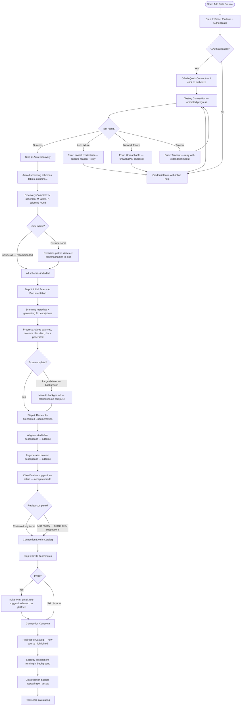
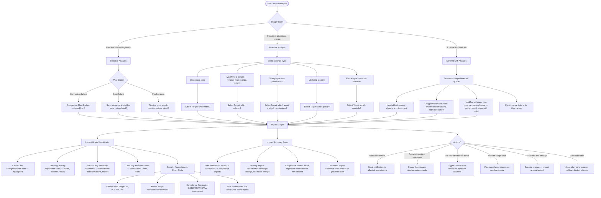

# Data Security Product — UX Flows v4 (Catalog & Security Integration)

## Changelog: v3 → v4

<!-- Summary of all changes incorporating competitive research findings from 10 competitors -->

### Strategic Shift: From Data Security Tool to Security-Aware Metadata Catalog

V3 was structured around the five-stage loop (Discover > Classify > Assess > Remediate > Track) with 7 flows and 53 screens. V4 retains the core security flows (classification, risk assessment, remediation, policies) but restructures the surface-level architecture around a **metadata catalog with security posture as the primary lens**. This is the key differentiator identified in competitive research: no competitor deeply integrates data security posture into catalog browsing.

### What Changed and Why

1. **Flow 1 (Connect a Data Source) redesigned for 30-minute time-to-value.** Added auto-discovery of schemas/tables, AI-generated documentation step, and teammate invite prompt. OAuth remains the fast path. The goal is a connected, documented, and classified first source within 30 minutes — matching the best-in-class benchmark from competitive analysis.

2. **Flow 2 (Catalog Browsing) rebuilt as search-first.** The Data Catalog is no longer a table list you filter — it is a search-first discovery interface with inline trust signals and security badges on every surface. Classification status, access policies, PII detection status, and data quality signals are visible without clicking into a detail view. This addresses the universal finding that search-first discovery with trust signals is best practice across all 10 competitors analyzed.

3. **Flow 3 (Managing Sources) moved to admin/settings context.** Connection management is operational infrastructure — it belongs in Settings, not as a primary navigation item. Added blast radius analysis for sync failures so administrators understand downstream impact when a connection breaks. The catalog browsing experience (Flow 2) no longer requires navigating through connection management.

4. **Flow 4 (Security-Aware Catalog Browsing) added as the key differentiator.** Every data asset displays its security posture: classification level, access policies, PII detection status, security alerts, and compliance status. Users can browse by security context (show me all unclassified assets, all assets with PII, all over-permissioned tables). This flow does not exist in any competitor product.

5. **Flow 5 (Progressive Governance Onboarding) added.** A structured path from zero governance to full maturity, with each stage delivering standalone value. Week 1: search + auto-docs. Week 2-3: ownership + tagging. Month 2: classification + policies. Month 3+: workflows + compliance. This addresses the #1 pain point across competitors: governance overhead killing adoption.

6. **Flow 6 (Blast Radius & Impact Analysis) added.** When something changes or breaks — a schema change, a sync failure, a policy update, an access revocation — show all downstream impact with security implications. Column-level lineage with blast radius analysis, as identified in competitive research as a best practice from dbt and DataHub.

### Persona Expansion (5 Personas)

V3 had 3 personas (Jordan, Priya, Marcus). V4 adds 2 personas from competitive research to address the full buyer spectrum:

| Persona | Role | Primary Flows | Key Need |
|---------|------|---------------|----------|
| **Jordan** (Data Engineer) | Manages connections, pipelines, infrastructure | Flow 1, 3, 6 | Automated lineage, impact analysis, API access |
| **Priya** (Data Steward / Governance Lead) | Defines policies, reviews classifications | Flow 4, 5 | Scalable classification, adoption-friendly governance |
| **Marcus** (VP Security / CDO) | Consumes dashboards, risk scores | Flow 4, 5 | AI-readiness scoring, maturity dashboards |
| **Anika** (Data Analyst / BI Developer) | Searches for data, builds reports | Flow 2, 4 | Fast search, trust signals, minimal context-switching |
| **Sam** (Business User / Domain Expert) | Needs data answers, not technical details | Flow 2 | Natural language search, simplified UX |

### Screen Count Impact

| Flow | Description | Screens |
|------|-------------|---------|
| Flow 1 | Connect a Data Source | 6 |
| Flow 2 | Catalog Browsing & Discovery | 8 |
| Flow 3 | Managing Sources (Admin) | 5 |
| Flow 4 | Security-Aware Catalog Browsing | 7 |
| Flow 5 | Progressive Governance Onboarding | 9 |
| Flow 6 | Blast Radius & Impact Analysis | 6 |
| **Total** | | **41** |

Note: These 6 flows replace the v3 structure. The v3 flows for Classification Review (Flow 2), Risk Assessment (Flow 3), Remediation (Flow 4), Policy Management (Flow 5), Dashboard & Monitoring (Flow 6), and Onboarding (Flow 7) remain as foundational product flows and are referenced within these new flows. V4 flows are additive catalog/security layers on top of the existing product architecture.

---

## Flow 1: Connect a Data Source (Optimized for 30-Minute Time-to-Value)

**Goal**: Connect an external data platform, auto-discover its structure, generate AI documentation, and invite teammates — all within 30 minutes of starting.
**Stage**: Discover
**Primary persona**: Jordan (Data Engineer)
**Secondary personas**: Priya (sees results), Marcus (invited)

### Design Principles

1. **30-minute time-to-value.** From clicking "Add Connection" to seeing a documented, classified, security-assessed data source in the catalog. Every step is designed to move toward that goal with no dead ends.
2. **Auto-discovery as default.** After connection, the system automatically discovers all schemas, tables, columns, and relationships. Users opt out of scanning, not opt in. This matches the Atlan/Secoda pattern of instant value.
3. **AI documentation fills the empty catalog.** The #1 barrier to catalog adoption is empty documentation. AI-generated descriptions for tables and columns populate on first scan, giving immediate value even before human curation. Based on competitive research showing AI-generated docs as a best practice.
4. **Teammate invite at the moment of value.** After the first source is connected and documented, prompt to invite teammates. The catalog has value to share — this is the right moment, not during setup.

### What Changed from v3

- **Added auto-discovery step.** After connection test succeeds, the system automatically discovers all available schemas, tables, and columns. The schema selection step (v3) is replaced by a schema exclusion step — everything is included by default, users deselect what they do not want.
- **Added AI documentation generation.** After auto-discovery, the system generates descriptions for tables and columns using AI. Users see a progress indicator and can review/edit generated docs. This is the single biggest adoption driver identified in competitive research.
- **Added teammate invite prompt.** After the first source is connected and initial scan completes, a prompt invites teammates with role-based access suggestions. "Invite your data team to start collaborating on this catalog."
- **Reduced OAuth path to 3 clicks.** Select platform > Authorize > Done. Auto-discovery and AI docs happen automatically in the background.
- **Added connection health SLA.** Each connection shows its sync health against an SLA (e.g., "syncs every 6 hours, last sync 2 hours ago"). Missed SLAs trigger alerts.

### Flow Diagram



### Screen Inventory

| Screen | Purpose | Entry From | Key Content | Actions | Exits To | Primary Persona |
|--------|---------|------------|-------------|---------|----------|-----------------|
| **Select Platform + Authenticate** | Choose platform and connect | Add Source CTA (from catalog, settings, onboarding) | Platform card grid with logos and "Popular" badges. OAuth button (prominent) for supported platforms. Manual credential form (expandable). Estimated setup time per platform ("~2 min with OAuth") | Quick Connect (OAuth), Enter Credentials, Cancel | Testing Connection | Jordan |
| **Auto-Discovery Results** | Show what was found, allow exclusions | Successful connection test | Discovery summary: N schemas, M tables, K columns. Schema tree with checkbox exclusions (all checked by default). Estimated scan time. "Include All" as primary CTA, "Customize" as secondary | Include All, Exclude Selected, Cancel | Initial Scan | Jordan |
| **Initial Scan + AI Documentation Progress** | Real-time scan and AI doc generation | Auto-discovery confirmation | Split progress: Left — scan progress (tables/columns processed). Right — AI documentation progress (descriptions generated). Classification preview (sensitive columns found so far). Estimated time remaining | Move to Background, Cancel | Review AI Docs | Jordan |
| **Review AI-Generated Documentation** | Edit and confirm AI descriptions | Scan complete | Table list with AI-generated descriptions (editable inline). Column descriptions (expandable per table). Classification badges inline. Confidence indicators for AI suggestions. "Accept All" bulk action for high-confidence items | Edit description, Accept suggestion, Override classification, Accept All, Skip Review | Catalog (new source) | Jordan/Priya |
| **Invite Teammates** | Share the catalog value | Review complete or skip | Invite form: email addresses, role suggestions ("Jordan connected Snowflake Prod — invite your analysts to explore"). Team member count ("3 teammates already on the platform"). Permission presets (Viewer, Editor, Admin) | Send Invites, Skip | Catalog | Jordan |
| **Connection Success — Catalog Entry** | Confirm source is live and browsable | Invite step or skip | Source card in catalog with: platform icon, name, schema/table/column counts, AI documentation coverage %, classification status (in progress), security assessment status (in progress). "Your data source is live. Security assessment is running in the background." | Browse Catalog, Add Another Source, View Security Status | Catalog Browse, Add Source | Jordan |

### Edge Cases

| Category | Scenario | Design Response |
|----------|----------|-----------------|
| Empty state | First connection ever | Full onboarding context: "Connect your first data source to start building your catalog. Most teams are browsing data within 30 minutes." Platform cards show estimated setup time |
| OAuth | OAuth token expires | Alert ribbon: "Snowflake connection needs re-authorization." One-click re-auth button |
| Auto-discovery | Very large source (10K+ tables) | Discovery shows running count. "Large source detected — full discovery may take a few minutes." Option to start with a subset |
| Auto-discovery | Empty schemas found | Show in tree with "(empty)" label. Auto-excluded from scan. "3 empty schemas excluded" note |
| AI docs | AI generates inaccurate description | Every AI description has an "Edit" action and a "Flag as inaccurate" feedback button. Flagged items train the model |
| AI docs | Sensitive data in descriptions | AI docs are generated from metadata only (column names, types, patterns) — never from actual data values. Note shown: "Descriptions generated from metadata patterns, not data content" |
| Invite | User does not know teammate emails | "Copy invite link" alternative. Link has role-based access preset |
| Interruption | User leaves mid-setup | Draft saved. On return: "Resume connecting Snowflake Prod? You were at step 3 (scanning)." Resume button |
| Network | Connection drops during discovery | Partial results saved. "Discovery paused at 67%. Resume when connection is restored." |
| Scale | Second, third connection | Skip invite step (already has team). Show "Add to existing catalog" framing instead of first-time celebration |

### Timing Targets

| Step | OAuth Path | Manual Path |
|------|-----------|-------------|
| Select platform + authenticate | 1 min | 5 min |
| Auto-discovery | 1-3 min | 1-3 min |
| Initial scan + AI docs (small) | 3-5 min | 3-5 min |
| Initial scan + AI docs (medium) | 10-15 min | 10-15 min |
| Review AI docs (quick pass) | 3 min | 3 min |
| Invite teammates | 1 min | 1 min |
| **Total (small source)** | **9-13 min** | **13-17 min** |
| **Total (medium source)** | **16-25 min** | **20-29 min** |

---

## Flow 2: Catalog Browsing & Discovery (Search-First)

**Goal**: Find, understand, and trust data assets through a search-first interface with inline trust and security signals.
**Stage**: Discover + Classify (browsing layer)
**Primary personas**: Anika (Data Analyst), Sam (Business User)
**Secondary personas**: Jordan (technical search), Priya (governance browsing)

### Design Principles

1. **Search-first, not browse-first.** The primary entry point is a search bar, not a table list. Search is the universal pattern across all 10 competitors analyzed. The catalog landing page leads with a prominent search bar (like Google), with browse paths as secondary navigation.
2. **Inline trust signals on every result.** Every data asset in search results and browse views shows: classification badge, data quality score, last updated timestamp, owner avatar, usage frequency indicator. Users assess trust without clicking into detail views. This addresses the Alation/Collibra best practice of trust signals in discovery.
3. **Classification badges everywhere.** Every surface where a data asset appears — search results, browse views, lineage diagrams, recommendations — shows classification badges (PII, PCI, PHI, Internal, Public, Unclassified). Security context is ambient, not hidden.
4. **Natural language search for business users.** Sam should be able to type "customer email addresses" and find the right columns, not need to know table names. AI-powered semantic search translates natural language to catalog queries.
5. **Zero-click preview.** Hover or keyboard focus on a search result shows a preview card with column list, description, classification, and sample query — without navigating away from results.

### What Changed from v3

- **Replaced the Data Catalog list view with a search-first landing.** The v3 Data Catalog was a filterable table. V4 leads with a search bar, recent searches, popular assets, and AI-suggested queries. The table view is still accessible as a "Browse All" option.
- **Added trust signal badges to every surface.** Classification, quality, freshness, ownership, and usage signals are visible on search results, browse views, and recommendations. No asset appears without security context.
- **Added natural language search.** AI interprets queries like "customer PII in production" and translates to structured catalog filters. Results show the interpreted query for transparency.
- **Added zero-click preview cards.** Hover/focus on any search result shows a preview without navigation. Preview includes: description (AI-generated or human), column list with types, classification badges, owner, last updated, sample query.
- **Added security-filtered browse paths.** Browse by: All Assets, By Connection, By Classification, By Owner, By Domain/Tag. Security-specific paths: Unclassified Assets, Assets with PII, Over-Permissioned Assets, Stale Assets.
- **Added "Endorsed" and "Deprecated" asset states.** Data stewards can mark assets as endorsed (recommended for use) or deprecated (should not be used). These states appear as prominent badges in search results.

### Flow Diagram

```mermaid
flowchart TD
    A([Start: Catalog Landing]) --> B[Search Bar — prominent, centered]
    B --> B1[Below search: Recent Searches, Popular Assets, AI Suggestions]

    B --> C{Search type?}
    C -->|Keyword search| C1[Traditional search: table name, column name, description match]
    C -->|Natural language| C2[AI interprets: "customer emails in prod" → connection:snowflake-prod AND classification:PII AND column_name:*email*]
    C -->|Browse path| D[Browse Navigation]

    C1 --> E[Search Results]
    C2 --> E
    E --> E0[Interpreted query shown: "Showing results for: PII columns containing 'email' in Snowflake Prod"]

    E --> E1[Result list — each result shows:]
    E1 --> E1a[Asset name + type icon — table / column / schema]
    E1 --> E1b[Description — AI-generated or human-curated, truncated]
    E1 --> E1c[Classification badges — PII, PCI, PHI, Internal, Public, Unclassified]
    E1 --> E1d[Trust signals — quality score, freshness, owner avatar, usage sparkline]
    E1 --> E1e[Status badges — Endorsed / Deprecated / Under Review]
    E1 --> E1f[Connection + schema breadcrumb]

    E --> E2[Faceted filters sidebar:]
    E2 --> E2a[Connection / Platform]
    E2 --> E2b[Classification Level]
    E2 --> E2c[Data Quality Score range]
    E2 --> E2d[Owner / Domain / Tag]
    E2 --> E2e[Freshness: updated within...]
    E2 --> E2f[Asset Type: schema / table / column]
    E2 --> E2g[Status: Endorsed / Deprecated / All]

    E --> E3{User action?}
    E3 -->|Hover result| F[Zero-Click Preview Card]
    E3 -->|Click result| G[Asset Detail Page]
    E3 -->|Refine search| B

    F --> F1[Preview: full description, column list with types + classifications, owner, last updated, sample query, security summary]
    F1 --> F2{From preview?}
    F2 -->|Click to detail| G
    F2 -->|Copy sample query| F3[Query copied to clipboard]
    F2 -->|Move to next result| F4[Preview updates to next result]

    D --> D1{Browse by?}
    D1 -->|All Assets| D2[Full catalog table — sortable, filterable]
    D1 -->|By Connection| D3[Connection cards → schema tree → tables]
    D1 -->|By Classification| D4[Classification groups: PII, PCI, PHI, Internal, Public, Unclassified — with counts]
    D1 -->|By Owner| D5[Owner cards with asset counts and coverage %]
    D1 -->|By Domain / Tag| D6[Domain/tag taxonomy tree with asset counts]
    D1 -->|Unclassified Assets| D7[Assets missing classification — action needed]
    D1 -->|Assets with PII| D8[All PII-classified assets — security review path]
    D1 -->|Over-Permissioned| D9[Assets with broad access grants — remediation path]
    D1 -->|Stale Assets| D10[Assets not updated in 30+ days — freshness concern]

    G --> G1[Asset Detail: Description, Columns, Lineage, Access, Security, Activity]
    G1 --> G2[Description tab: AI-generated + human edits, edit history]
    G1 --> G3[Columns tab: name, type, classification badge, description, sample values masked]
    G1 --> G4[Lineage tab: upstream/downstream with security context on each node]
    G1 --> G5[Access tab: who/what has access, permission levels, platform-native labels]
    G1 --> G6[Security tab: classification detail, risk factors, compliance status, remediation history]
    G1 --> G7[Activity tab: recent queries, changes, scan history]
```

### Screen Inventory

| Screen | Purpose | Entry From | Key Content | Actions | Exits To | Primary Persona |
|--------|---------|------------|-------------|---------|----------|-----------------|
| **Catalog Landing** | Search-first entry to the catalog | Sidebar nav, top nav search icon | Prominent search bar (centered, large). Below: Recent Searches (personalized), Popular Assets (org-wide), AI-Suggested Queries ("Try: customer PII in production"). Quick browse cards: By Connection, By Classification, By Owner. Stats bar: total assets, classified %, documented % | Search, Browse, Click suggestion | Search Results, Browse views | All |
| **Search Results** | Find and evaluate data assets | Search submission | Result list with inline trust signals per result (classification badges, quality score, freshness, owner, usage). Interpreted query banner for NL search. Faceted filter sidebar. Result count with breakdown by type. Sort: relevance, freshness, usage, name | Filter, Sort, Hover (preview), Click (detail), Refine search | Asset Detail, Preview Card | Anika/Sam |
| **Zero-Click Preview Card** | Assess asset without navigating | Hover/focus on search result | Popover card: full description, column list (top 10) with types + classification badges, owner with avatar, last updated, sample query (copyable), security summary (risk level, classification status). 400px wide max | Click to detail, Copy query, Navigate to next | Asset Detail | Anika |
| **Browse — All Assets** | Full catalog table view | Browse path from landing | Sortable table: name, type, connection, classification badge, quality score, owner, last updated, usage count. Bulk actions: tag, assign owner, export. Column visibility toggle | Sort, Filter, Click row, Bulk select | Asset Detail | Priya/Jordan |
| **Browse — By Classification** | Security-focused browsing | Browse path from landing | Classification group cards: PII (N assets), PCI (M), PHI (K), Internal, Public, Unclassified. Each card shows asset count, trend, completion %. Click card to see filtered asset list | Click group, View trends | Filtered asset list | Priya |
| **Browse — Security Paths** | Targeted security browsing | Browse path from landing | Three views: Unclassified (needs action), PII Assets (security review), Over-Permissioned (remediation), Stale (freshness). Each shows count, severity indicator, and top recommended actions | Click asset, Bulk remediate, Export | Asset Detail, Remediation | Priya |
| **Asset Detail** | Complete view of a single data asset | Search result click, browse click | Tabbed view: Description (AI + human, editable), Columns (with classifications), Lineage (visual, security-annotated), Access (platform-native), Security (classification, risk, compliance), Activity (queries, changes). Header: asset name, type, connection breadcrumb, classification badges, endorsed/deprecated badge, owner, last updated | Edit description, Request access, View lineage, Remediate, Endorse/Deprecate | Lineage view, Access request, Remediation | All |
| **Asset Detail — Columns Tab** | Column-level detail with classifications | Asset Detail tabs | Column table: name, data type, classification badge (PII/PCI/PHI/etc.), AI description, sample values (masked), quality indicators. Each column row expandable to show: classification reasoning, confidence score, access grants for this column, lineage (column-level) | Accept/Override classification, View column lineage, Request access | Classification review, Column lineage | Anika/Priya |

### Edge Cases

| Category | Scenario | Design Response |
|----------|----------|-----------------|
| Empty search | No results for query | "No results for [query]. Try: broader terms, different spelling, or browse by connection." Show related suggestions from AI |
| Natural language | AI misinterprets query | Show interpreted query banner: "Showing results for: [interpretation]. Not what you meant? Try refining." Allow editing the interpreted query |
| Scale | 100K+ assets in catalog | Search is the primary path (always fast). Browse views paginate with 50 per page. Faceted filters show counts to guide refinement |
| New asset | Just-scanned asset with no documentation | AI description appears immediately ("AI-generated — review recommended"). Classification badge shows status. Trust signals show "New" indicator |
| Deprecated | User finds deprecated asset | Red "Deprecated" badge on result and detail. Banner: "This asset is deprecated. Recommended alternative: [link]." Usage blocked or warned |
| Access | User searches for asset they cannot access | Result appears in search (discoverability). Classification badge visible. Detail shows "Request Access" instead of column data. Security summary visible |
| Stale | Asset not updated in 60+ days | Orange "Stale" badge on result. Detail shows: "Last updated 62 days ago. Data may not reflect current state." |
| Quality | Low data quality score | Yellow quality indicator on result. Detail shows specific quality issues: nulls, duplicates, format inconsistencies |
| Offline | Search index being rebuilt | "Search results may be incomplete — index is updating. Full results available shortly." Partial results shown immediately |
| Business user | Sam types conversational query | AI handles: "where do we store customer phone numbers?" → searches for columns with phone-related names/patterns across all connections |

### Cross-Flow Connections

| Connection Point | Behavior |
|-----------------|----------|
| Search > Asset Detail | Click result navigates to detail. Back returns to results with scroll position preserved |
| Search > Security-Aware Browsing (Flow 4) | Classification filter in search connects to Flow 4 security browsing paths |
| Browse > Remediation | "Over-Permissioned" browse path surfaces remediation CTAs inline |
| Asset Detail > Blast Radius (Flow 6) | Lineage tab connects to Flow 6 impact analysis |
| Asset Detail > Access Request | "Request Access" on restricted assets initiates access request flow with security context |
| Catalog > Governance Onboarding (Flow 5) | Uncurated assets feed into governance task queues |

---

## Flow 3: Managing Sources (Admin/Settings Context)

**Goal**: Administer data source connections, sync schedules, health monitoring, and blast radius analysis from a centralized settings context.
**Stage**: Infrastructure / Admin
**Primary persona**: Jordan (Data Engineer)
**Secondary persona**: Priya (monitors sync health for governance)

### Design Principles

1. **Admin context, not primary navigation.** Connection management is infrastructure. It belongs in Settings/Admin, not alongside catalog browsing. Data analysts and business users should never need to visit this screen. This follows the pattern from Alation and Collibra where connector management is an admin function.
2. **Health-first dashboard.** The sources management page leads with health status: how many connections are healthy, degraded, or errored. Sync SLA compliance is the primary metric. This is the operational view Jordan needs.
3. **Blast radius on failure.** When a connection fails or sync is delayed, show the blast radius: which catalog assets are affected, which dashboards/reports go stale, which security assessments are impacted. This is the key addition from competitive research — dbt and DataHub show impact analysis for pipeline failures.
4. **Bulk operations for scale.** Enterprises have 50-100+ connections. Bulk reconnect, bulk schedule changes, and bulk health checks are essential.

### What Changed from v3

- **Moved from primary sidebar navigation to Settings/Admin section.** The sidebar item "Connections" is replaced by a settings entry. The catalog (Flow 2) is the primary navigation item. Connection management is accessed via Settings > Data Sources.
- **Added sync SLA monitoring.** Each connection has a configurable sync SLA (e.g., "sync every 6 hours"). The management page shows SLA compliance: on-time, at-risk, breached. Breached SLAs trigger alerts.
- **Added blast radius analysis for sync failures.** When a connection fails, a "View Impact" action shows all downstream effects: stale catalog assets, affected security assessments, impacted compliance reports, downstream consumers. This is the bridge to Flow 6 (Blast Radius).
- **Added connection groups with environment tags.** Connections can be tagged (Production, Staging, Dev, Test) and grouped. Production connections have stricter SLA defaults and require approval for changes.
- **Added bulk operations.** Select multiple connections for bulk actions: re-test, re-sync, change schedule, change environment tag.

### Flow Diagram

```mermaid
flowchart TD
    A([Start: Settings > Data Sources]) --> B[Sources Dashboard]

    B --> B1[Health Summary Bar: N healthy, M degraded, K errored, J total]
    B --> B2[SLA Compliance: X on-time, Y at-risk, Z breached]
    B --> B3[Connection Table with group/filter controls]

    B3 --> C{View mode?}
    C -->|List view| C1[Table: name, platform, status, last sync, SLA status, schema count, environment tag]
    C -->|Grouped by platform| C2[Platform groups with aggregate health]
    C -->|Grouped by environment| C3[Environment groups: Production, Staging, Dev]
    C -->|Grouped by status| C4[Status groups: Healthy, Degraded, Errored — errors first]

    C1 --> D{Connection action?}
    D -->|Click row| E[Connection Detail]
    D -->|+ Add Source| F[Flow 1: Connect a Data Source]
    D -->|Bulk select| G[Bulk Actions: re-test, re-sync, change schedule, tag]

    E --> E1[Tabs: Overview, Schemas, Sync History, Blast Radius, Settings]
    E1 --> E1a[Overview: health metrics, latency chart, SLA status, last 5 syncs]
    E1 --> E1b[Schemas: browsable tree linked to catalog assets]
    E1 --> E1c[Sync History: list with status, duration, records processed, errors]
    E1 --> E1d[Blast Radius: downstream impact of this connection's health]
    E1 --> E1e[Settings: credentials, schedule, SLA config, environment tag, notifications]

    E1d --> H[Blast Radius Panel]
    H --> H1[Affected Catalog Assets: N tables, M columns across K schemas]
    H --> H2[Stale Security Assessments: classifications based on data from this source]
    H --> H3[Impacted Compliance Reports: regulations referencing this data]
    H --> H4[Downstream Consumers: users/teams/dashboards that query this data]
    H --> H5{Connection status?}
    H5 -->|Healthy| H6[Blast radius shown as "impact if this connection fails"]
    H5 -->|Degraded/Error| H7[Blast radius shown as "current impact of this failure"]
    H7 --> H8[Remediation CTAs: Reconnect, Re-sync, Notify Consumers]

    B --> I{Alert state?}
    I -->|SLA breached| I1[Alert banner: "2 connections breached SLA — Snowflake Prod last synced 8 hours ago (SLA: 6h)"]
    I1 --> I2[Click: navigate to connection detail with blast radius tab open]
    I -->|Connection errored| I3[Alert banner: "BigQuery Staging disconnected — view impact"]
    I3 --> I4[Click: navigate to connection detail with reconnect prompt]
```

### Screen Inventory

| Screen | Purpose | Entry From | Key Content | Actions | Exits To | Primary Persona |
|--------|---------|------------|-------------|---------|----------|-----------------|
| **Sources Dashboard** | Central admin view of all connections | Settings > Data Sources | Health summary bar (healthy/degraded/errored counts). SLA compliance summary (on-time/at-risk/breached). Connection table with grouping controls (platform, environment, status). Bulk action toolbar when items selected | + Add Source, Group, Filter, Bulk actions, Click row | Connection Detail, Flow 1 | Jordan |
| **Connection Detail** | Single connection administration | Sources Dashboard row click | Tabs: Overview (health, latency, SLA), Schemas (tree), Sync History (log), Blast Radius (impact), Settings (config). Status badge prominent. Reconnect banner if errored | Edit, Reconnect, Trigger Sync, View Blast Radius, Delete | Blast Radius, Catalog Asset, Settings | Jordan |
| **Blast Radius Panel** | Impact analysis for a connection | Connection Detail "Blast Radius" tab | Four sections: Affected Catalog Assets (count + list), Stale Security Assessments (classifications at risk), Impacted Compliance (reports/regulations), Downstream Consumers (users/teams/dashboards). When connection is errored: remediation CTAs prominent | Reconnect, Re-sync, Notify Consumers, View Affected Assets | Catalog, Remediation, Notifications | Jordan/Priya |
| **Sync History** | Log of all sync operations | Connection Detail "Sync History" tab | Table: sync date, status (success/partial/failed), duration, records processed, errors. Click row to expand: detailed error log, affected tables. SLA compliance indicator per sync | Re-sync, Download log, Filter by status | Sync Detail (expanded) | Jordan |
| **Connection Settings** | Configure connection parameters | Connection Detail "Settings" tab | Credential management (update, rotate). Sync schedule (cron or preset: hourly/6h/daily/weekly). SLA threshold configuration. Environment tag selector. Notification preferences (who to alert on failure). Approval requirement toggle for production connections | Save, Test Connection, Rotate Credentials | Connection Detail | Jordan |

### Edge Cases

| Category | Scenario | Design Response |
|----------|----------|-----------------|
| Scale | 100+ connections | Grouping by platform/environment/status. Search within connections. Health summary bar provides instant triage: "Focus on 3 errored connections" |
| SLA breach | Connection syncs late | SLA badge turns red. Alert ribbon fires. Blast radius tab auto-opens on detail page showing impact. "Re-sync now" is primary CTA |
| Cascade | Upstream connection feeds downstream pipeline | Blast radius shows transitive impact: "This connection feeds 3 downstream transformations that feed 12 catalog assets" |
| Bulk | Need to change schedule for all prod connections | Select connections with environment:Production filter, bulk action "Change Schedule," apply to all |
| Credentials | Token rotation needed | Settings tab shows token expiry date. Warning 7 days before expiry. "Rotate Credentials" action with zero-downtime rotation (test new before deactivating old) |
| Delete | Remove connection with catalog data | Blast radius panel shows exactly what will be affected. Confirmation: "Removing this connection will mark N catalog assets as disconnected. Classifications and documentation will be preserved." |
| Permission | Non-admin views sources | Read-only view of health status and blast radius. No edit/delete/reconnect actions. "Contact admin" tooltip on disabled actions |
| Production | Change to production connection | If connection is tagged Production and org requires approval, changes route through approval workflow. "This is a production connection — changes require admin approval" |

### Cross-Flow Connections

| Connection Point | Behavior |
|-----------------|----------|
| Sources > Flow 1 (Add Source) | "+ Add Source" initiates the full connection flow with auto-discovery and AI docs |
| Sources > Catalog (Flow 2) | Schema tree links directly to catalog asset detail pages |
| Sources > Blast Radius (Flow 6) | Blast radius tab connects to the full impact analysis flow for deeper drill-downs |
| Sources > Alert Ribbon | SLA breaches and connection errors surface in the global alert ribbon |
| Sources > Governance (Flow 5) | Connection health is a governance maturity indicator — unhealthy connections reduce maturity score |

---

## Flow 4: Security-Aware Catalog Browsing (Key Differentiator)

**Goal**: Browse and evaluate data assets with security posture as the primary lens — classification levels, access policies, PII detection, security alerts, and compliance status are front and center on every surface.
**Stage**: Assess + Track
**Primary personas**: Priya (Data Steward), Marcus (VP Security)
**Secondary personas**: Anika (sees security context while searching), Jordan (technical security drill-down)

### Design Principles

1. **Security posture is the default context, not a secondary tab.** When browsing any asset, security information (classification, access, compliance) is visible by default — not hidden behind a "Security" tab. This is the core differentiator: no competitor displays security posture as ambient context across all catalog surfaces.
2. **Every asset card shows its security state.** Whether in search results, browse views, lineage diagrams, or recommendation cards — every data asset shows: classification level badge, access scope indicator (narrow/moderate/broad), PII presence indicator, compliance flags, and risk score contribution.
3. **Security-specific entry points.** Users can browse the catalog through security lenses: "Show me all unclassified production assets," "Show me all PII with broad access," "Show me compliance gaps for GDPR." These are first-class navigation paths, not ad-hoc filter combinations.
4. **Actionable security context.** Security indicators are not just informational — they are actionable. A "Broad Access" indicator links to access review. An "Unclassified" badge links to classification. A "Non-Compliant" flag links to remediation. The browsing experience drives security actions.
5. **Role-based security views.** Marcus sees the executive security posture (aggregated scores, trends, coverage). Priya sees the governance detail (classification gaps, policy compliance, review queues). Jordan sees the technical detail (access grants, platform permissions, lineage risk).

### What This Flow Adds

This flow is entirely new in v4. It layers security context onto the catalog browsing experience (Flow 2) and provides dedicated security browsing paths that do not exist in any competitor product.

### Flow Diagram

```mermaid
flowchart TD
    A([Start: Security Posture View]) --> B[Security Posture Dashboard]

    B --> B1[Security Coverage Summary]
    B1 --> B1a[Classification Coverage: N% of assets classified]
    B1 --> B1b[Access Review Status: M% of access grants reviewed]
    B1 --> B1c[PII Exposure: K assets with PII, J with broad access]
    B1 --> B1d[Compliance Coverage: regulations mapped to data]

    B --> B2[Security Browse Paths — Card Navigation]
    B2 --> C1[Unclassified Assets — needs action]
    B2 --> C2[PII Inventory — all personally identifiable data]
    B2 --> C3[Over-Permissioned Assets — broad access grants]
    B2 --> C4[Compliance Gaps — regulation requirements unmet]
    B2 --> C5[High-Risk Assets — top risk score contributors]
    B2 --> C6[Recently Changed — security state changes in last 7 days]

    C1 --> D1[Asset List: unclassified items sorted by usage — high-usage unclassified first]
    D1 --> D1a[Each row: asset name, connection, column count, usage frequency, "Classify" CTA]
    D1 --> D1b[Bulk action: "Auto-classify with AI" for selected items]

    C2 --> D2[PII Inventory View]
    D2 --> D2a[Grouped by PII type: Email, Name, SSN, Phone, Address, Custom]
    D2 --> D2b[Each group: count, connections containing, access scope summary]
    D2 --> D2c[Drill-down: specific columns with PII classification]
    D2 --> D2d[Export: PII inventory report for compliance]

    C3 --> D3[Over-Permissioned Asset List]
    D3 --> D3a[Each row: asset, permission count, broadest grant, risk contribution]
    D3 --> D3b[Access scope indicator: Narrow — 1-5 grants, Moderate — 6-20, Broad — 20+]
    D3 --> D3c[Action: "Review Access" → opens access review panel]
    D3 --> D3d[Action: "Remediate" → enters remediation flow with access revocation pre-selected]

    C4 --> D4[Compliance Gap View]
    D4 --> D4a[Grouped by regulation: GDPR, CCPA, HIPAA, PCI-DSS]
    D4 --> D4b[Each regulation: requirements met/unmet, affected assets, gap severity]
    D4 --> D4c[Drill-down: specific requirement → affected data → remediation path]

    C5 --> D5[High-Risk Asset List]
    D5 --> D5a[Sorted by risk score contribution — highest first]
    D5 --> D5b[Each row: asset, risk score, risk factors (unprotected, broad access, non-compliant), remediation CTA]

    C6 --> D6[Recent Security Changes]
    D6 --> D6a[Timeline view: classification changes, access changes, policy applications, scan results]
    D6 --> D6b[Filter by change type, connection, severity]

    B --> E[Asset Security Detail — from any browse path]
    E --> E1[Security Summary Card]
    E1 --> E1a[Classification: level + confidence + reviewer + date]
    E1 --> E1b[Access Policies: who has access, permission levels, platform-native labels]
    E1 --> E1c[PII Detection: what PII types found, which columns, confidence]
    E1 --> E1d[Compliance: which regulations apply, status per regulation]
    E1 --> E1e[Risk Score: this asset's contribution to overall score]
    E1 --> E1f[Security Alerts: active alerts for this asset]
    E1 --> E1g[Remediation History: past actions on this asset]

    E --> E2{Security action?}
    E2 -->|Classify| E3[Open classification review for this asset]
    E2 -->|Review Access| E4[Access review panel with revocation options]
    E2 -->|Remediate| E5[Enter remediation flow — context preserved]
    E2 -->|Request Access| E6[Access request form with security justification]
    E2 -->|View Lineage with Security| E7[Lineage diagram — each node shows security state]
    E2 -->|Generate Report| E8[Security report for this asset — compliance evidence]
```

### Screen Inventory

| Screen | Purpose | Entry From | Key Content | Actions | Exits To | Primary Persona |
|--------|---------|------------|-------------|---------|----------|-----------------|
| **Security Posture Dashboard** | Aggregated security view of the catalog | Sidebar nav "Security" or Dashboard security widget | Coverage metrics: classification % (with trend), access review %, PII exposure summary, compliance mapping status. Security browse path cards (6 paths). Risk trend chart. "Needs Attention" queue: top 5 items requiring action | Browse security paths, Click metric for drill-down, Export posture report | Security browse views, Risk Detail | Marcus/Priya |
| **Unclassified Assets** | Triage unclassified data | Security browse path | Asset list sorted by usage (high-usage first). Each row: name, connection, column count, usage frequency (sparkline), age (days since discovery). Bulk "Auto-classify with AI" action. Filter by connection, age, usage | Classify (single), Auto-classify (bulk), Filter, Assign to reviewer | Classification review, Assignment | Priya |
| **PII Inventory** | Complete view of all personal data | Security browse path | Grouped by PII type (email, name, SSN, phone, address, custom). Each group: count, connections containing, access scope summary (narrow/moderate/broad). Drill-down to column list. Export as PII inventory report | Drill-down by type, Export report, Remediate (bulk access review) | Column list, Report, Remediation | Priya/Marcus |
| **Over-Permissioned Assets** | Assets with broad access grants | Security browse path | Asset list with: name, permission count, broadest grant, risk contribution. Access scope badge (narrow/moderate/broad). "Review Access" opens inline panel showing all grants with revocation checkboxes | Review Access, Remediate (revoke), Filter, Export | Access review panel, Remediation | Priya/Jordan |
| **Compliance Gap View** | Regulation gaps mapped to data | Security browse path | Grouped by regulation. Each: requirements met/unmet count, affected asset count, gap severity, remediation effort estimate. Drill-down: specific requirement to affected assets to remediation path | Drill-down, Generate compliance report, Remediate gaps | Asset list (filtered), Remediation, Report | Priya |
| **Asset Security Detail** | Full security context for one asset | Any browse path click, search result, catalog detail "Security" tab | Security summary card: classification (level, confidence, reviewer), access policies (grants list, platform-native labels), PII detection (types, columns, confidence), compliance (regulations, status), risk score (contribution), alerts (active), remediation history (past actions). All sections actionable | Classify, Review Access, Remediate, Request Access, View Lineage, Generate Report | Classification, Remediation, Access Request, Lineage | All |
| **Security-Annotated Lineage** | Lineage with security context per node | Asset Security Detail "View Lineage with Security" | Visual lineage diagram. Each node shows: asset name + classification badge + access scope + risk indicator. Edges show data flow direction. Clicking a node opens its security summary. Color-coding: green (secure), yellow (needs attention), red (high risk) | Click node (security detail), Zoom, Filter by security state, Export | Asset Security Detail | Jordan/Priya |

### Edge Cases

| Category | Scenario | Design Response |
|----------|----------|-----------------|
| Empty state | No classified assets yet | Security Posture Dashboard shows 0% coverage with "Start classifying your data" CTA. Points to Flow 5 (Progressive Governance Onboarding) |
| Scale | 50K+ classified assets | Browse paths show counts and filters. PII inventory groups by type for manageability. "Top 100 highest risk" as default sort |
| Conflict | Asset classified differently by policy vs manual review | Show both: "Policy classification: PCI. Manual override: Internal. Manual override takes precedence." Alert if override reduces protection |
| Access | User cannot see access details for an asset | "Access details restricted — contact [owner/admin]." Classification and compliance status still visible |
| Mixed | Asset with multiple classification levels (PII + PCI) | Show all applicable badges. Highest sensitivity level determines overall classification badge color. Detail view shows per-column breakdown |
| Stale | Security assessment older than scan data | "Security assessment outdated — based on scan from 14 days ago. Re-assess recommended." |
| Real-time | Classification changes during browse session | Optimistic update: badge updates immediately when classification is confirmed. Slight highlight animation on changed items |
| Lineage | Lineage crosses security boundaries | Lineage node at security boundary shows "Crosses to: [connection with different classification]." Highlight boundary transitions |
| Compliance | New regulation added, assets not yet mapped | Compliance Gap View shows "New: [regulation] — N assets potentially affected. Assessment needed." |

### Cross-Flow Connections

| Connection Point | Behavior |
|-----------------|----------|
| Security Browsing > Classification Review | "Classify" action on unclassified assets opens the classification review queue (existing Flow 2b from v3) filtered to that asset |
| Security Browsing > Remediation | "Remediate" actions carry full security context into the remediation flow (existing Flow 4 from v3) |
| Security Browsing > Blast Radius (Flow 6) | "View Lineage with Security" connects to Flow 6 for full impact analysis |
| Security Browsing > Risk Dashboard | Security Posture Dashboard metrics link to the existing Risk Dashboard (v3 Flow 3) for deeper risk analysis |
| Security Browsing > Catalog (Flow 2) | Security browse paths are accessible from catalog faceted filters. Catalog search results show security badges linking to security detail |
| Security Browsing > Governance (Flow 5) | Unclassified and uncurated asset counts feed into governance maturity scores |

---

## Flow 5: Progressive Governance Onboarding

**Goal**: Guide organizations from zero governance to full maturity through stages that each deliver standalone value, avoiding the governance-overhead-kills-adoption problem.
**Stage**: All stages, progressively
**Primary persona**: Priya (Data Steward / Governance Lead)
**Secondary personas**: Marcus (tracks maturity), Jordan (technical governance tasks), Anika (benefits from governance outputs)

### Design Principles

1. **Each stage delivers standalone value.** Users do not need to complete all stages to benefit. Week 1 (search + auto-docs) is valuable even if the organization never reaches Month 3+ (workflows + compliance). This addresses the #1 pain point from competitive analysis: governance overhead killing adoption.
2. **Progressive, not prescriptive.** The stages are recommended, not required. Organizations can skip stages, reorder them, or focus on the stages relevant to their compliance requirements. The system suggests the next stage based on current maturity.
3. **Governance maturity score.** A visible score (0-100) shows overall governance maturity across dimensions: documentation, classification, ownership, policies, compliance. Each action improves the score, creating a gamification loop that drives adoption.
4. **Embed governance into existing workflows.** Governance tasks appear where users already work: classification suggestions in the catalog, ownership prompts when viewing an unowned asset, policy suggestions during remediation. Governance is not a separate destination — it is ambient.
5. **Celebrate progress, not penalize gaps.** The tone is "You've documented 45% of your catalog — great progress!" not "55% of your catalog is undocumented." Positive reinforcement drives adoption better than deficit messaging.

### Governance Stages

| Stage | Timeline | Value Delivered | Key Actions | Maturity Score Impact |
|-------|----------|-----------------|-------------|----------------------|
| **Stage 1: Search + Auto-Docs** | Week 1 | Data is findable and described | Connect sources (Flow 1), AI auto-documentation, basic search | 0 → 20 |
| **Stage 2: Ownership + Tagging** | Week 2-3 | Data has owners and context | Assign owners to assets, create domains/tags, organize catalog | 20 → 40 |
| **Stage 3: Classification + Policies** | Month 2 | Sensitive data is identified and policy-covered | Run classification, create tokenization policies, review classifications | 40 → 65 |
| **Stage 4: Workflows + Compliance** | Month 3+ | Governance is automated and auditable | Approval workflows, compliance reporting, scheduled scans, automated classification rules | 65 → 85 |
| **Stage 5: Full Maturity** | Ongoing | Continuous governance with metrics | Full coverage, active monitoring, automated remediation, stakeholder reporting | 85 → 100 |

### Flow Diagram

```mermaid
flowchart TD
    A([Start: Governance Hub]) --> B[Governance Maturity Dashboard]

    B --> B1[Maturity Score: animated gauge 0-100]
    B --> B2[Current Stage indicator with progress within stage]
    B --> B3[Stage Timeline: visual progress across all 5 stages]
    B --> B4[Recommended Next Actions: top 3 tasks to improve maturity]
    B --> B5[Governance Metrics: documentation %, ownership %, classification %, compliance %]

    B --> C{Current stage?}

    C -->|Stage 1: Search + Auto-Docs| S1[Stage 1 Tasks]
    S1 --> S1a[Connect at least 1 data source — links to Flow 1]
    S1 --> S1b[AI auto-documentation coverage > 50%]
    S1 --> S1c[Search usage: at least 5 searches performed by team]
    S1 --> S1d{Stage 1 complete?}
    S1d -->|All criteria met| S1e[Stage 1 Complete — celebration + unlock Stage 2]
    S1d -->|Not yet| S1f[Progress bar shows completion %]

    C -->|Stage 2: Ownership + Tagging| S2[Stage 2 Tasks]
    S2 --> S2a[Assign owners to 50%+ of high-usage assets]
    S2 --> S2b[Create at least 3 domains or tag categories]
    S2 --> S2c[Tag 30%+ of assets with at least one domain/tag]
    S2 --> S2d{Stage 2 complete?}
    S2d -->|All criteria met| S2e[Stage 2 Complete — celebration + unlock Stage 3]
    S2d -->|Not yet| S2f[Progress bar + "Quick Win" suggestions]

    C -->|Stage 3: Classification + Policies| S3[Stage 3 Tasks]
    S3 --> S3a[Run classification scan on all connected sources]
    S3 --> S3b[Review and confirm 80%+ of classification suggestions]
    S3 --> S3c[Create at least 1 tokenization policy]
    S3 --> S3d[Apply policy to at least 1 data source]
    S3 --> S3e{Stage 3 complete?}
    S3e -->|All criteria met| S3f[Stage 3 Complete — celebration + unlock Stage 4]
    S3e -->|Not yet| S3g[Progress bar + "Impact Preview": how maturity score will improve]

    C -->|Stage 4: Workflows + Compliance| S4[Stage 4 Tasks]
    S4 --> S4a[Set up approval workflows for remediation]
    S4 --> S4b[Map at least 1 regulation to data]
    S4 --> S4c[Generate first compliance report]
    S4 --> S4d[Schedule recurring scans for all connections]
    S4 --> S4e[Create at least 1 classification rule for automation]
    S4 --> S4f{Stage 4 complete?}
    S4f -->|All criteria met| S4g[Stage 4 Complete — celebration + unlock Stage 5]
    S4f -->|Not yet| S4h[Progress bar + "Time Savings" preview: how automation will reduce manual work]

    C -->|Stage 5: Full Maturity| S5[Stage 5 — Continuous Governance]
    S5 --> S5a[Maintain classification coverage > 95%]
    S5 --> S5b[Maintain ownership coverage > 90%]
    S5 --> S5c[Maintain documentation coverage > 80%]
    S5 --> S5d[All regulations mapped and monitored]
    S5 --> S5e[Scheduled reports active for all stakeholders]
    S5 --> S5f[Risk score trending down or stable]

    B --> D[Governance Task Queue]
    D --> D1[Task list: prioritized governance actions]
    D1 --> D1a[Each task: description, impact on maturity score, effort estimate, assignee]
    D1 --> D1b[Quick Win filter: tasks that improve maturity the most with least effort]
    D1 --> D1c[Assign tasks to team members]

    B --> E[Governance Leaderboard — optional gamification]
    E --> E1[Team members ranked by governance contributions]
    E --> E2[Contribution types: classifications reviewed, docs edited, assets tagged, policies created]
    E --> E3[Weekly digest: "Your team classified 234 columns this week"]
```

### Screen Inventory

| Screen | Purpose | Entry From | Key Content | Actions | Exits To | Primary Persona |
|--------|---------|------------|-------------|---------|----------|-----------------|
| **Governance Maturity Dashboard** | Central governance hub | Sidebar nav "Governance" | Maturity score gauge (0-100, animated). Current stage indicator with progress bar. Stage timeline (5 stages, visual). Recommended next actions (top 3). Coverage metrics: documentation %, ownership %, classification %, compliance %. Trend chart: maturity over time | View stage details, Start recommended action, Export maturity report | Stage detail, Task queue, Flow-specific screens | Priya/Marcus |
| **Stage Detail** | Deep dive into a governance stage | Maturity Dashboard click stage | Stage description and value statement. Criteria checklist with progress per criterion. Task list for this stage. Estimated time to complete. "Start" CTA for incomplete tasks. Celebration animation on stage completion | Start task, Skip criterion, Mark complete | Flow-specific screens (Flow 1, 2, 4, etc.) | Priya |
| **Governance Task Queue** | Prioritized governance work | Maturity Dashboard, Sidebar | Task table: description, maturity impact (+N points), effort estimate (S/M/L), assignee, status, source stage. Sort by impact, effort, assignee. "Quick Wins" filter (high impact, low effort). Assign to team member | Start task, Assign, Filter, Bulk assign | Flow-specific screens | Priya |
| **Ownership Assignment** | Assign owners to data assets | Stage 2 task, Asset Detail | Asset list with owner column (empty or populated). Owner selector: search team members, suggest based on usage patterns ("Jordan queries this table most"). Bulk assign: by connection, by domain, by schema | Assign owner, Bulk assign, Skip | Catalog | Priya |
| **Domain & Tag Management** | Create and organize taxonomy | Stage 2 task, Settings | Domain/tag creation form. Taxonomy tree view. Tag assignment: drag-drop or bulk select. Usage stats per domain/tag: asset count, coverage % | Create domain/tag, Assign to assets, Reorganize hierarchy | Catalog (filtered by domain) | Priya |
| **Classification Campaign** | Batch classification with progress tracking | Stage 3 task | Campaign creation: name, scope (connection/schema/all), target coverage %. Campaign dashboard: progress bar, items classified, items remaining, team progress. Leaderboard for campaign participants | Start campaign, Assign reviewers, Track progress | Classification review (v3 Flow 2b) | Priya |
| **Compliance Mapping** | Map regulations to data assets | Stage 4 task | Regulation selector (GDPR, CCPA, HIPAA, PCI-DSS, custom). Requirement list per regulation. Data mapping: which assets satisfy which requirements. Gap analysis: requirements without data evidence | Map data to requirement, Identify gaps, Generate report | Regulation Detail, Remediation | Priya |
| **Governance Report** | Maturity and governance metrics report | Maturity Dashboard export | Maturity score with trend. Stage progress. Coverage metrics with trends. Top achievements. Outstanding gaps. Team contributions. Scheduled delivery (weekly/monthly to stakeholders) | Generate now, Schedule delivery, Customize report | PDF/Email | Marcus/Priya |
| **Governance Leaderboard** | Gamification and team engagement | Maturity Dashboard, optional | Team member ranking by governance contributions. Contribution breakdown: classifications, docs, tags, policies. Weekly/monthly view. Team aggregate stats | View period, Filter by contribution type | Team member detail | Priya/Marcus |

### Edge Cases

| Category | Scenario | Design Response |
|----------|----------|-----------------|
| Empty state | Brand new organization, no governance | Maturity score at 0 with encouraging message: "Let's get started. Most teams reach Stage 1 in their first week." Stage 1 tasks pre-populated and ready |
| Skip stage | Organization wants to jump to classification | Allow it, but show: "Completing Stage 1 (search + docs) first helps your team find data to classify." Skipping is allowed, not blocked |
| Regression | Maturity score decreases (e.g., new sources added without classification) | Alert: "Maturity score decreased by 5 points — 3 new sources are unclassified." Task queue updated with remediation tasks |
| Scale | Large team (50+ people) | Governance tasks assignable to specific team members. Task queue filterable by assignee. Leaderboard shows top contributors |
| Compliance-first | Organization needs compliance before full governance | Stage 4 tasks can be started independently. Compliance mapping does not require Stages 1-3 completion, though coverage metrics benefit |
| Low engagement | Team is not completing governance tasks | Weekly digest email: "Your catalog has 234 unclassified assets. 15 minutes of review would improve maturity by 8 points." Suggested quick wins |
| Re-onboarding | New team member joins mid-maturity | Personalized onboarding: "Your team is at Stage 3. Here's what's been set up and what you can help with." Role-specific task suggestions |
| Gamification opt-out | Team does not want leaderboard | Leaderboard is opt-in per organization. Can be enabled/disabled in Settings. Task queue and maturity score work without it |

### Cross-Flow Connections

| Connection Point | Behavior |
|-----------------|----------|
| Governance > Flow 1 (Connect Source) | Stage 1 "Connect a source" task initiates Flow 1 |
| Governance > Flow 2 (Catalog) | Documentation and ownership tasks appear as inline prompts in the catalog when browsing unowned/undocumented assets |
| Governance > Flow 4 (Security Browsing) | Classification and compliance tasks connect to security browsing paths |
| Governance > Classification Review (v3 Flow 2b) | Classification campaigns create filtered views in the review queue |
| Governance > Risk Dashboard (v3 Flow 3) | Governance maturity score appears as a widget on the executive dashboard view |
| Governance > Remediation (v3 Flow 4) | Policy creation tasks connect to the policy management flow |
| Governance > Reports | Governance maturity report is a report type available in the reporting system |

---

## Flow 6: Blast Radius & Impact Analysis

**Goal**: When something changes or breaks — a schema change, a sync failure, a policy update, an access revocation — show all downstream impact with security implications.
**Stage**: Assess + Track
**Primary persona**: Jordan (Data Engineer)
**Secondary personas**: Priya (security impact), Marcus (risk impact summary)

### Design Principles

1. **Impact-first, not change-first.** When showing an impact analysis, lead with what is affected (downstream consumers, security assessments, compliance reports), not what changed. The change is the cause; the impact is what matters for decision-making.
2. **Column-level lineage.** Impact analysis traces at column level, not just table level. A change to one column may not affect all downstream consumers — show the precise blast radius. This matches best practice from dbt and DataHub.
3. **Security-annotated impact.** Every node in the impact graph shows its security state. If a change affects a PII column that feeds a compliance report, that is higher priority than a change affecting an internal column. Security context differentiates our impact analysis from generic lineage tools.
4. **Proactive and reactive.** Blast radius analysis works in two modes: reactive (something broke — what is affected?) and proactive (I want to change X — what will be affected?). Both modes use the same visualization and impact graph.
5. **Actionable, not just informational.** Impact analysis does not just show the blast radius — it suggests actions: notify affected consumers, pause dependent pipelines, re-run classifications, update compliance reports.

### What This Flow Adds

This flow is entirely new in v4. It provides the impact analysis capability identified as best practice in competitive research (dbt's lineage, DataHub's impact analysis, Select Star's popularity-based lineage). The security annotation is our differentiator.

### Flow Diagram



### Screen Inventory

| Screen | Purpose | Entry From | Key Content | Actions | Exits To | Primary Persona |
|--------|---------|------------|-------------|---------|----------|-----------------|
| **Impact Analysis Entry** | Choose what to analyze | Sidebar "Impact Analysis", Connection Detail blast radius, Schema Drift alert, proactive change planning | Two paths: "Something broke" (reactive — select broken item) and "Planning a change" (proactive — describe planned change). Recent impact analyses list. Active incidents list | Select analysis type, Click recent analysis | Impact Graph, Change Selector | Jordan |
| **Change Selector (Proactive)** | Describe the planned change | Proactive path | Change type selector: Drop Table, Modify Column, Change Access, Update Policy, Revoke Access. Target selector: search/browse to select the item. "Preview Impact" as primary CTA | Select change type, Select target, Preview Impact | Impact Graph | Jordan |
| **Impact Graph** | Visual blast radius with security context | Reactive trigger, Proactive preview, Schema drift | Interactive graph: center node (changed item), expanding rings of impact. Each node: asset name, type icon, classification badge, access scope indicator, compliance flag. Color-coded by severity: red (high security impact), yellow (moderate), green (low). Zoom/pan controls. Click node for detail | Click node (detail), Zoom, Filter by severity, Filter by type, Export | Impact Summary, Node Detail | Jordan/Priya |
| **Impact Summary Panel** | Quantified impact assessment | Impact Graph sidebar | Totals: affected assets, affected consumers, affected compliance reports. Security impact: classification changes, risk score delta (projected). Compliance impact: regulation assessments needing update. Consumer impact: users/teams/dashboards affected. Severity assessment: Critical/High/Moderate/Low | Notify consumers, Pause processes, Re-classify, Update compliance, Proceed, Cancel | Notification, Pipeline control, Classification review | Jordan/Priya |
| **Schema Drift Analysis** | Changes detected by scan | Scan completion (when changes found), Alert ribbon | Change list: new items (classify + document), dropped items (archive + notify), modified items (verify classifications). Each change shows: item name, change type, blast radius preview (affected count), security impact | Classify new items, Archive dropped, Verify modified, View full blast radius | Impact Graph, Classification review | Jordan |
| **Impact Report** | Exportable impact analysis | Impact Summary "Export" | Full impact report: change description, blast radius visualization, affected items inventory, security impact assessment, compliance impact, recommended actions, risk score projection. Formatted for stakeholder sharing | Export PDF, Share link, Schedule as part of change management | PDF, shared link | Marcus/Priya |

### Edge Cases

| Category | Scenario | Design Response |
|----------|----------|-----------------|
| Empty lineage | Asset has no known downstream dependencies | Impact graph shows only the center node. "No downstream dependencies detected. If this asset feeds external systems not tracked in the catalog, impact may be broader." |
| Deep lineage | Impact chain extends 5+ levels deep | Graph shows first 3 rings by default. "Show full impact chain" expands further. Summary always shows total affected count regardless of display depth |
| Cross-connection | Impact crosses connection boundaries | Different connections shown in different colors. Security annotations remain per-node. "Impact crosses from Snowflake Prod to BigQuery Analytics" highlighted |
| Circular | Lineage contains circular dependencies | Detect and mark cycles. "Circular dependency detected between A → B → C → A. Impact may cascade." Show cycle clearly in graph |
| Concurrent | Multiple changes happening simultaneously | Each change gets its own impact analysis. "Combined Impact" view merges overlapping blast radii: "These 3 changes collectively affect N assets" |
| Historical | Need to understand a past incident's impact | Impact analyses are logged. "View Past Analyses" shows history with timestamps. Replay impact graph for any past incident |
| Proactive + approval | Change requires approval before execution | Impact analysis result attached to approval request (connects to v3 Flow 4 approval workflow). Approver sees blast radius before approving |
| Schema drift | Drift detected but connection is healthy | Not an error — informational. "Schema changes detected: 3 new tables, 1 modified column. Review changes to maintain classification accuracy." |
| Large impact | Change affects 1000+ downstream items | Summary shows totals. Graph groups items by type/connection for readability. "Expand groups" to see individual items. Export to CSV for detailed review |
| Security escalation | Change affects PII that feeds compliance report | Red highlight on impacted compliance nodes. "This change affects PII columns referenced in your GDPR compliance report. Compliance status will be flagged as 'Needs Review.'" |

### Cross-Flow Connections

| Connection Point | Behavior |
|-----------------|----------|
| Blast Radius > Flow 3 (Managing Sources) | Connection failures in Flow 3 link to blast radius analysis. "View Impact" on errored connection opens this flow |
| Blast Radius > Classification Review (v3 Flow 2b) | "Re-classify affected items" action opens the classification review queue filtered to impacted items |
| Blast Radius > Remediation (v3 Flow 4) | Proactive changes that affect security state can initiate remediation. Impact analysis attached to remediation approval requests |
| Blast Radius > Catalog (Flow 2) | Asset detail lineage tab links to full blast radius analysis for that asset |
| Blast Radius > Security Browsing (Flow 4) | Security-annotated lineage connects to security-aware catalog browsing |
| Blast Radius > Risk Dashboard (v3 Flow 3) | Risk score projection from impact analysis matches the risk simulation in the dashboard |
| Blast Radius > Alert Ribbon | Schema drift and connection failures trigger alerts that link to blast radius analysis |

---

## Updated Navigation Structure

### Primary Navigation (Sidebar)

```
SIDEBAR
├── Search (Cmd+K)              ← Universal Search overlay
│
├── Catalog                      ← Flow 2: Search-first catalog landing (default)
├── Security                     ← Flow 4: Security Posture Dashboard
├── Governance                   ← Flow 5: Governance Maturity Dashboard
│
├── GROUP: Discover & Classify
│   ├── Review Queue             ← Classification review workflow (v3 Flow 2b)
│   └── Scans                   ← Scan history + schedule management
│
├── GROUP: Protect
│   ├── Risk Dashboard           ← v3 Flow 3 (with persona views)
│   ├── Policies                 ← v3 Flow 5: Tokenization policy management
│   ├── Remediation              ← v3 Flow 4: Remediation + approvals
│   └── Impact Analysis          ← Flow 6: Blast Radius
│
├── GROUP: Compliance
│   ├── Regulations              ← Regulation mapping + status
│   └── Reports                  ← Generate/schedule compliance reports
│
├── ─── spacer ───
│
└── FOOTER
    ├── Settings                 ← Account, team, integrations
    │   └── Data Sources         ← Flow 3: Source management (admin)
    └── [Collapse toggle]

GLOBAL ELEMENTS (z-index hierarchy)
├── Modal Dialogs / Drawers      ← z-1000
├── Universal Search Overlay     ← z-900, Cmd+K
├── Alert Ribbon                 ← z-800, persistent alerts
├── Top Navigation Bar           ← z-700, includes search icon
├── Sidebar Navigation           ← z-600
├── Page Content                 ← z-0
├── Sidebar Badges               ← Scan count, Approval count, Governance tasks
└── Onboarding Checklist         ← Dismissible widget (Flow 5)
```

### Navigation Philosophy

The sidebar is organized around user intent, not product architecture:

1. **Catalog** is the default landing — most users most of the time are looking for data.
2. **Security** is the second-level entry — the key differentiator, always one click away.
3. **Governance** is the third-level entry — the adoption-driving flow that keeps users engaged.
4. **Discover & Classify** and **Protect** groups contain the operational flows from v3.
5. **Settings > Data Sources** moves connection management out of primary navigation.

### Cross-Flow Navigation Map

| # | From | To | Trigger | Context Passed |
|---|------|-----|---------|---------------|
| 1 | Catalog Search | Asset Detail | Click result | Asset ID, search context |
| 2 | Catalog Search | Security Detail (Flow 4) | Click classification badge on result | Asset ID, security context |
| 3 | Catalog Browse | Asset Detail | Click row | Asset ID |
| 4 | Catalog Asset Detail | Blast Radius (Flow 6) | "View Impact" on lineage tab | Asset ID, lineage context |
| 5 | Catalog Asset Detail | Classification Review | "Classify" on unclassified asset | Asset ID |
| 6 | Catalog Asset Detail | Remediation | "Remediate" on security actions | Asset ID, security context |
| 7 | Security Dashboard | Security Browse Paths | Click browse card | Security filter type |
| 8 | Security Browse | Remediation | "Remediate" on over-permissioned/non-compliant | Selected assets, action type |
| 9 | Security Browse | Classification Review | "Classify" on unclassified assets | Selected assets |
| 10 | Security Asset Detail | Blast Radius (Flow 6) | "View Lineage with Security" | Asset ID, security annotations |
| 11 | Governance Dashboard | Flow 1 (Connect Source) | Stage 1 task | Governance context |
| 12 | Governance Dashboard | Classification Review | Stage 3 task / Campaign | Campaign filter |
| 13 | Governance Dashboard | Policy Management | Stage 3 task | Governance context |
| 14 | Governance Dashboard | Compliance Mapping | Stage 4 task | Regulation context |
| 15 | Blast Radius | Classification Review | "Re-classify affected" | Impacted asset IDs |
| 16 | Blast Radius | Remediation | "Remediate" on security impact | Impacted items, action type |
| 17 | Blast Radius | Notification | "Notify consumers" | Consumer list, impact summary |
| 18 | Settings > Data Sources | Flow 1 (Connect) | "+ Add Source" | Admin context |
| 19 | Settings > Data Sources | Blast Radius (Flow 6) | "View Impact" on failed connection | Connection ID, failure context |
| 20 | Risk Dashboard | Security Browsing (Flow 4) | Click risk item | Risk item, security context |
| 21 | Risk Dashboard | Remediation | "Remediate" or "Simulate" | Risk items, action type |
| 22 | Any page | Universal Search | Cmd+K / search icon | None |
| 23 | Alert Ribbon | Source flow | Click alert action | Alert context |
| 24 | Governance > Flow 5 | All flows | Task CTAs | Task-specific context |

---

## Status Token Mapping (v4 Additions)

### New States in v4

| Flow State | Token | Usage |
|------------|-------|-------|
| **Catalog States** | | |
| Asset endorsed | `--sds-status-success-*` | Green "Endorsed" badge — recommended for use |
| Asset deprecated | `--sds-status-error-*` | Red "Deprecated" badge — should not be used |
| Asset under review | `--sds-status-warning-*` | Yellow "Under Review" badge — being evaluated |
| Asset unclassified | `--sds-status-neutral-*` | Gray "Unclassified" badge — needs classification |
| **Trust Signal States** | | |
| Data quality: High (80-100) | `--sds-status-success-*` | Green quality indicator |
| Data quality: Medium (50-79) | `--sds-status-warning-*` | Yellow quality indicator |
| Data quality: Low (0-49) | `--sds-status-error-*` | Red quality indicator |
| Freshness: Current (< 7d) | `--sds-status-success-*` | Green freshness indicator |
| Freshness: Aging (7-30d) | `--sds-status-warning-*` | Yellow freshness indicator |
| Freshness: Stale (30d+) | `--sds-status-error-*` | Red freshness indicator |
| **Access Scope States** | | |
| Access: Narrow (1-5 grants) | `--sds-status-success-*` | Green access scope indicator |
| Access: Moderate (6-20 grants) | `--sds-status-warning-*` | Yellow access scope indicator |
| Access: Broad (20+ grants) | `--sds-status-error-*` | Red access scope indicator |
| **Governance States** | | |
| Governance stage complete | `--sds-status-success-*` | Green stage indicator |
| Governance stage in progress | `--sds-status-info-*` | Blue stage indicator |
| Governance stage locked | `--sds-status-neutral-*` | Gray stage indicator |
| Governance task complete | `--sds-status-success-*` | Green checkmark |
| Governance task in progress | `--sds-status-info-*` | Blue indicator |
| Governance task pending | `--sds-status-neutral-*` | Gray indicator |
| **SLA States** | | |
| SLA: On-time | `--sds-status-success-*` | Green SLA badge |
| SLA: At-risk | `--sds-status-warning-*` | Yellow SLA badge |
| SLA: Breached | `--sds-status-error-*` | Red SLA badge |
| **Impact Analysis States** | | |
| Impact: Low | `--sds-status-success-*` | Green node in impact graph |
| Impact: Moderate | `--sds-status-warning-*` | Yellow node in impact graph |
| Impact: High | `--sds-status-error-*` | Red node in impact graph |
| Impact: Critical (PII/compliance) | `--sds-status-error-*` | Red node with glow in impact graph |

All v3 status tokens remain valid and are incorporated by reference.

---

## Complete Screen Count

| Flow | Description | Screens |
|------|-------------|---------|
| Flow 1: Connect a Data Source | 6 screens | Select+Auth, Auto-Discovery, Scan+AI Docs, Review AI Docs, Invite, Success |
| Flow 2: Catalog Browsing | 8 screens | Landing, Search Results, Preview Card, Browse All, Browse Classification, Browse Security, Asset Detail, Columns Tab |
| Flow 3: Managing Sources | 5 screens | Sources Dashboard, Connection Detail, Blast Radius Panel, Sync History, Connection Settings |
| Flow 4: Security-Aware Browsing | 7 screens | Security Posture Dashboard, Unclassified, PII Inventory, Over-Permissioned, Compliance Gaps, Asset Security Detail, Security Lineage |
| Flow 5: Progressive Governance | 9 screens | Maturity Dashboard, Stage Detail, Task Queue, Ownership Assignment, Domain/Tag Management, Classification Campaign, Compliance Mapping, Governance Report, Leaderboard |
| Flow 6: Blast Radius | 6 screens | Impact Entry, Change Selector, Impact Graph, Impact Summary, Schema Drift, Impact Report |
| **V4 Total** | | **41 screens** |
| **V3 Retained Flows** | Classification Review (10), Risk Assessment (4), Remediation (11), Policies (8), Dashboard (6), Onboarding (10) | **49 screens** |
| **Grand Total** | V4 new + V3 retained | **90 screens** |

Note: Several v4 screens replace or subsume v3 screens (e.g., v4 Flow 2 Catalog Landing replaces v3 Data Catalog list view; v4 Flow 3 Sources Dashboard replaces v3 Connection List). The actual unique screen count after deduplication would be approximately 75-80 screens. A screen-by-screen mapping document should be created during wireframing to track which v3 screens are replaced, retained, or merged.

---

## Next Steps

- **For screen mapping**: Create a v3-to-v4 screen mapping document that identifies which v3 screens are replaced, retained, or merged by v4 screens. This is a prerequisite for wireframing.
- **For wireframing priority**: Start with Flow 4 (Security-Aware Catalog Browsing) as it is the key differentiator. Then Flow 2 (Catalog Landing + Search), then Flow 1 (Connect with AI Docs).
- **For the 5 personas**: Use `/product-designer` to define detailed persona journeys through each flow, particularly for Anika (analyst) and Sam (business user) who are new.
- **For search UX**: Use `/product-designer` to design the natural language search experience, including interpreted query display, suggestion UI, and zero-click preview interactions.
- **For governance gamification**: Validate the leaderboard and maturity score concepts with stakeholder interviews before wireframing. These are engagement mechanisms that may or may not fit the enterprise buyer.
- **For blast radius visualization**: Use `/interactive-flow-diagram` to prototype the impact graph visualization — this is a complex interactive component that needs early prototyping.
- **For AI documentation**: Define the AI model requirements for auto-documentation (what metadata inputs produce what description outputs) as a technical prerequisite for Flow 1.
