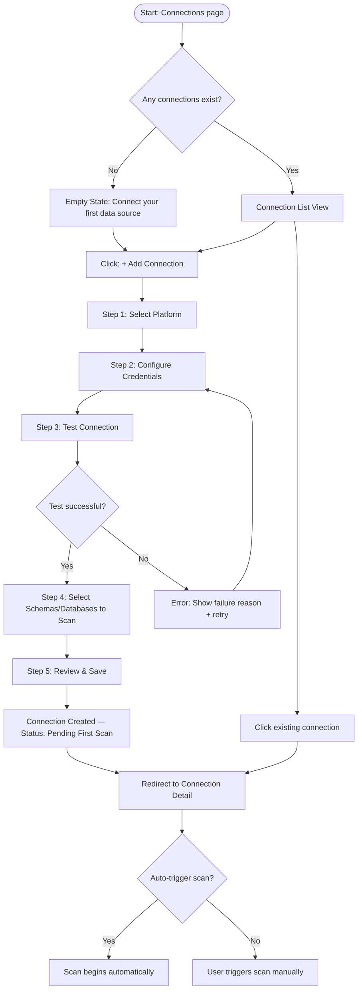
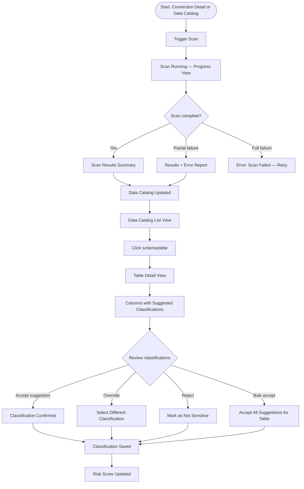
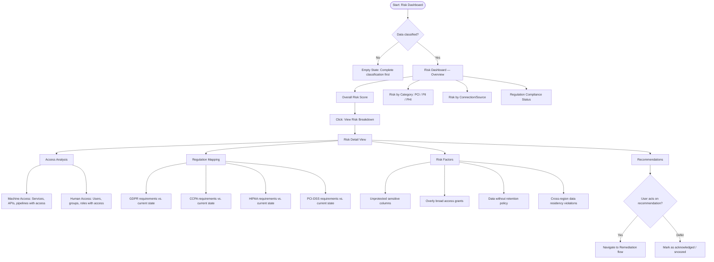
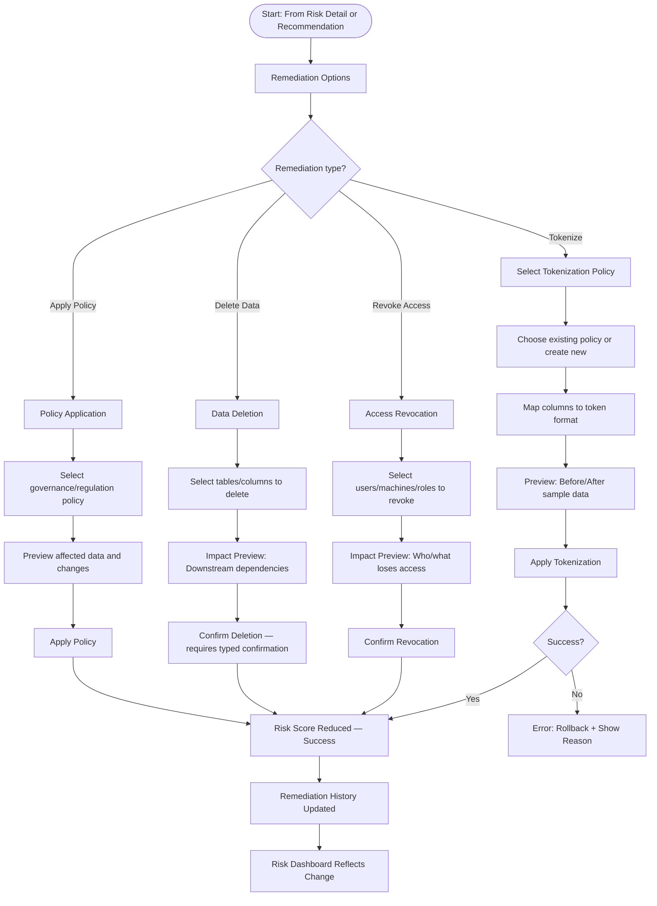
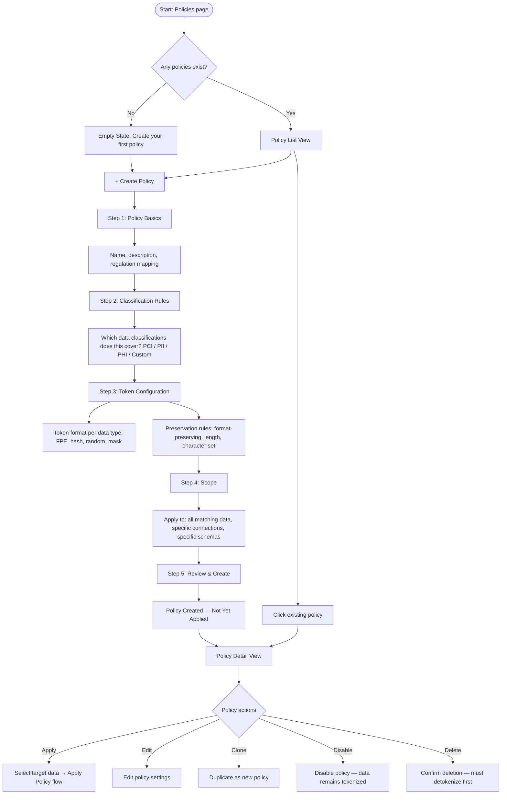
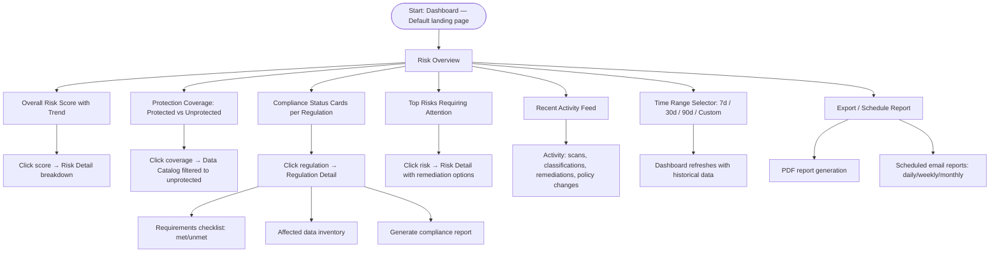

# Data Security Product — UX Flows

## Product Overview

**Product**: Standalone data security SaaS that helps companies discover, classify, and secure sensitive data across their infrastructure.

**Primary Users**:
- **Data engineers**: Manage connections, run scans, monitor infrastructure
- **Data governance team**: Define policies, review classifications, manage access rules
- **Security/compliance + executives**: Consume dashboards, risk scores, audit reports (informed stakeholders)

**Classification model**: Guided semi-automatic — system suggests, users confirm or override.

---

## Flow 1: Data Source Connections

**Goal**: Connect external data platforms (Snowflake, AWS, Databricks, etc.) so the system can scan and ingest metadata.



### Screen Inventory

| Screen | Purpose | Entry From | Key Content | Actions | Exits To |
|--------|---------|------------|-------------|---------|----------|
| **Connection List** | Browse all connected data sources | Sidebar nav | Table: name, platform, status, last scan, schema count | + Add Connection, filter by platform/status | Connection Detail, Add Connection |
| **Add Connection — Select Platform** | Choose which platform to connect | Connection List | Grid of platform cards (Snowflake, AWS S3, Databricks, BigQuery, Redshift, etc.) with logos | Select platform | Configure Credentials |
| **Add Connection — Configure** | Enter connection credentials | Select Platform | Platform-specific form (host, port, credentials, warehouse, etc.) | Test Connection, Back | Test result, Select Schemas |
| **Add Connection — Select Schemas** | Choose which databases/schemas to scan | Successful test | Tree view of databases → schemas → tables (checkboxes) | Select all, deselect all, search | Review & Save |
| **Add Connection — Review** | Confirm before creating | Select Schemas | Summary: platform, host, selected schemas count | Save, Back | Connection Detail |
| **Connection Detail** | View connection health, scan history, schema inventory | Connection List | Tabs: Overview, Schemas, Scan History, Settings | Edit, Delete, Trigger Scan, Disable | Schema Detail |

### Edge Cases

| Category | Scenario | Design Response |
|----------|----------|-----------------|
| Empty state | No connections yet | Guided empty state: "Connect your first data source to start discovering sensitive data" + platform logo grid |
| Error | Credentials invalid | Inline error on test step with specific failure reason (auth failed, network unreachable, etc.) |
| Error | Connection drops after setup | Status badge: "Disconnected" (error tag), banner on detail page with reconnect action |
| Permission | Read-only user views connections | See list and details, all mutation buttons disabled with tooltip "Contact admin" |
| Scale | 50+ connections | Pagination, filter by platform/status, search by name |
| Loading | Testing connection takes time | "Testing connection..." spinner with cancel option, 30s timeout |
| Destructive | Delete connection with scanned data | Confirmation: "Deleting this connection will remove 12 scanned schemas and their classifications. This can't be undone." |

---

## Flow 2: Data Scanning & Classification

**Goal**: Scan connected data sources, ingest metadata, and classify sensitive data with guided semi-automatic classification.



### Screen Inventory

| Screen | Purpose | Entry From | Key Content | Actions | Exits To |
|--------|---------|------------|-------------|---------|----------|
| **Scan Progress** | Show real-time scan status | Trigger scan action | Progress bar, tables scanned/total, estimated time, discovered columns count | Cancel scan | Scan Results |
| **Scan Results Summary** | Overview of what was found | Scan completion | Total tables/columns scanned, sensitive columns found (by category: PCI, PII, PHI), new vs. previously classified | View Data Catalog, Re-scan | Data Catalog |
| **Data Catalog** | Browse all scanned data assets | Sidebar nav, scan results | Table: schema, table name, columns, classified columns, sensitivity level, last scanned | Filter by: connection, sensitivity, classification status, search | Table Detail |
| **Table Detail** | View columns and their classifications | Data Catalog | Column list with: name, data type, sample values (masked), suggested classification, confidence score, status (pending/confirmed/rejected) | Accept, Override, Reject classification (per column or bulk) | Data Catalog |
| **Classification Override** | Change a column's classification | Table Detail | Dropdown: PCI, PII (name, email, SSN, phone, address...), PHI, Financial, Internal, Public, Custom | Select classification, add notes | Table Detail |

### Edge Cases

| Category | Scenario | Design Response |
|----------|----------|-----------------|
| Empty state | No scans run yet | Empty state on Data Catalog: "Scan your connected data sources to discover sensitive data" + link to Connections |
| Loading | Scan takes hours on large datasets | Background scan with email notification, progress accessible from sidebar badge |
| Error | Scan fails on specific tables | Partial results shown, failed tables listed with retry per-table |
| Confidence | Low confidence classification (< 70%) | Visual indicator (yellow warning tag), prioritized in review queue |
| Scale | 10,000+ columns to review | Bulk accept suggestions above 90% confidence, filter to "needs review" only |
| Data | Sample values contain sensitive data | Mask/redact sample values by default, reveal with click + audit log |
| Conflict | Reclassifying previously confirmed column | Warning: "This column was previously classified as PII (SSN). Changing to 'Not Sensitive' will affect risk score." |
| Stale | Data source schema changed since last scan | "Schema drift detected" banner on connection, suggest re-scan |

---

## Flow 3: Risk Assessment & Scoring

**Goal**: Evaluate risk based on what sensitive data exists, who/what has access to it, and which regulations apply.



### Screen Inventory

| Screen | Purpose | Entry From | Key Content | Actions | Exits To |
|--------|---------|------------|-------------|---------|----------|
| **Risk Dashboard** | High-level risk overview | Sidebar nav (home/default) | Risk score (0-100), trend chart, breakdown by category (PCI/PII/PHI), top risks, compliance status cards | Filter by time range, connection, regulation | Risk Detail, Remediation |
| **Risk Detail** | Deep dive into specific risk area | Risk Dashboard drill-down | Risk factors list, affected tables/columns, access analysis, regulation gaps | Remediate, Acknowledge, Snooze | Remediation, Access Analysis |
| **Access Analysis** | Who/what has access to sensitive data | Risk Detail | Two tabs: Machine Access (services, roles, read/write) and Human Access (users, groups, permissions) | Revoke access (→ Remediation), Export report | Remediation |
| **Regulation Mapping** | Compliance status per regulation | Risk Dashboard | Regulation cards: GDPR, CCPA, HIPAA, PCI-DSS — each showing requirements met/unmet, affected data | View requirements, Generate compliance report | Risk Detail |

### Risk Score Model (UX perspective)

| Score Range | Label | Color Token | Indicator |
|-------------|-------|-------------|-----------|
| 0–25 | Low Risk | `--sds-status-success-*` | Green |
| 26–50 | Moderate Risk | `--sds-status-warning-*` | Yellow |
| 51–75 | High Risk | `--sds-status-error-*` (lighter) | Orange (use red-300) |
| 76–100 | Critical Risk | `--sds-status-error-*` | Red |

### Edge Cases

| Category | Scenario | Design Response |
|----------|----------|-----------------|
| Empty state | No classified data yet | Dashboard shows 0 score with "Complete data classification to see your risk assessment" CTA |
| Loading | Risk calculation processing | "Calculating risk score..." with skeleton cards, partial results as available |
| Change | Risk score changed since last visit | Trend indicator: "↑ 12 points since last week" with sparkline |
| Conflict | Regulation requirements conflict | Show both, flag conflict: "GDPR requires deletion, HIPAA requires 6-year retention" |
| Staleness | Data hasn't been scanned in 30+ days | Warning banner: "Risk score may be outdated — last scan was 45 days ago" + Re-scan CTA |
| Executive view | Leadership wants summary, not details | Dashboard top section is the executive summary — no drill-down needed for high-level view |

---

## Flow 4: Remediation

**Goal**: Apply fixes to reduce risk — tokenize data, revoke access, delete data, or apply policies.



### Screen Inventory

| Screen | Purpose | Entry From | Key Content | Actions | Exits To |
|--------|---------|------------|-------------|---------|----------|
| **Remediation Options** | Choose how to address a risk | Risk Detail recommendation | Cards for each option: Tokenize, Revoke Access, Delete Data, Apply Policy — each with description and affected item count | Select remediation type | Type-specific flow |
| **Tokenize — Configure** | Map columns to tokenization | Remediation Options | Column list, token format selector (per column or bulk), policy selector | Preview, Apply | Token Preview |
| **Tokenize — Preview** | See before/after of tokenization | Configure step | Side-by-side: original value → tokenized value for sample rows | Apply, Back, Edit | Apply result |
| **Revoke Access — Select** | Choose what access to revoke | Remediation Options | Table of current access grants: entity (user/service), permission level, data scope | Select grants to revoke, Select all | Impact Preview |
| **Revoke Access — Impact** | Understand consequences | Select step | List of affected entities, what they'll lose access to, downstream impact | Confirm, Back | Success |
| **Delete Data — Confirm** | Confirm destructive deletion | Remediation Options | Affected tables/columns, dependency warnings, typed confirmation ("delete") | Type confirmation + Delete, Cancel | Success |
| **Remediation Success** | Acknowledge risk reduction | Any remediation completion | Updated risk score (before → after), what was changed, audit trail entry | View Risk Dashboard, Remediate More | Risk Dashboard |
| **Remediation History** | Audit trail of all remediations | Sidebar nav or Risk Dashboard | Table: date, type, applied by, affected data, risk impact, status | Filter, Export | Remediation Detail |

### Edge Cases

| Category | Scenario | Design Response |
|----------|----------|-----------------|
| Destructive | Deleting data that's referenced elsewhere | Impact preview: "3 downstream pipelines reference this table. Deletion may break them." Block or require override |
| Destructive | Tokenizing production data | Preview step is mandatory. Show "This will modify production data" warning. Offer dry-run option |
| Rollback | Tokenization fails mid-process | Automatic rollback, error report: which columns succeeded/failed, retry failed only |
| Permission | User can view risks but not remediate | Remediation buttons show "Request approval" instead of direct action |
| Batch | 500+ columns need tokenization | Bulk policy application, progress bar, background processing with notification |
| Audit | Compliance requires who did what | Every remediation action creates an immutable audit log entry |
| Undo | User wants to reverse a remediation | Tokenization: detokenize option. Access revocation: re-grant option. Deletion: not reversible (warned upfront) |

---

## Flow 5: Tokenization Policy Management

**Goal**: Define and manage tokenization policies that map token configuration rules to regulations and business governance.



### Screen Inventory

| Screen | Purpose | Entry From | Key Content | Actions | Exits To |
|--------|---------|------------|-------------|---------|----------|
| **Policy List** | Browse all tokenization policies | Sidebar nav | Table: name, regulation, classifications covered, scope, status (active/draft/disabled), applied to (count) | + Create Policy, filter by regulation/status | Policy Detail, Create Policy |
| **Create Policy — Basics** | Name and map to regulation | Policy List | Form: name, description, regulation dropdown (GDPR, CCPA, HIPAA, PCI-DSS, Custom), priority level | Next, Cancel | Classification Rules |
| **Create Policy — Classifications** | Define which data types | Basics step | Checkbox groups: PCI (card number, CVV, expiry), PII (name, SSN, email, phone, address), PHI (diagnosis, prescription, MRN), Custom | Next, Back | Token Configuration |
| **Create Policy — Token Config** | Configure tokenization rules | Classifications step | Per data-type config: token format (FPE, hash, random, mask), preservation rules, reversibility setting | Next, Back | Scope |
| **Create Policy — Scope** | Define where policy applies | Token Config step | Radio: All matching data / Specific connections (multi-select) / Specific schemas (tree select) | Next, Back | Review |
| **Create Policy — Review** | Confirm before creation | Scope step | Summary of all settings, estimated affected columns count | Create Policy, Back | Policy Detail |
| **Policy Detail** | View and manage a policy | Policy List | Tabs: Overview (settings summary), Applied Data (tables/columns using this policy), Activity Log (changes, applications) | Apply, Edit, Clone, Disable, Delete | Apply flow, Edit flow |

### Edge Cases

| Category | Scenario | Design Response |
|----------|----------|-----------------|
| Empty state | No policies yet | "Create your first tokenization policy to start protecting sensitive data. Policies define how data is tokenized based on classification and regulation." |
| Conflict | Two policies cover same column with different rules | Warning: "Column X matches both 'GDPR PII Policy' and 'PCI Compliance Policy'. Higher priority policy will apply." Show priority order |
| Regulation | New regulation added (e.g., state-level privacy law) | Policy creation supports "Custom" regulation with free-text name |
| Edit | Editing an active policy | Warning: "This policy is applied to 234 columns. Changes will take effect on next scan." Option to apply immediately |
| Delete | Deleting policy with applied tokenization | Block: "Detokenize 234 columns before deleting this policy, or transfer them to another policy." |
| Clone | Common workflow — base new policy on existing | Pre-fill all fields from source, change name to "Copy of [original]" |
| Versioning | Need to track policy changes over time | Activity log tab shows all edits with diff view |

---

## Flow 6: Risk Dashboard & Monitoring

**Goal**: Provide at-a-glance risk visibility with trends, drill-downs, and alerts for security/compliance and executive stakeholders.



### Screen Inventory

| Screen | Purpose | Entry From | Key Content | Actions | Exits To |
|--------|---------|------------|-------------|---------|----------|
| **Risk Dashboard** | Default landing page, executive summary | Login, sidebar nav | Risk score (large), trend sparkline, protection coverage donut, compliance cards, top risks list, activity feed | Time range filter, Export report, Schedule report | All other sections via drill-down |
| **Protection Coverage** | Sensitive data protected vs. not | Dashboard drill-down | Donut chart: protected/unprotected/partially protected, breakdowns by category (PCI/PII/PHI), table of unprotected items | Filter, Remediate unprotected | Data Catalog, Remediation |
| **Regulation Detail** | Compliance status for one regulation | Dashboard compliance card | Requirements checklist with pass/fail, affected data, gap analysis, remediation suggestions | Generate report, Remediate gaps | Remediation, Report |
| **Reports** | Generate and schedule compliance reports | Dashboard export | Report templates: Executive Summary, Compliance Audit, Risk Trend, Remediation History | Generate now, Schedule recurring | PDF download, Email config |

### Key Metrics

| Metric | Visualization | Meaning |
|--------|---------------|---------|
| **Risk Score** | Large number (0-100) with trend arrow | Overall risk posture — lower is better |
| **Protection Coverage** | Donut chart (%) | % of sensitive data that has remediation applied |
| **Sensitive Data Volume** | Number + breakdown | Total sensitive columns discovered, by category |
| **Compliance Score** | Per-regulation gauge | % of regulation requirements met |
| **Remediation Velocity** | Line chart over time | How fast risks are being addressed |
| **Open Risks** | Count with severity breakdown | Risks identified but not yet remediated |

### Edge Cases

| Category | Scenario | Design Response |
|----------|----------|-----------------|
| Empty state | Brand new account, no data | Onboarding dashboard: Step 1: Connect data source, Step 2: Run first scan, Step 3: Review classifications → progress tracker |
| Staleness | Dashboard data is old | "Last updated 3 hours ago" timestamp + refresh button. Warning banner if > 24 hours |
| Alert | Risk score jumped significantly | Alert banner at top: "Risk score increased by 23 points since yesterday due to 4 new unprotected PII columns" |
| Executive | CEO wants one-page summary | Export → Executive Summary PDF: risk score, coverage %, top 3 risks, compliance status, 30-day trend |
| Trend | Risk going up over time | Trend line turns red with callout: "Risk trending up — 12 new sensitive columns discovered, 0 remediated this week" |
| Scale | Enterprise with 50+ connections | Dashboard aggregates across all connections, with connection-level filter to drill down |

---

## Complete Screen Map

### Primary Navigation (Sidebar)

```
SIDEBAR
├── Dashboard                    ← Risk Dashboard (default landing)
│
├── GROUP: Discovery
│   ├── Connections              ← Data source management
│   ├── Data Catalog             ← Browse scanned data + classifications
│   └── Scans                    ← Scan history + trigger new scans
│
├── GROUP: Protection
│   ├── Policies                 ← Tokenization policy management
│   └── Remediation              ← Remediation history + actions
│
├── GROUP: Compliance
│   ├── Regulations              ← Regulation mapping + status
│   └── Reports                  ← Generate/schedule compliance reports
│
├── ─── spacer ───
│
└── FOOTER
    ├── Settings                 ← Account, team, integrations
    └── [Collapse toggle]
```

### Cross-Flow Navigation

| From | To | Trigger |
|------|-----|---------|
| Dashboard → Connections | "Connect your first data source" CTA | Empty state |
| Dashboard → Data Catalog | Click protection coverage | Drill-down |
| Dashboard → Risk Detail | Click risk score or top risk | Drill-down |
| Dashboard → Remediation | Click "Remediate" on a risk | Action |
| Data Catalog → Table Detail | Click table row | Navigation |
| Table Detail → Remediation | "Tokenize" / "Revoke Access" on classified column | Action |
| Risk Detail → Remediation | Click recommendation | Action |
| Remediation → Dashboard | Completion success screen | Return |
| Policy List → Remediation | "Apply Policy" on policy detail | Action |
| Connection Detail → Data Catalog | Click schema/table | Navigation |

---

## Status Token Mapping

| Flow State | Token | Usage |
|------------|-------|-------|
| Connection active | `--sds-status-success-*` | Healthy connection badge |
| Connection error | `--sds-status-error-*` | Disconnected/failed badge |
| Scan running | `--sds-status-info-*` | In-progress scan indicator |
| Classification pending review | `--sds-status-warning-*` | Needs human confirmation |
| Classification confirmed | `--sds-status-success-*` | Accepted classification |
| Risk: Low (0-25) | `--sds-status-success-*` | Green risk indicator |
| Risk: Moderate (26-50) | `--sds-status-warning-*` | Yellow risk indicator |
| Risk: High (51-75) | `--sds-status-error-*` | Orange/red risk indicator |
| Risk: Critical (76-100) | `--sds-status-error-*` | Red risk indicator |
| Remediation applied | `--sds-status-success-*` | Protected/remediated badge |
| Remediation failed | `--sds-status-error-*` | Failed remediation badge |
| Policy active | `--sds-status-success-*` | Active policy badge |
| Policy draft | `--sds-status-neutral-*` | Not yet applied |
| Policy disabled | `--sds-status-warning-*` | Paused policy |
| Regulation compliant | `--sds-status-success-*` | Requirements met |
| Regulation non-compliant | `--sds-status-error-*` | Requirements not met |
| Regulation partial | `--sds-status-warning-*` | Some requirements unmet |

---

## Next Steps

- **Navigation structure**: Use `/information-architect` to validate the sidebar grouping and page hierarchy
- **Screen sketches**: Use `/wireframe-agent` to sketch key screens (Dashboard, Data Catalog, Policy Detail)
- **Page specs**: Use `/page-designer` to create detailed layout specs with Software DS tokens
- **Feature design**: Use `/product-designer` for deep dives on specific features (e.g., classification review UX, risk scoring model)
- **Copy**: Use `/content-copy-designer` for empty states, error messages, and status labels
